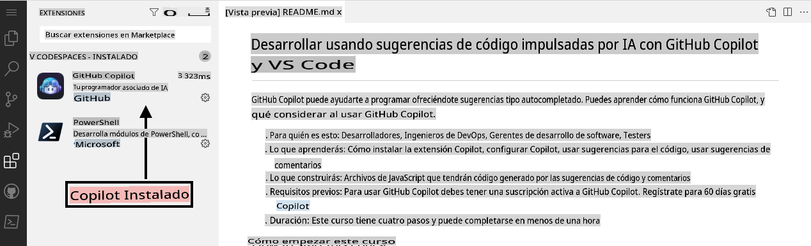

## Paso 1: Aprovecha Codespaces con VS Code para Copilot

_¡Bienvenido a "Desarrolla con sugerencias de código impulsadas por IA usando GitHub Copilot y VS Code"! :wave:_

GitHub Copilot es un programador asistente impulsado por IA que te ayuda a escribir código más rápido y con menos esfuerzo. Toma contexto de comentarios y código para sugerir líneas individuales y funciones completas al instante. GitHub Copilot está impulsado por OpenAI Codex, un modelo de lenguaje generativo preentrenado creado por OpenAI.

**Copilot funciona con muchos editores de código, incluidos VS Code, Visual Studio, JetBrains IDE y Neovim.**

Además, GitHub Copilot está entrenado en todos los lenguajes que aparecen en repositorios públicos. Para cada lenguaje, la calidad de las sugerencias que recibas puede depender del volumen y la diversidad de los datos de entrenamiento para ese lenguaje.

Usar Copilot dentro de un Codespace demuestra lo fácil que es comenzar a utilizar la suite de herramientas de [Codificación Colaborativa](https://github.com/features#features-collaboration) de GitHub.

> **Nota**
> Este ejercicio práctico se centrará en aprovechar GitHub Codespace. Se recomienda que completes la habilidad de GitHub, [Codespaces](https://github.com/skills/code-with-codespaces), antes de continuar con este ejercicio.

### ⌨️ Actividad: Habilitar Copilot dentro de un Codespace

[](https://codespaces.new/microsoft/mastering-github-copilot-for-dotnet-csharp-developers?devcontainer_path=.devcontainer%2Fintroduction%2Fdevcontainer.json)

**Recomendamos abrir otra pestaña del navegador para realizar las siguientes actividades, de manera que puedas mantener estas instrucciones abiertas como referencia.**

Antes de abrir un codespace en un repositorio, puedes crear un contenedor de desarrollo y definir extensiones o configuraciones específicas que se usarán o instalarán en tu codespace. Vamos a crear este contenedor de desarrollo y añadir Copilot a la lista de extensiones.

1. Nota en el cuerpo del archivo **.devcontainer/introduction/devcontainer.json**, el siguiente contenido:
   ```
   {
       // Name this configuration
       "name": "Introduction to Copilot",
       "customizations": {
           "vscode": {
               "extensions": [
                   "GitHub.copilot",
                   "ms-dotnettools.csdevkit"
               ]
           }
       }
   }
   ```

Si encuentras problemas en cualquier momento, puedes crear un nuevo codespace:

1. Navega de regreso a la página principal de tu repositorio haciendo clic en la pestaña **Code** ubicada en la parte superior izquierda de la pantalla.
1. Haz clic en el botón **Code** ubicado en el centro de la página.
1. Haz clic en la pestaña **Codespaces** en el cuadro que aparece.
1. Haz clic en el botón **Create codespace on main** y selecciona Introduction to Copilot.

   **Espera aproximadamente 2 minutos para que el codespace se inicie.**

1. Verifica que tu codespace esté funcionando. El navegador debería contener un editor basado en la web de VS Code y debería haber un terminal presente como el siguiente:
   
1. La extensión `copilot` debería aparecer en la lista de extensiones de VS Code. Haz clic en la pestaña de la barra lateral de extensiones. Deberías ver lo siguiente:
   

Dirígete a [Parte 2 del Ejercicio](./2-skills-dotnet.md)

**Descargo de responsabilidad**:  
Este documento ha sido traducido utilizando servicios de traducción automática basados en inteligencia artificial. Si bien nos esforzamos por garantizar la precisión, tenga en cuenta que las traducciones automatizadas pueden contener errores o imprecisiones. El documento original en su idioma nativo debe considerarse la fuente autorizada. Para información crítica, se recomienda una traducción profesional realizada por humanos. No nos hacemos responsables de malentendidos o interpretaciones erróneas que surjan del uso de esta traducción.