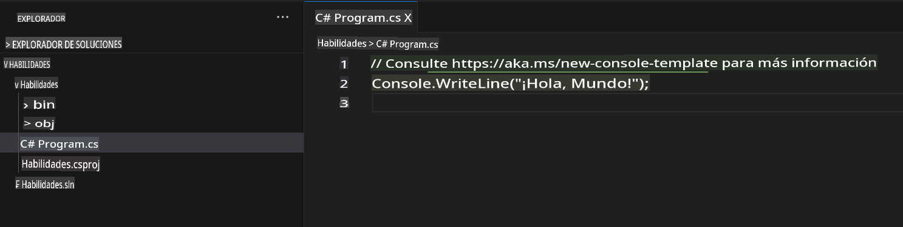
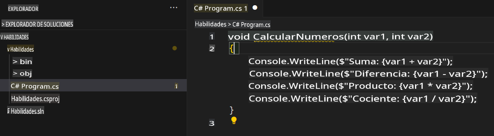

## Paso 2: ¡Explorando sugerencias de código de Seeing AI en un archivo C#!

¡Buen trabajo! 🎉 Creaste un Codespace utilizando un archivo devcontainer que instaló Copilot.

GitHub Copilot ofrece sugerencias para numerosos lenguajes y una amplia variedad de frameworks, pero funciona especialmente bien con Python, JavaScript, TypeScript, Ruby, Go, C# y C++. Los siguientes ejemplos están en C#, pero otros lenguajes funcionarán de manera similar.

Probemos esto utilizando C# con Copilot.

> **Nota**:  
> Si cerraste el Codespace anterior, vuelve a abrirlo o crea uno nuevo.

### ⌨️ Actividad: Agrega un archivo C# y comienza a escribir código

> **Nota**:  
> Asegúrate de abrir el **Solution Explorer** para tener una vista organizada que facilite agregar nuevos proyectos y ejecutarlos.

1. Crea un nuevo proyecto .NET utilizando el comando `.NET: New Project...` y seleccionando `Console App`.  
1. Selecciona la carpeta **code** y nombra el proyecto **Skills**.  
1. Abre `Program.cs`.  
1. Verifica que tu nuevo archivo se vea así:  
   

1. En el archivo `Program.cs`, elimina cualquier código y escribe el siguiente encabezado de función.

   ```csharp
   void CalculateNumbers(int var1, int var2)
   {
   ```

   GitHub Copilot sugerirá automáticamente un cuerpo completo para la función en texto gris. A continuación, se muestra un ejemplo de lo que probablemente verás, aunque la sugerencia exacta puede variar.  
   

5. Presiona `Tab` para aceptar la sugerencia.

### ⌨️ Actividad: Empuja el código a tu repositorio desde el Codespace

Utilicemos GitHub Copilot para resumir nuestros cambios y luego hacer el commit del código.

1. Abre la pestaña **Source Control**.  
2. Haz clic en el botón ✨ en la entrada **Message** para que Copilot genere tu mensaje.


3. Haz clic en el botón **Commit**.

Dirígete a la [Parte 3 del Ejercicio](./3-copilot-hub.md).

**Descargo de responsabilidad**:  
Este documento ha sido traducido utilizando servicios de traducción automática basados en inteligencia artificial. Si bien nos esforzamos por garantizar la precisión, tenga en cuenta que las traducciones automáticas pueden contener errores o inexactitudes. El documento original en su idioma nativo debe considerarse como la fuente autorizada. Para información crítica, se recomienda una traducción profesional realizada por humanos. No nos hacemos responsables de malentendidos o interpretaciones erróneas que puedan surgir del uso de esta traducción.