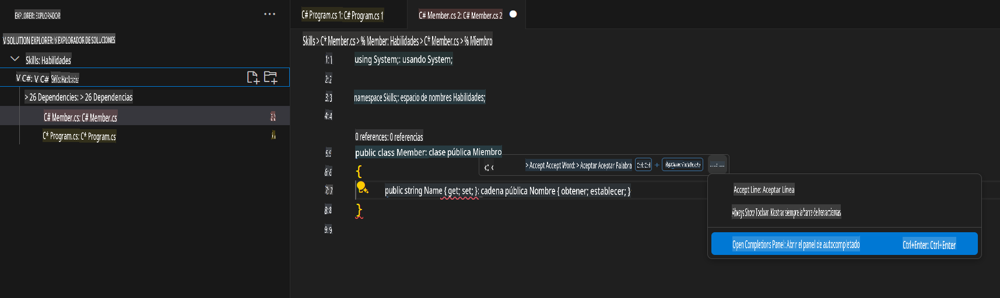

## Paso 3: Visualiza la pestaña de GitHub Copilot con múltiples sugerencias

_¡Buen trabajo! Acabas de usar sugerencias de código con IA dentro de un archivo C# utilizando GitHub Copilot :sparkles:_

Ten en cuenta que, a medida que sigas usando Copilot, puede que no quieras algunas de las sugerencias que ofrece. GitHub Copilot mostrará múltiples sugerencias en una nueva pestaña.

### ⌨️ Actividad: Añade otro método en C# y visualiza todas las sugerencias

1. Desde el espacio de trabajo en el Explorador de Soluciones, haz clic derecho sobre el proyecto y crea un archivo nuevo.

> Nota: Si cerraste el espacio de trabajo previamente, por favor ábrelo de nuevo o crea uno nuevo.

2. Selecciona **Clase** y nombra el archivo `Members.cs`.  
3. En el archivo `Members.cs`, escribe la siguiente función dentro de la clase `Member`.  
   ```
   public strin
   ```  
4. Deja de escribir y visualiza la sugerencia de Copilot pasando el cursor sobre el texto gris subrayado en rojo. Selecciona `...`
5. Click `Abrir Panel de Completions`. 

   > **Note**
   > If you don't see the copilot code block suggestion or the red squiggly and the three dots `...`, you can type `control + enter` to bring up the GitHub Copilot completions panel.

6. Copilot will synthesize around 10 different code suggestions or press CTRL+Enter. You should see something like this:
   
7. Find a solution you like and click `Aceptar Solución`.
8. Your ``. El archivo Member.cs se actualizará con tu solución.

### ⌨️ Actividad: Sube el código a tu repositorio desde el espacio de trabajo

Usemos GitHub Copilot para resumir nuestros cambios y luego hacer un commit del código.

1. Abre la pestaña **Control de Código Fuente**.  
2. Haz clic en el botón ✨ en la entrada **Mensaje** para que Copilot genere tu mensaje.


3. Haz clic en el botón **Commit**.

Dirígete a [Parte 4 del Ejercicio](./4-copilot-comment.md).

**Descargo de responsabilidad**:  
Este documento ha sido traducido utilizando servicios de traducción basados en inteligencia artificial. Si bien nos esforzamos por garantizar la precisión, tenga en cuenta que las traducciones automáticas pueden contener errores o imprecisiones. El documento original en su idioma nativo debe considerarse la fuente autorizada. Para información crítica, se recomienda una traducción profesional realizada por humanos. No nos hacemos responsables de malentendidos o interpretaciones erróneas que puedan surgir del uso de esta traducción.