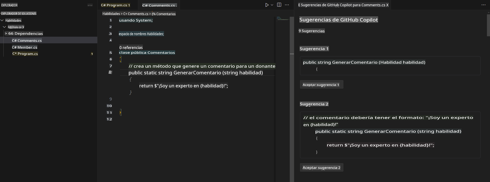
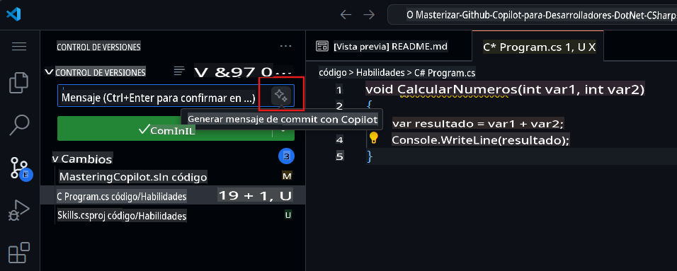

## Paso 4: Usar comentarios para generar código con Copilot

_¡Bien hecho al utilizar la pestaña de Copilot!_ :partying_face:

Ahora has aprovechado la pestaña rápida de sugerencias de Copilot, así como el hub de Copilot, para aceptar sugerencias generadas por IA.

¡Ahora veamos cómo puedes usar comentarios para generar sugerencias con Copilot!

### ⌨️ Actividad: Generar código sugerido por Copilot a partir de comentarios.

1. Desde el espacio de trabajo en el Explorador de Soluciones, haz clic derecho en el proyecto y crea un nuevo archivo.

> Nota: Si cerraste el espacio de trabajo anterior, por favor ábrelo nuevamente o crea uno nuevo.

2. Selecciona **Clase** y nombra el archivo `Comments.cs`  
3. Escribe el siguiente comentario en el archivo dentro de la clase **Comments**:  
   ```
   // create a method that generates a comment for a given skill
   ```  
4. Presiona `enter` to go to a new line.
5. Copilot will suggest a code block.
6. Hover over the red squiggly and select the `...`

   > **Note**
   > If you don't see the copilot code block suggestion or the red squiggly and the three dots `...`, you can type `control + enter` to bring up the GitHub Copilot completions panel.

7. Click `Open Completions Panel`. Copilot will synthesise around 10 different code suggestions. You should see something like this:
   
8. Find a solution you like and click `Accept Solution`.  
9. Tu archivo `Comments.cs` se actualizará con tu solución.

### ⌨️ Actividad: Subir código a tu repositorio desde el espacio de trabajo

Usemos GitHub Copilot para resumir nuestros cambios y luego realizar el commit del código.

1. Abre la pestaña **Control de Fuente**.  
2. Haz clic en el botón ✨ en el campo de entrada **Mensaje** para que Copilot genere tu mensaje.  



3. Haz clic en el botón **Commit**.

Dirígete a [Ejercicio 4 - Usar GitHub Copilot con C#](../../04-Using-GitHub-Copilot-with-CSharp/README.md)

**Descargo de responsabilidad**:  
Este documento ha sido traducido utilizando servicios de traducción automática basados en inteligencia artificial. Si bien nos esforzamos por garantizar la precisión, tenga en cuenta que las traducciones automatizadas pueden contener errores o imprecisiones. El documento original en su idioma nativo debe considerarse como la fuente autorizada. Para información crítica, se recomienda una traducción profesional realizada por humanos. No nos hacemos responsables de malentendidos o interpretaciones erróneas que puedan surgir del uso de esta traducción.