- **Para quién es esto**: Desarrolladores, Ingenieros DevOps, Gerentes de desarrollo de software, Testers.
- **Qué aprenderás**: Cómo usar GitHub Copilot para crear código y añadir comentarios a tu trabajo.
- **Qué construirás**: Archivos en C# que tendrán código generado por Copilot AI para sugerencias de código y comentarios.
- **Requisitos previos**: GitHub Copilot está disponible de forma gratuita, regístrate en [GitHub Copilot](https://gh.io/copilot).
- **Duración**: Este curso se puede completar en menos de una hora.

Al final de este módulo, adquirirás las habilidades para:

- Crear indicaciones (prompts) para generar sugerencias con GitHub Copilot.
- Aplicar GitHub Copilot para mejorar tus proyectos.

## Lecturas previas necesarias:
- [Introducción a la ingeniería de prompts con GitHub Copilot](https://learn.microsoft.com/training/modules/introduction-prompt-engineering-with-github-copilot)

- [¿Qué es la extensión GitHub Copilot para Visual Studio?](https://learn.microsoft.com/en-us/visualstudio/ide/visual-studio-github-copilot-extension?view=vs-2022)

## Requisitos

1. Activa tu [servicio de GitHub Copilot](https://github.com/github-copilot/signup)

1. Familiarízate con [este repositorio con Codespaces](https://github.com/github/dotnet-codespaces)

## 💪🏽 Ejercicio

**Haz clic derecho en el siguiente botón de Codespaces para abrir tu Codespace en una nueva pestaña**
 
[](https://codespaces.new/github/dotnet-codespaces)

El repositorio "**GitHub Codespaces ♥️ .NET**" construye una API del clima usando Minimal APIs, abre Swagger para que puedas llamar y probar la API, y muestra los datos en una aplicación web usando Blazor con .NET.

Revisaremos los pasos para actualizar la aplicación BackEnd del clima añadiendo un nuevo endpoint que solicita una ubicación específica y devuelve el pronóstico del clima para esa ubicación.

### 🤔 Paso 0: Familiarízate con el repositorio "GitHub Codespaces ♥️ .NET"

Una vez que abras el repositorio en Codespaces, encontrarás una nueva ventana del navegador con un Codespace completamente funcional. Todo en este repositorio está contenido dentro de este único Codespace. Por ejemplo, en el panel del explorador, podemos ver el código principal del proyecto BackEnd y FrontEnd.

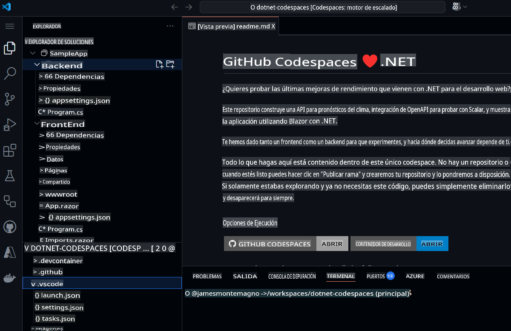

Antes de ejecutar el proyecto, usemos GitHub Copilot Chat para consultar sobre qué trata el proyecto y los diferentes componentes.

1. Abre **GitHub Copilot Chat** desde la barra de navegación principal.  
1. Escribe `What is this project doing, and what are the key components?` y presiona **Enviar**.

GitHub Copilot Chat ahora analizará todo el proyecto y nos dará un resumen de lo que hacen los proyectos, qué tecnología usan y cuáles son los componentes clave.

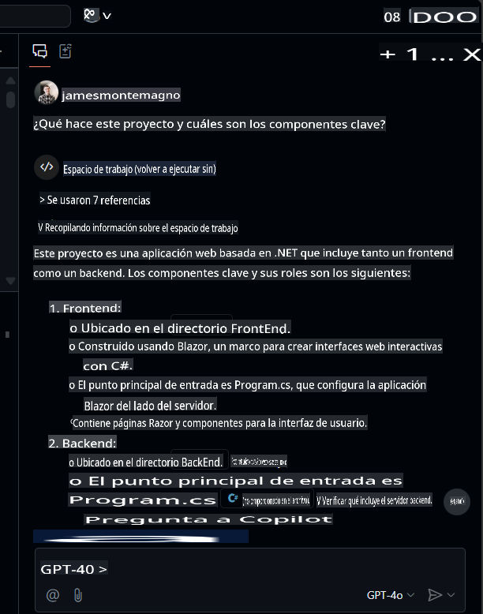

Desde aquí, puedes hacer clic en los archivos para navegar a ellos y puedes hacer preguntas de seguimiento como `What APIs are available?`.

### 🚀 Paso 1: Ejecutar los proyectos

Ahora que tenemos contexto sobre lo que hay en el proyecto, ejecutémoslo para verlo en acción.  
Para ejecutar el proyecto BackEnd, ve al panel "Run and Debug" y selecciona el proyecto "BackEnd".


Inicia la depuración del proyecto seleccionado. El proyecto de la API del clima, nuestro proyecto BackEnd, ahora se ejecutará en el puerto 8080. Podemos copiar la URL publicada desde el panel *Ports*.

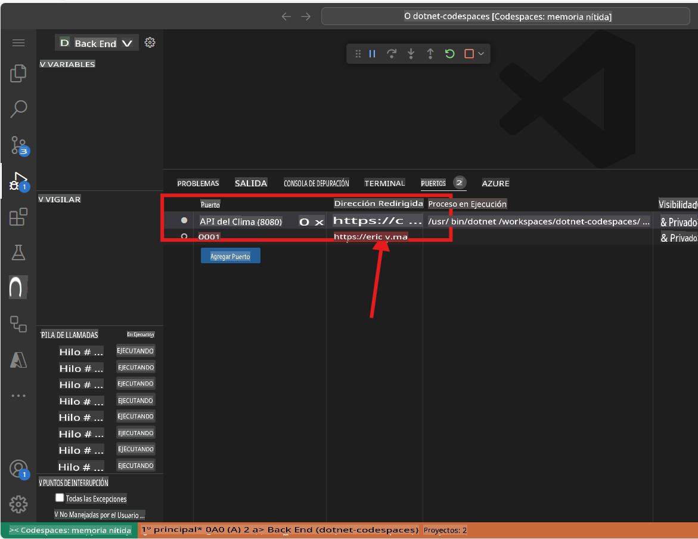

> Nota: Cuando ejecutes la aplicación verás el mensaje de error "Esta página no está funcionando". Esto se debe a que necesitamos navegar al endpoint, que se detalla a continuación.

La aplicación BackEnd publicó un endpoint llamado `weatherforecast` que genera datos de pronóstico aleatorios. Para probar la aplicación en ejecución, puedes añadir `/weatherforecast` a la URL publicada. La URL final debería ser similar a esta:

```bash
https://< your url>.app.github.dev/weatherforecast
```  
La aplicación en ejecución en un navegador debería verse como esta:

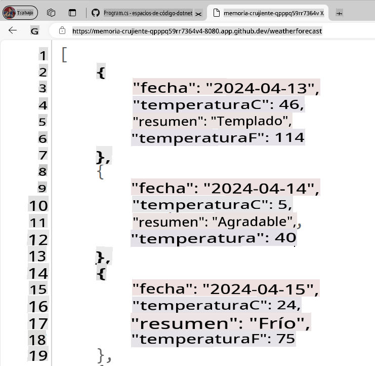

Ahora añadamos un punto de interrupción en nuestra aplicación, para depurar cada llamada a la API. Ve a `Program.cs` file in the BackEnd project. The file is in the following path `SampleApp\BackEnd\Program.cs`. 

Add a breakpoint in line 24 (press F9) and refresh the browser with the Url to test the endpoint. The browser should not show the weather forecast, and in the Visual Studio Editor we can see how the program execution was paused at line 24.

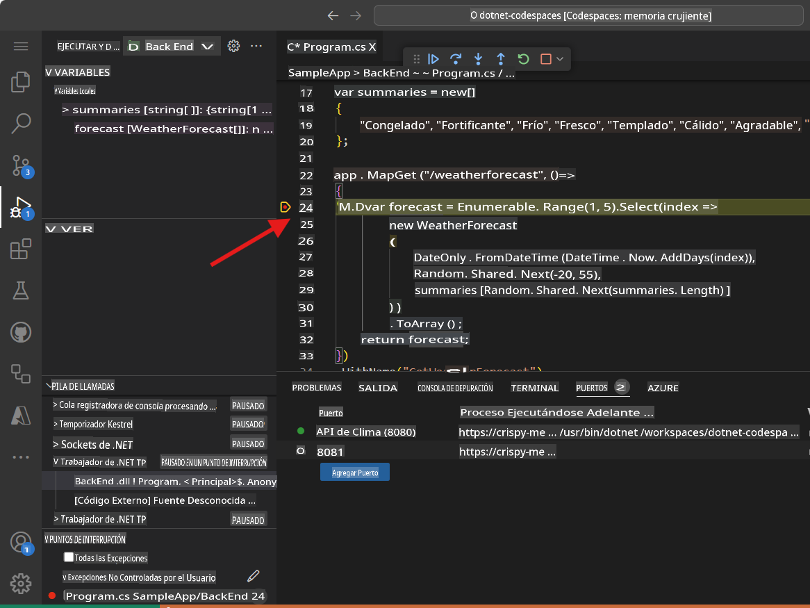

Pressing F10 we can debug step-by-step until line 32, where we can see the generated values. The application should have been generated samples Weather values for the next 5 days. The variable `forecast` has an array containing these values.

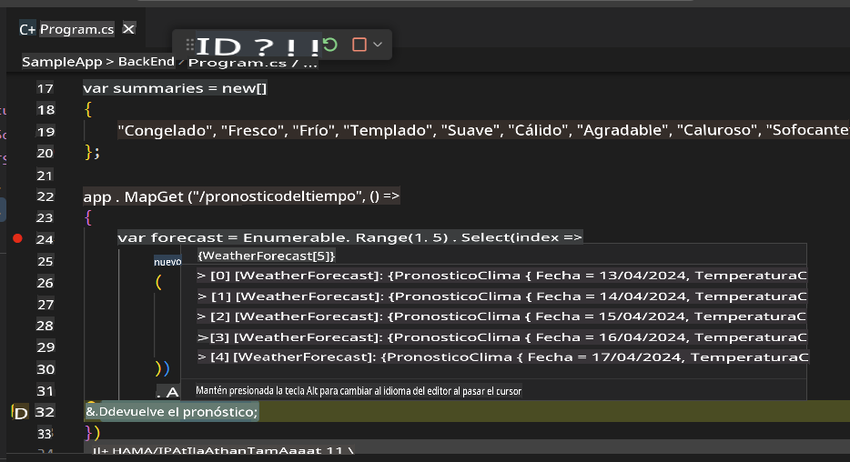

You can stop debugging now.

Congratulations! Now you are ready to add more features into the app using GitHub Copilot.

### 🗒️ Step 2: Get familiarized with GitHub Copilot Slash Commands

As we start working in our codebase, we usually need to refactor some code, or get more context or explanations about it. Using GitHub Copilot Chat, we can have AI-driven conversations to perform these tasks. 

Open the file `Program.cs` in the BackEnd project. The file is in the following path `SampleApp\BackEnd\Program.cs`. 

Now let's use a slash command, in GitHub Copilot to understand a piece of code. Select lines 22-35, press `CTRL + I` to open the inline chat, and type `/explain`.


Dependiendo de tu versión de GitHub Copilot, verás una respuesta en línea o una actualización en el Panel de Chat. GitHub Copilot creará una explicación detallada del código seleccionado. Una versión resumida sería algo como esta:

```
The selected C# code is part of an ASP.NET Core application using the minimal API feature. It defines a GET endpoint at "/weatherforecast" that generates an array of WeatherForecast objects. Each object is created with a date, a random temperature, and a random summary. The endpoint is named "GetWeatherForecast" and has OpenAPI support for standardized API structure documentation.
```

**Los comandos de barra** son comandos especiales que puedes usar en el chat para realizar acciones específicas en tu código. Por ejemplo, puedes usar: 
- `/doc` to add a documentation comment 
- `/explain` to explain the code 
- `/fix` to propose a fix for the problems in the selected code 
- `/generate` to generate code to answer your question

Let's use the `/tests` command to generate tests to the code. Select lines 39-42, press `CTRL + I` to open the inline chat, and type `/tests` (or select the /tests slash command) to generate a new set of tests for this record.


At this point, GitHub Copilot will suggest a new class. You need to first press [Accept] to create the new file. 

A new class `ProgramTests.cs` was created and added to the project. This tests are using XUnit, however, you can ask to generate tests using another Unit Test library with a command like this one `/tests use MSTests for unit testing`.

***Important:** We are not going to use the test file in this project. You must delete the generated test file to continue.*

Finally, let's use the `/doc` to generate automatic documentation to the code. Select lines 39-42, press `CTRL + I` to open the inline chat, and type `/doc` (or select the command) to generate the documentation for this record.


Inline chat, the Chat Panel, and slash commands are part of the amazing tools that support our development experience with GitHub Copilot. Now we are ready to add new features to this App.


### 🗒️ Step 3: Generate a new Record that includes the city name

Go to the `Program.cs` file in the BackEnd project. The file is in the following path `SampleApp\BackEnd\Program.cs`.

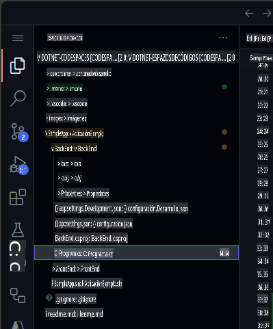

Navega al final del archivo y pide a Copilot que genere un nuevo registro que incluya el nombre de la ciudad.

```csharp
// create a new internal record named WeatherForecastByCity that request the following parameters: City, Date, TemperatureC, Summary
```

El código generado debería ser similar a este:

```csharp
// create a new internal record named WeatherForecastByCity that request the following parameters: City, Date, TemperatureC, Summary
internal record WeatherForecastByCity(string City, DateOnly Date, int TemperatureC, string? Summary)
{
    public int TemperatureF => 32 + (int)(TemperatureC / 0.5556);
}
```

Puedes ver el prompt funcionando en la siguiente animación:


### 🔎 Paso 4: Generar un nuevo endpoint para obtener el pronóstico del clima de una ciudad

Ahora generemos un nuevo endpoint de API similar a `/weatherforecast` que también incluya el nombre de la ciudad. El nombre del nuevo endpoint de API será **`/weatherforecastbycity`**.

***Importante:** Debes colocar el código después de la línea '.WithOpenApi();', que comienza en la línea 36. También recuerda presionar TAB en cada nueva línea sugerida hasta que el endpoint esté completamente definido.*

A continuación, genera un nuevo endpoint con GitHub Copilot añadiendo el comentario:

```csharp
// Create a new endpoint named /WeatherForecastByCity/{city}, that accepts a city name in the urls as a paremeter and generates a random forecast for that city
```  
En el siguiente ejemplo, añadimos algunas líneas en blanco después del endpoint anterior y luego GitHub Copilot generó el nuevo endpoint. Una vez que se generó el código principal del endpoint, GitHub Copilot también sugirió código para el nombre del endpoint (línea 49) y la especificación OpenAPI (línea 50). Recuerda aceptar cada una de estas sugerencias presionando [TAB].


***Importante**: Este prompt genera varias líneas de código en C#. Es altamente recomendable revisar el código generado para verificar que funcione como se desea.*

El código generado debería verse similar a este:

```csharp
// Create a new endpoint named /WeatherForecastByCity/{city}, that accepts a city name in the urls as a paremeter and generates a random forecast for that city
app.MapGet("/WeatherForecastByCity/{city}", (string city) =>
{
    var forecast = new WeatherForecastByCity
    (
        city,
        DateOnly.FromDateTime(DateTime.Now),
        Random.Shared.Next(-20, 55),
        summaries[Random.Shared.Next(summaries.Length)]
    );
    return forecast;
})
.WithName("GetWeatherForecastByCity")
.WithOpenApi();
```

### 🐍 Paso 5: Probar el nuevo endpoint.

Finalmente, verifica que el nuevo endpoint funcione iniciando el proyecto desde el panel Run and Debug.  
Selecciona Run and Debug, y luego selecciona el proyecto BackEnd.

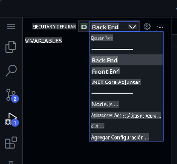

Ahora presiona Run y el proyecto debería compilarse y ejecutarse. Una vez que el proyecto esté en ejecución, podemos probar la URL original usando tu URL de Codespace y el endpoint original:

```bash
https://< your code space url >.app.github.dev/WeatherForecast
```

Y el nuevo endpoint también estará listo para probarse. Aquí hay algunas URLs de ejemplo con diferentes ciudades:
```bash
https://< your code space url >.app.github.dev/WeatherForecastByCity/Toronto

https://< your code space url >.app.github.dev/WeatherForecastByCity/Madrid

https://< your code space url >.app.github.dev/WeatherForecastByCity/<AnyCityName>
```

Ambas pruebas en ejecución deberían verse como estas:

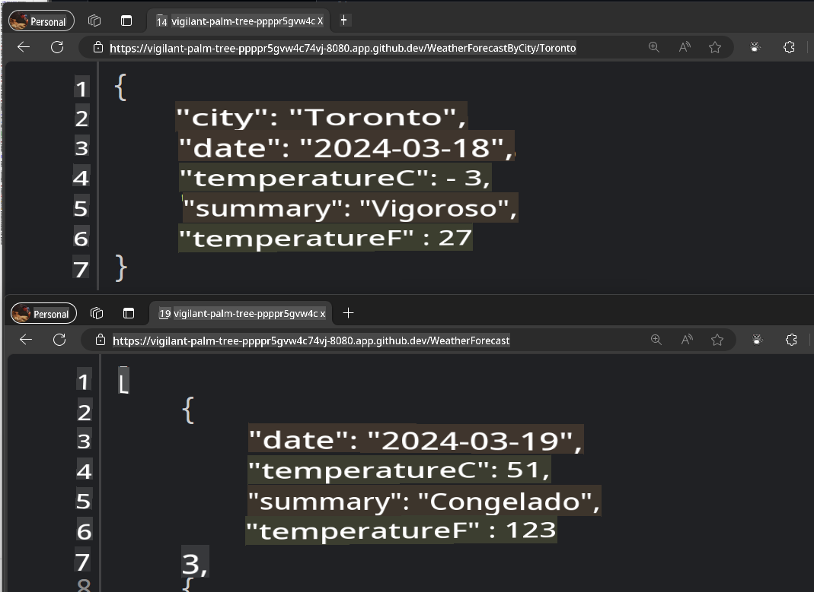

🚀 ¡Felicidades! A lo largo del ejercicio, no solo has usado GitHub Copilot para generar código, sino que también lo has hecho de una manera interactiva y divertida. Puedes usar GitHub Copilot no solo para generar código, sino también para escribir documentación, probar tus aplicaciones y más.

### ✨ Bonus: Añadir nuevas capacidades con GitHub Copilot Edits

Usemos **Copilot Edits** para iniciar una sesión de edición de código impulsada por IA y realizar cambios rápidamente en múltiples archivos utilizando lenguaje natural. Copilot Edits aplica los cambios directamente en el editor, donde puedes revisarlos en el contexto completo del código circundante.

Añadamos una nueva funcionalidad para que el usuario pueda ingresar la ciudad que desea buscar y llamar a nuestra nueva API.

1. Abre la ventana de modo **Edits** en GitHub Copilot Chat.

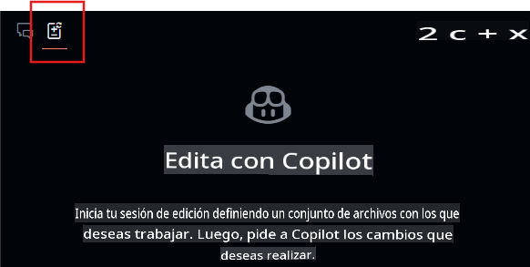  
2. Selecciona el botón **+Add Files...** en la ventana de Edits y añade **FetchData.razor** y **WeatherForecastClient.cs**.  
3. Escribe en el chat: `Actualiza la interfaz de usuario para pedir al usuario la ciudad que desea el clima, usa el cliente de pronóstico para llamar al nuevo endpoint para la ciudad y actualiza la tabla para mostrar la ciudad también`.  
4. Selecciona el botón **Enviar** y ahora Edits generará un plan de iteración para los cambios.  
5. Revisa los cambios y presiona **Aceptar** en la ventana de Edits para aceptar todos los cambios en los archivos.  
6. Ejecuta la aplicación.

> Nota: Si la aplicación no se ejecuta o no llama al nuevo endpoint, valida los cambios en los archivos modificados y asegúrate de que el endpoint se esté llamando correctamente.

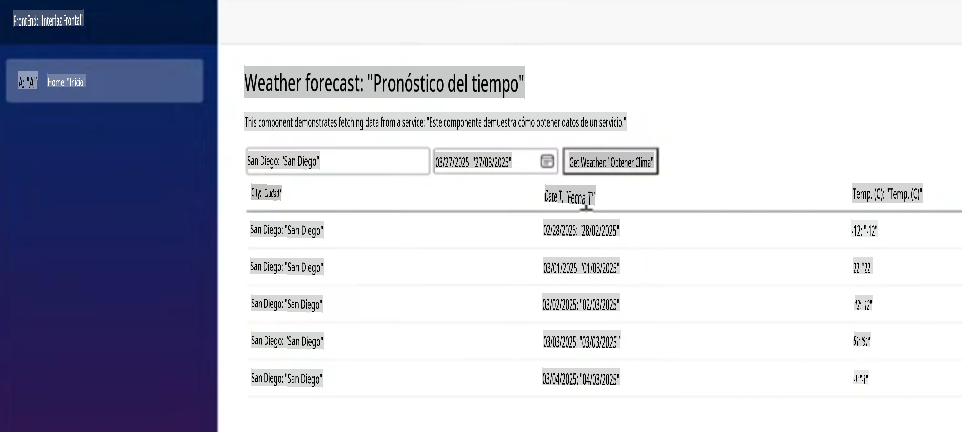

Desde aquí, puedes continuar iterando y hacer preguntas sobre el estilo u otras funcionalidades para añadir a la aplicación.

## Avisos legales

Microsoft y cualquier colaborador te otorgan una licencia para la documentación de Microsoft y otro contenido en este repositorio bajo la [Licencia Pública Internacional Creative Commons Attribution 4.0](https://creativecommons.org/licenses/by/4.0/legalcode), consulta el archivo [LICENSE](../../../04-Using-GitHub-Copilot-with-CSharp/LICENSE), y te otorgan una licencia para cualquier código en el repositorio bajo la [Licencia MIT](https://opensource.org/licenses/MIT), consulta el archivo [LICENSE-CODE](../../../04-Using-GitHub-Copilot-with-CSharp/LICENSE-CODE).

Microsoft, Windows, Microsoft Azure y/u otros productos y servicios de Microsoft mencionados en la documentación pueden ser marcas registradas o marcas comerciales de Microsoft en los Estados Unidos y/u otros países.  
Las licencias de este proyecto no te otorgan derechos para usar ningún nombre, logotipo o marca comercial de Microsoft.  
Las pautas generales de marcas comerciales de Microsoft se pueden encontrar en http://go.microsoft.com/fwlink/?LinkID=254653.

La información de privacidad se puede encontrar en https://privacy.microsoft.com/en-us/

Microsoft y cualquier colaborador se reservan todos los demás derechos, ya sea bajo sus respectivos derechos de autor, patentes o marcas comerciales, ya sea por implicación, impedimento o de otra manera.

**Descargo de responsabilidad**:  
Este documento ha sido traducido utilizando servicios de traducción automática basados en inteligencia artificial. Si bien nos esforzamos por garantizar la precisión, tenga en cuenta que las traducciones automatizadas pueden contener errores o inexactitudes. El documento original en su idioma nativo debe considerarse la fuente autorizada. Para información crítica, se recomienda una traducción profesional realizada por humanos. No nos hacemos responsables de malentendidos o interpretaciones erróneas que puedan surgir del uso de esta traducción.