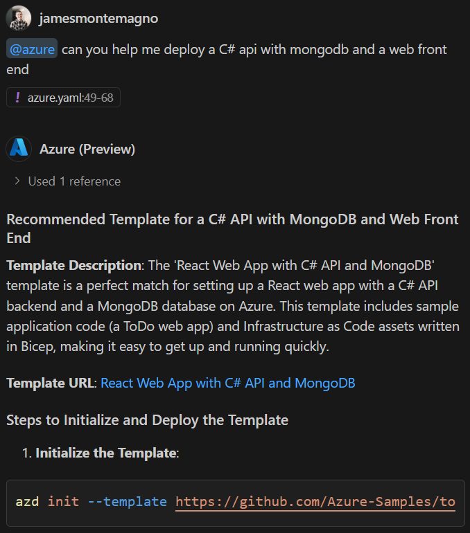
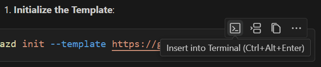
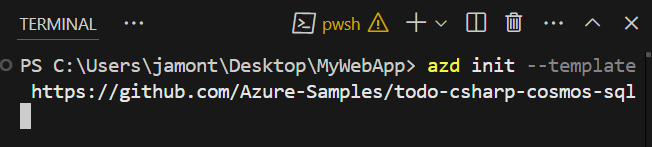
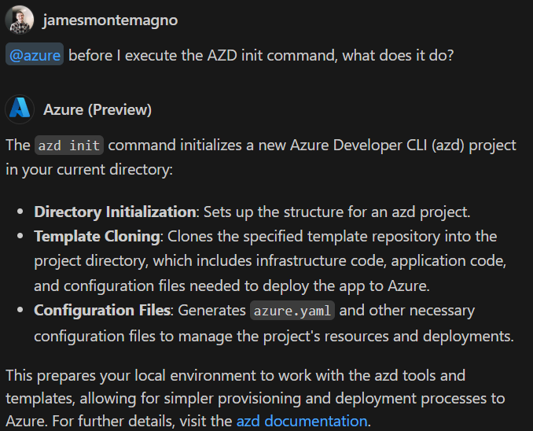
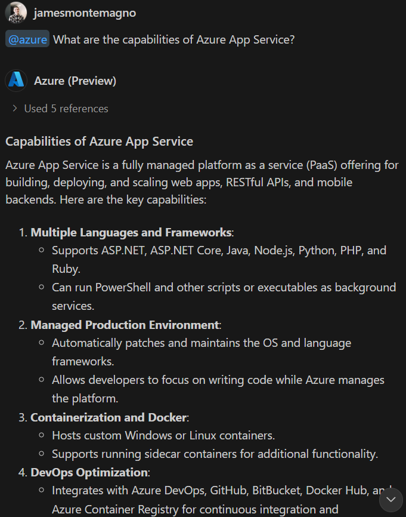

# Crear y desplegar tu aplicación con GitHub Copilot para Azure

Este módulo es una continuación del módulo 1 y proporciona una guía paso a paso sobre cómo usar GitHub Copilot para Azure Preview para crear y desplegar un nuevo sitio web en Azure.

Destaca un enfoque para integrar sin problemas GitHub Copilot para Azure en tu flujo de trabajo de desarrollo y despliegue.

## Requisitos previos

Completar [Módulo 1 - Introducción al uso de GitHub Copilot para Azure](./01-Getting-Started-with-GitHub-Copilot-for-Azure.md)

## Crear y desplegar un sitio web utilizando GitHub Copilot para Azure Preview

1. Crea una nueva carpeta en tu computadora local donde puedas clonar localmente un repositorio de GitHub.
    1. En VS Code, haz clic en **Archivo**, luego en "Abrir carpeta".
    1. En el cuadro de diálogo **Abrir carpeta**, haz clic en **Nueva carpeta**, dale un nombre, selecciónala y luego haz clic en **Seleccionar carpeta**.

1. VS Code te preguntará **¿Confías en los autores de los archivos en esta carpeta?**
    1. Haz clic en **Sí, confío en los autores**.

1. En Visual Studio Code, selecciona **Ver** > **Terminal**. En el panel del terminal, navega a la nueva carpeta.

1. En la barra de estado, selecciona el icono de **Chat** (GitHub) para abrir el panel de chat.

1. Inicia una nueva sesión de chat seleccionando el icono de más (**+**) en la barra de título del panel.

   

> Si cerraste el chat de GitHub Copilot después del último módulo, haz clic en el icono de GitHub en la barra de estado, en la parte inferior derecha de la pantalla de VS Code. Luego selecciona **"GitHub Copilot Chat"** en el menú de opciones.
>
> 

6. En el cuadro de texto del chat, escribe el siguiente mensaje. Luego selecciona **Enviar** (icono de avión de papel) o presiona Enter en tu teclado.

   ```prompt
   @azure can you help me deploy a C# api with mongodb and a web front end?
   ```

    > **IMPORTANTE**  
El texto exacto de la respuesta puede variar cada vez que GitHub Copilot para Azure responde, debido a cómo los modelos de lenguaje generan las respuestas.

   Después de un momento, es probable que GitHub Copilot para Azure sugiera un comando `azd` template to use.  Or in some cases will provide an answer like the following:

    

    Just Remember that the Large Language Model will understand what you tell it.  Therefore, just have the conversation with it.

1. If the answer provides a command that begins with `azd init` in a code fence, hover over the code fence to reveal a small pop-up action menu.

    

    Select **Insert into Terminal** to insert the command into the terminal.

    

1. Before you run the `azd init`. Podrías tener preguntas sobre cómo afecta a tu computadora local y a tu suscripción de Azure.

   Usa el siguiente mensaje:

   ```prompt
   @azure Before I execute azd init, what does it do?
   ```

   Podrías ver una respuesta similar a la captura de pantalla siguiente.

   

1. Usa el siguiente mensaje para aprender más sobre la plantilla `azd`:

   ```prompt
   @azure What resources are created with this template?
   ```

   Podrías ver una respuesta similar a la captura de pantalla siguiente.

    

1. Haz preguntas sobre los servicios que utiliza la plantilla con un mensaje como:

   ```prompt
   @azure What are the capabilities of Azure App Service?
   ```

   Podrías ver una respuesta similar a la captura de pantalla siguiente.

    

1. Cuando estés satisfecho, ejecuta la herramienta `azd init` command in the terminal. Answer its prompts. If you're unsure what to answer for a prompt, ask GitHub Copilot for Azure for help.

1. Before you can continue, you must authenticate the `azd` escribiendo el siguiente comando en el terminal:

    ```cmd
    azd auth login
    ```

    1. Esto abrirá un navegador que te pedirá autenticarte en Azure. Selecciona las mismas credenciales que usaste antes.

1. Una vez que el nuevo proyecto esté inicializado y que te hayas autenticado en Azure, utiliza el comando **azd up** para desplegar la aplicación en tu suscripción. En el terminal, ejecuta el comando según las instrucciones de la respuesta del mensaje original.

    ```
    azd up
    ```

1. El comando `azd up` solicita información sobre tu suscripción, dónde desplegar los recursos y más.

    Si no estás seguro de cómo responder, puedes pedir ayuda a GitHub Copilot para Azure. Por ejemplo, podrías preguntar:

    ```prompt
    @azure azd up is asking me what location I want to deploy the website into. How should I respond?
    ```

    Podrías ver una respuesta similar a la captura de pantalla siguiente.

    

5. Continúa respondiendo a las indicaciones de `azd up`. Ask GitHub Copilot for Azure questions as needed.

    1. When asked the location select **Canada East (canadaeast)**.

    Depending on the `azd` template that you're deploying and the location that you selected, the template might take 10 minutes (or more) to deploy. But we can Move on to [Module 3](./03-Get-Answers-to-your-Questions-about-Azure-Services-and-Resources.md) while it completes

1. If `azd up` experiences an error, ask GitHub Copilot for Azure about the error and how you can resolve it.

    > **TIP**
    > For an easy way to attach the last terminal command results, use the paperclip icon at the bottom left of the chat pane. GitHub Copilot for Azure doesn't know the terminal command results unless they are copy/pasted or attached via the paperclip.


1. When you are done run `azd down` para eliminar todos los recursos.

**Descargo de responsabilidad**:  
Este documento ha sido traducido utilizando servicios de traducción automática basados en inteligencia artificial. Si bien nos esforzamos por garantizar la precisión, tenga en cuenta que las traducciones automáticas pueden contener errores o imprecisiones. El documento original en su idioma nativo debe considerarse la fuente autorizada. Para información crítica, se recomienda una traducción profesional realizada por humanos. No nos hacemos responsables de malentendidos o interpretaciones erróneas que puedan surgir del uso de esta traducción.