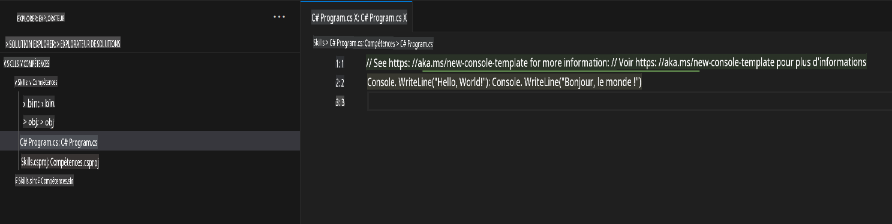
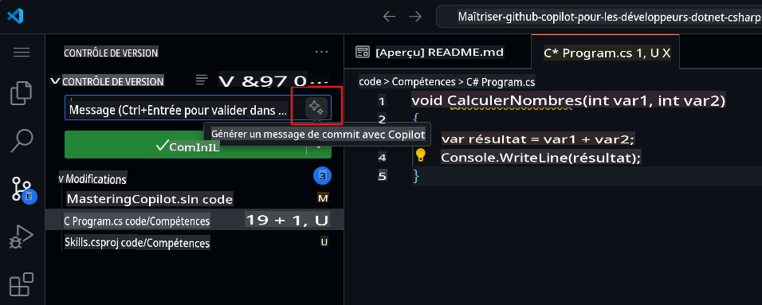

## Étape 2 : Voir les suggestions de code AI dans un fichier C# !

_Bien joué ! :tada: Vous avez créé un Codespace à l'aide d'un fichier devcontainer qui a installé Copilot !_

GitHub Copilot propose des suggestions pour de nombreux langages et une grande variété de frameworks, mais fonctionne particulièrement bien avec Python, JavaScript, TypeScript, Ruby, Go, C# et C++. Les exemples suivants sont en C#, mais les autres langages fonctionneront de manière similaire.

Essayons cela en utilisant C# avec Copilot.

> **Note** :
> Si vous avez fermé le Codespace ci-dessus, veuillez le rouvrir ou en créer un nouveau.

### ⌨️ Activité : Ajouter un fichier C# et commencer à coder

> **Note** :
> Assurez-vous d'ouvrir l'**Explorateur de solutions** pour voir une vue organisée afin d'ajouter facilement de nouveaux projets et de les exécuter.

1. Créez un nouveau projet .NET en utilisant la commande `.NET: New Project...` et en sélectionnant `Console App`.
1. Sélectionnez le dossier **code** et nommez le projet **Skills**.
1. Ouvrez `Program.cs`
1. Vérifiez que votre nouveau fichier ressemble à ceci :
   

1. Dans le fichier `Program.cs`, supprimez tout code existant et tapez l'en-tête de fonction suivant.

   ```csharp
   void CalculateNumbers(int var1, int var2)
   {
   ```

   GitHub Copilot suggérera automatiquement un corps de fonction complet en texte grisé. Voici un exemple de ce que vous verrez probablement, bien que la suggestion exacte puisse varier.
   

5. Appuyez sur `Tab` pour accepter la suggestion.

### ⌨️ Activité : Pousser du code dans votre dépôt depuis le Codespace

Utilisons GitHub Copilot pour résumer nos modifications et ensuite valider le code.

1. Ouvrez l'onglet **Source Control**.
2. Cliquez sur le bouton ✨ dans le champ **Message** pour que Copilot génère votre message.



3. Cliquez sur le bouton **Commit**.

Rendez-vous à la [Partie 3 de l'exercice](./3-copilot-hub.md)

**Avertissement** :  
Ce document a été traduit à l'aide de services de traduction automatisée basés sur l'intelligence artificielle. Bien que nous fassions de notre mieux pour garantir l'exactitude, veuillez noter que les traductions automatisées peuvent contenir des erreurs ou des inexactitudes. Le document original dans sa langue d'origine doit être considéré comme la source faisant autorité. Pour des informations critiques, il est recommandé de recourir à une traduction humaine professionnelle. Nous déclinons toute responsabilité en cas de malentendus ou d'interprétations erronées résultant de l'utilisation de cette traduction.