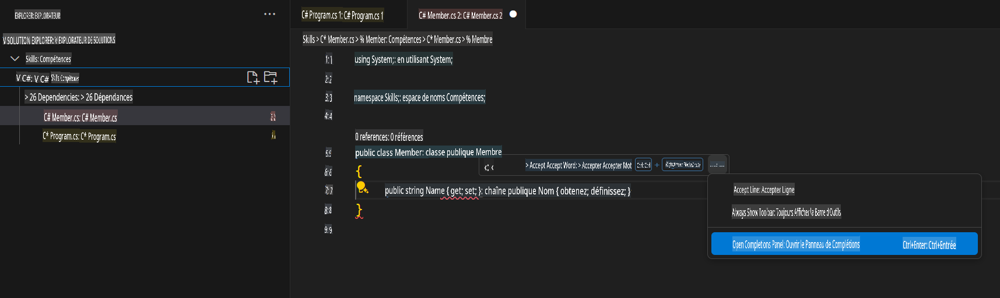

## Étape 3 : Afficher l'onglet GitHub Copilot avec plusieurs suggestions

_Bravo ! Vous venez d'utiliser des suggestions de code IA dans un fichier C# grâce à GitHub Copilot :sparkles:_

Gardez à l'esprit qu'au fur et à mesure que vous utilisez Copilot, il se peut que certaines suggestions proposées par GitHub Copilot ne vous conviennent pas. GitHub Copilot affichera plusieurs suggestions dans un nouvel onglet.

### ⌨️ Activité : Ajouter une autre méthode C# et voir toutes les suggestions

1. Depuis l'espace de code dans l'Explorateur de solutions, faites un clic droit sur le projet et créez un nouveau fichier.

> Note : Si vous avez fermé l'espace de code précédemment, veuillez le rouvrir ou en créer un nouveau.

2. Sélectionnez **Classe** et nommez le fichier `Members.cs`.
3. Dans le fichier `Members.cs`, tapez la fonction suivante à l'intérieur de la classe `Member`.
   ```
   public strin
   ```
4. Arrêtez de taper et consultez la suggestion de Copilot en survolant la fin du texte souligné en rouge et sélectionnez `...`
5. Click `Ouvrir le panneau des complétions`. 

   > **Note**
   > If you don't see the copilot code block suggestion or the red squiggly and the three dots `...`, you can type `control + entrer` to bring up the GitHub Copilot completions panel.

6. Copilot will synthesize around 10 different code suggestions or press CTRL+Enter. You should see something like this:
   
7. Find a solution you like and click `Accepter la solution`.
8. Your `Le fichier Member.cs sera mis à jour avec votre solution.

### ⌨️ Activité : Pousser le code vers votre dépôt depuis l'espace de code

Utilisons GitHub Copilot pour résumer nos modifications, puis validons le code.

1. Ouvrez l'onglet **Contrôle de source**.
2. Cliquez sur le bouton ✨ dans le champ **Message** pour que Copilot génère votre message.


3. Cliquez sur le bouton **Commit**.

Rendez-vous à la [Partie 4 de l'exercice](./4-copilot-comment.md)

**Avertissement** :  
Ce document a été traduit à l'aide de services de traduction automatisée basés sur l'intelligence artificielle. Bien que nous nous efforcions d'assurer l'exactitude, veuillez noter que les traductions automatiques peuvent contenir des erreurs ou des inexactitudes. Le document original dans sa langue d'origine doit être considéré comme la source faisant autorité. Pour des informations critiques, il est recommandé de faire appel à une traduction humaine professionnelle. Nous déclinons toute responsabilité en cas de malentendus ou d'interprétations erronées résultant de l'utilisation de cette traduction.