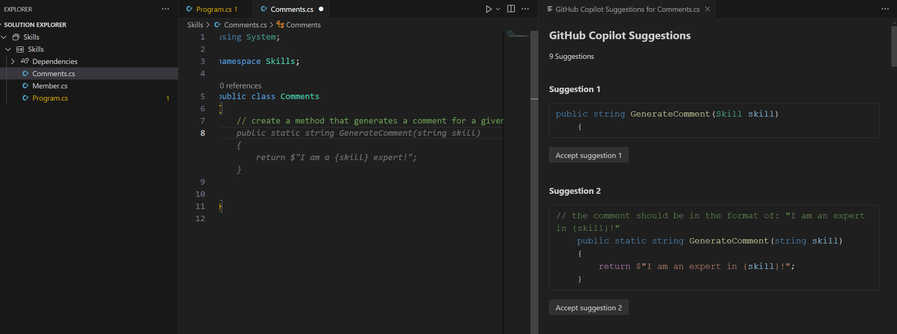
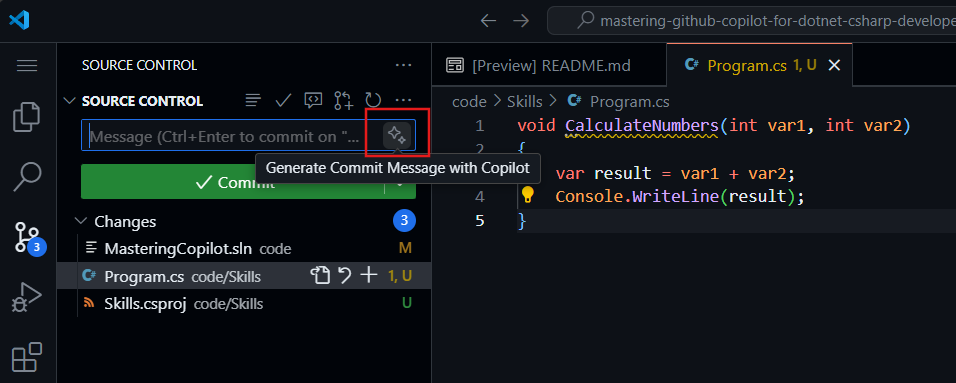

## Étape 4 : Utiliser des commentaires pour générer du code avec Copilot

_Bien joué en utilisant l'onglet Copilot !_ :partying_face:

Vous avez maintenant exploité l'onglet rapide de Copilot pour des suggestions automatiques ainsi que le hub Copilot pour accepter des propositions générées par l'IA.

Voyons maintenant comment utiliser des commentaires pour générer des suggestions avec Copilot !

### ⌨️ Activité : Générer du code suggéré par Copilot à partir de commentaires.

1. Depuis l'espace de code dans l'Explorateur de solutions, faites un clic droit sur le projet, créez un nouveau fichier.

> Note : Si vous avez fermé l'espace de code mentionné précédemment, veuillez le rouvrir ou en créer un nouveau.

2. Sélectionnez **Classe** et nommez le fichier `Comments.cs`.
3. Tapez le commentaire suivant dans le fichier à l'intérieur de la classe **Comments** :
   ```
   // create a method that generates a comment for a given skill
   ```
4. Appuyez sur `entrer` to go to a new line.
5. Copilot will suggest a code block.
6. Hover over the red squiggly and select the `...`

   > **Note**
   > If you don't see the copilot code block suggestion or the red squiggly and the three dots `...`, you can type `control + entrer` to bring up the GitHub Copilot completions panel.

7. Click `Ouvrir le panneau des complétions`. Copilot will synthesise around 10 different code suggestions. You should see something like this:
   
8. Find a solution you like and click `Accepter la solution`.
9. Votre fichier `Comments.cs` sera mis à jour avec votre solution.

### ⌨️ Activité : Pousser le code vers votre dépôt depuis l'espace de code

Utilisons GitHub Copilot pour résumer nos modifications et ensuite valider le code.

1. Ouvrez l'onglet **Contrôle de source**.
2. Appuyez sur le bouton ✨ dans le champ **Message** pour que Copilot génère votre message.



3. Cliquez sur le bouton **Commit**.

Rendez-vous sur [Exercice 4 - Utiliser GitHub Copilot avec C#](../../04-Using-GitHub-Copilot-with-CSharp/README.md)

**Clause de non-responsabilité** :  
Ce document a été traduit à l'aide de services de traduction automatique basés sur l'intelligence artificielle. Bien que nous nous efforcions d'assurer l'exactitude, veuillez noter que les traductions automatisées peuvent contenir des erreurs ou des inexactitudes. Le document original dans sa langue d'origine doit être considéré comme la source faisant autorité. Pour des informations critiques, il est recommandé de recourir à une traduction humaine professionnelle. Nous déclinons toute responsabilité en cas de malentendus ou d'interprétations erronées découlant de l'utilisation de cette traduction.