- **Pour qui est-ce fait** : Développeurs, ingénieurs DevOps, responsables du développement logiciel, testeurs.  
- **Ce que vous apprendrez** : Comment utiliser GitHub Copilot pour créer du code et ajouter des commentaires à votre travail.  
- **Ce que vous construirez** : Des fichiers C# contenant du code généré par Copilot AI avec des suggestions de code et de commentaires.  
- **Prérequis** : GitHub Copilot est disponible gratuitement, inscrivez-vous sur [GitHub Copilot](https://gh.io/copilot).  
- **Durée** : Ce cours peut être complété en moins d'une heure.  

À la fin de ce module, vous aurez acquis les compétences nécessaires pour :  

- Rédiger des prompts pour générer des suggestions avec GitHub Copilot.  
- Appliquer GitHub Copilot pour améliorer vos projets.  

## Lecture préalable :  
- [Introduction à l'ingénierie des prompts avec GitHub Copilot](https://learn.microsoft.com/training/modules/introduction-prompt-engineering-with-github-copilot)  

- [Qu'est-ce que l'extension GitHub Copilot pour Visual Studio ?](https://learn.microsoft.com/en-us/visualstudio/ide/visual-studio-github-copilot-extension?view=vs-2022)  

## Exigences  

1. Activez votre [service GitHub Copilot](https://github.com/github-copilot/signup).  

1. Familiarisez-vous avec [ce dépôt utilisant Codespaces](https://github.com/github/dotnet-codespaces).  

## 💪🏽 Exercice  

**Faites un clic droit sur le bouton Codespaces suivant pour ouvrir votre Codespace dans un nouvel onglet**  

[](https://codespaces.new/github/dotnet-codespaces)  

Le dépôt "**GitHub Codespaces ♥️ .NET**" construit une API météo en utilisant Minimal APIs, ouvre Swagger pour appeler et tester l'API, et affiche les données dans une application web utilisant Blazor avec .NET.  

Nous examinerons les étapes pour mettre à jour l'application BackEnd météo en ajoutant un nouvel endpoint qui demande une localisation spécifique et retourne les prévisions météo pour cet endroit.  

### 🤔 Étape 0 : Familiarisez-vous avec le dépôt "GitHub Codespaces ♥️ .NET"  

Une fois que vous ouvrez le dépôt dans Codespaces, une nouvelle fenêtre de navigateur s'ouvre avec un Codespace entièrement fonctionnel. Tout ce qui concerne ce dépôt est contenu dans ce Codespace. Par exemple, dans le panneau d'exploration, nous pouvons voir le code principal des projets BackEnd et FrontEnd.  

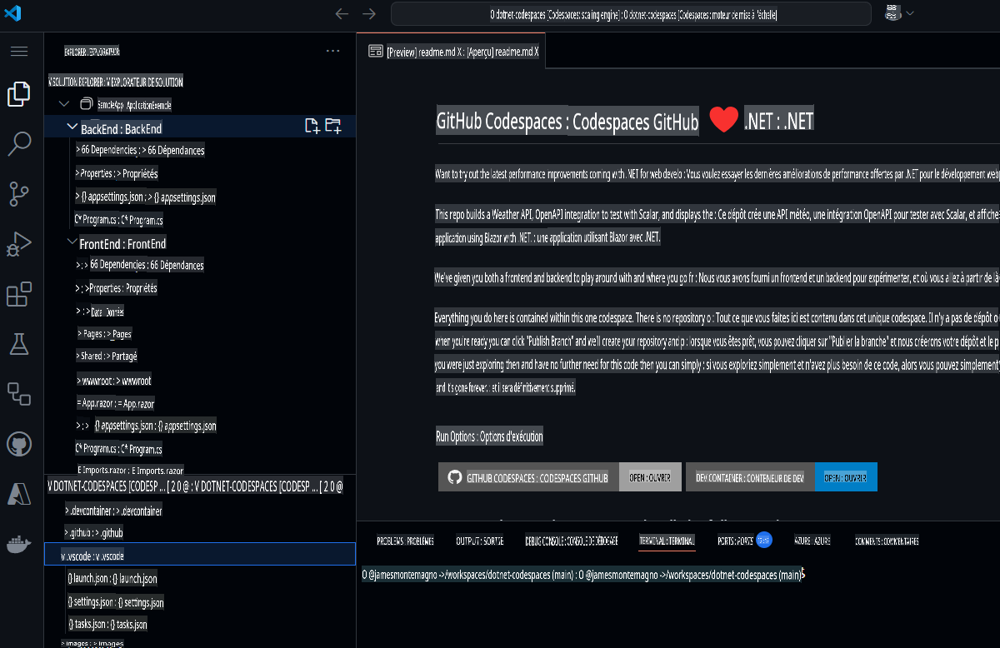  

Avant d'exécuter le projet, utilisons GitHub Copilot Chat pour nous renseigner sur le projet et ses différents composants.  

1. Ouvrez **GitHub Copilot Chat** depuis la barre de navigation principale.  
1. Tapez `What is this project doing, and what are the key components?` et appuyez sur **Envoyer***  

GitHub Copilot Chat examinera maintenant l'ensemble du projet et nous donnera un résumé de ce que font les projets, des technologies utilisées et des composants clés.  

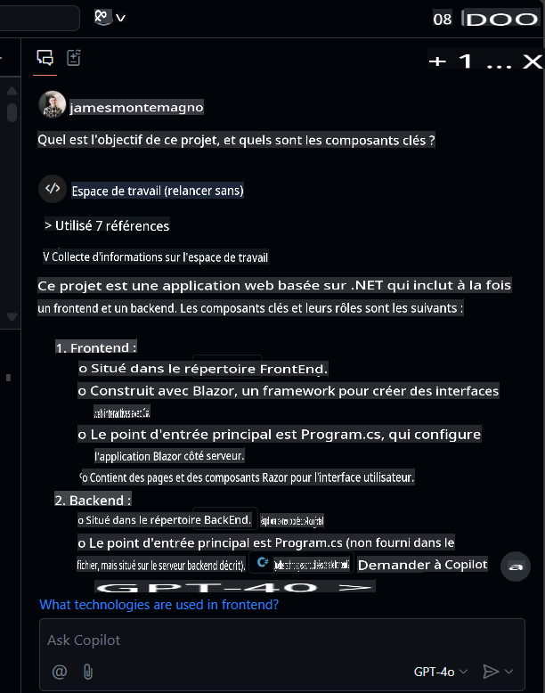  

À partir de là, vous pouvez cliquer sur les fichiers pour y naviguer et poser des questions complémentaires comme `What APIs are available?`.  

### 🚀 Étape 1 : Exécutez les projets  

Maintenant que nous avons une idée du contenu du projet, exécutons-le pour le voir en action.  
Pour exécuter le projet BackEnd, allez dans le panneau "Run and Debug", et sélectionnez le projet "BackEnd".  

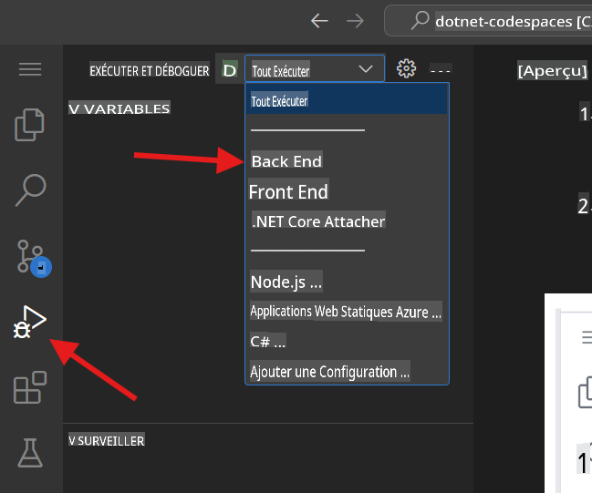  

Démarrez le débogage du projet sélectionné. Le projet Weather API, notre projet BackEnd, sera maintenant exécuté sur le port 8080. Nous pouvons copier l'URL publiée depuis le panneau *Ports*.  

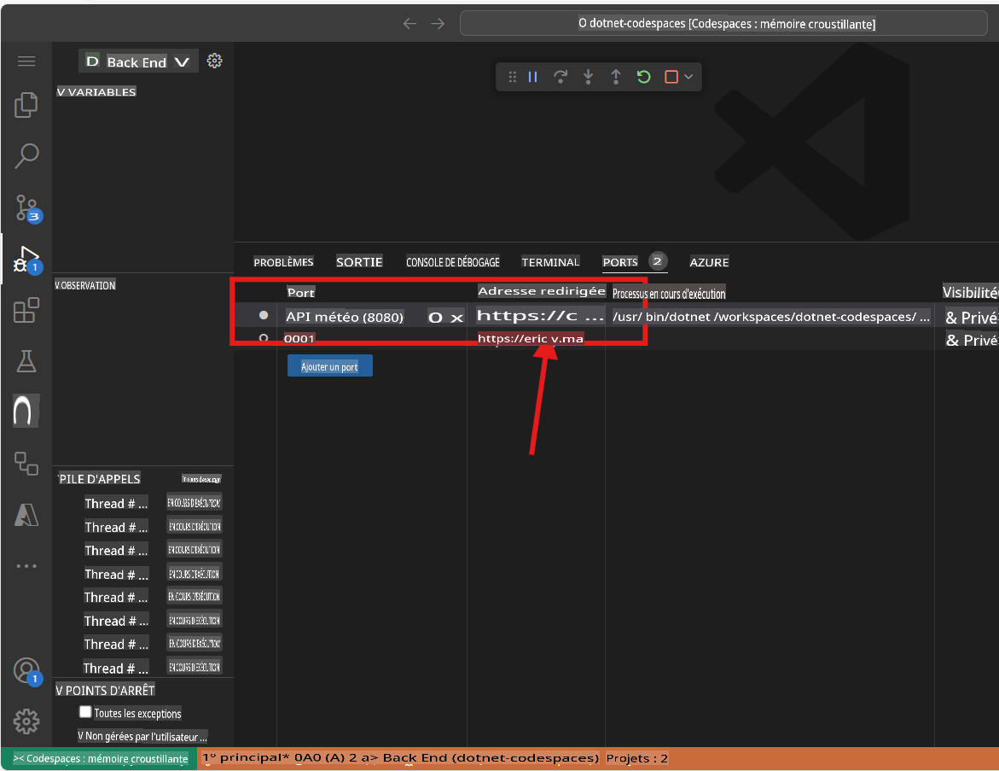  

> Note : Lorsque vous exécutez l'application, vous verrez un message d'erreur "Cette page ne fonctionne pas". Cela est dû au fait que nous devons naviguer vers l'endpoint, qui est détaillé ci-dessous.  

L'application BackEnd a publié un endpoint nommé `weatherforecast` qui génère des données de prévisions aléatoires. Pour tester l'application en cours d'exécution, vous pouvez ajouter `/weatherforecast` à l'URL publiée. L'URL finale devrait ressembler à ceci :  

```bash
https://< your url>.app.github.dev/weatherforecast
```  
L'application en cours d'exécution dans un navigateur devrait ressembler à ceci :  

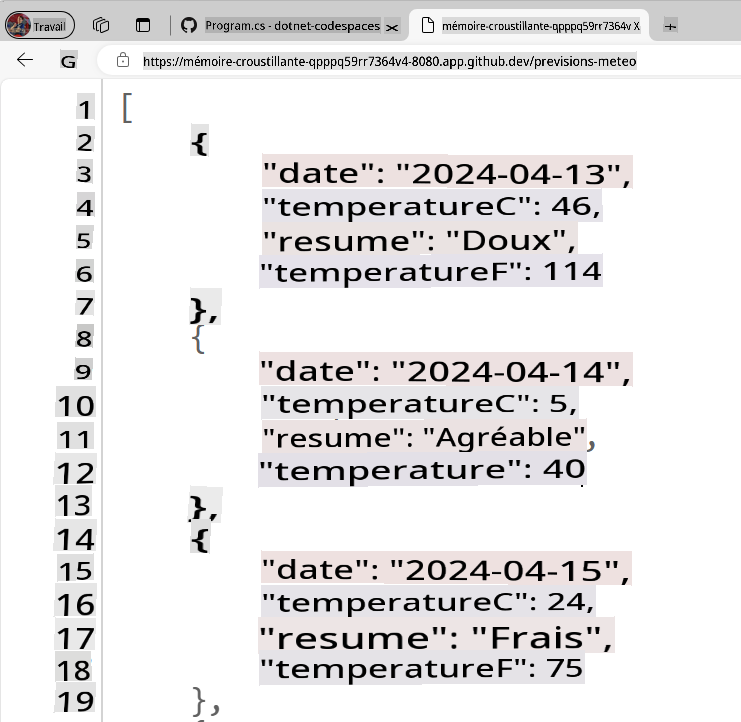  

Ajoutons maintenant un point d'arrêt dans notre application pour déboguer chaque appel à l'API. Accédez au fichier `Program.cs` file in the BackEnd project. The file is in the following path `SampleApp\BackEnd\Program.cs`. 

Add a breakpoint in line 24 (press F9) and refresh the browser with the Url to test the endpoint. The browser should not show the weather forecast, and in the Visual Studio Editor we can see how the program execution was paused at line 24.

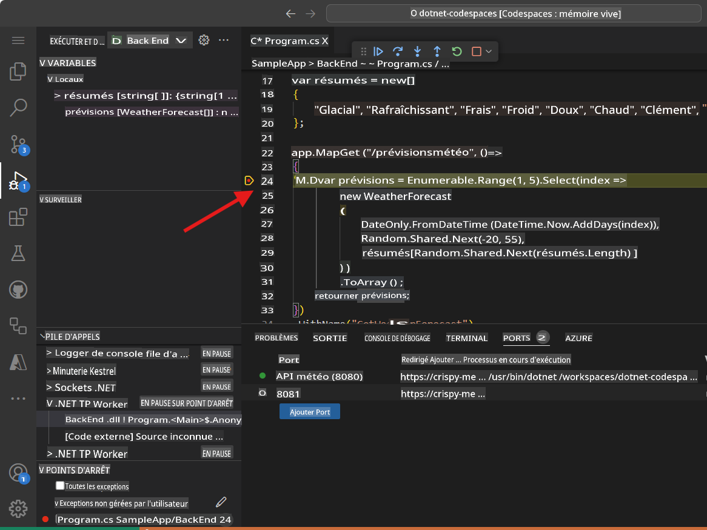

Pressing F10 we can debug step-by-step until line 32, where we can see the generated values. The application should have been generated samples Weather values for the next 5 days. The variable `forecast` has an array containing these values.

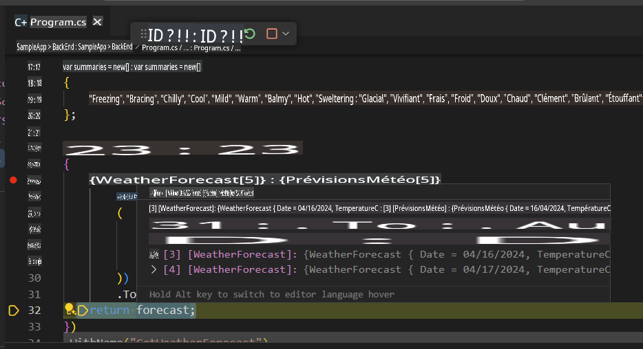

You can stop debugging now.

Congratulations! Now you are ready to add more features into the app using GitHub Copilot.

### 🗒️ Step 2: Get familiarized with GitHub Copilot Slash Commands

As we start working in our codebase, we usually need to refactor some code, or get more context or explanations about it. Using GitHub Copilot Chat, we can have AI-driven conversations to perform these tasks. 

Open the file `Program.cs` in the BackEnd project. The file is in the following path `SampleApp\BackEnd\Program.cs`. 

Now let's use a slash command, in GitHub Copilot to understand a piece of code. Select lines 22-35, press `CTRL + I` to open the inline chat, and type `/explain`.  

  

En fonction de votre version de GitHub Copilot, vous verrez soit une réponse en ligne, soit une mise à jour dans le panneau de chat. GitHub Copilot créera une explication détaillée du code sélectionné. Une version résumée pourrait ressembler à ceci :  

```
The selected C# code is part of an ASP.NET Core application using the minimal API feature. It defines a GET endpoint at "/weatherforecast" that generates an array of WeatherForecast objects. Each object is created with a date, a random temperature, and a random summary. The endpoint is named "GetWeatherForecast" and has OpenAPI support for standardized API structure documentation.
```  

**Les commandes slash** sont des commandes spéciales que vous pouvez utiliser dans le chat pour effectuer des actions spécifiques sur votre code. Par exemple, vous pouvez utiliser :  
- `/doc` to add a documentation comment 
- `/explain` to explain the code 
- `/fix` to propose a fix for the problems in the selected code 
- `/generate` to generate code to answer your question

Let's use the `/tests` command to generate tests to the code. Select lines 39-42, press `CTRL + I` to open the inline chat, and type `/tests` (or select the /tests slash command) to generate a new set of tests for this record.


At this point, GitHub Copilot will suggest a new class. You need to first press [Accept] to create the new file. 

A new class `ProgramTests.cs` was created and added to the project. This tests are using XUnit, however, you can ask to generate tests using another Unit Test library with a command like this one `/tests use MSTests for unit testing`.

***Important:** We are not going to use the test file in this project. You must delete the generated test file to continue.*

Finally, let's use the `/doc` to generate automatic documentation to the code. Select lines 39-42, press `CTRL + I` to open the inline chat, and type `/doc` (or select the command) to generate the documentation for this record.


Inline chat, the Chat Panel, and slash commands are part of the amazing tools that support our development experience with GitHub Copilot. Now we are ready to add new features to this App.


### 🗒️ Step 3: Generate a new Record that includes the city name

Go to the `Program.cs` file in the BackEnd project. The file is in the following path `SampleApp\BackEnd\Program.cs`.  

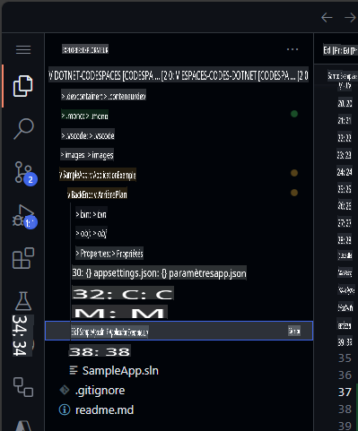  

Naviguez à la fin du fichier et demandez à Copilot de générer un nouvel enregistrement qui inclut le nom de la ville.  

```csharp
// create a new internal record named WeatherForecastByCity that request the following parameters: City, Date, TemperatureC, Summary
```  

Le code généré devrait ressembler à ceci :  

```csharp
// create a new internal record named WeatherForecastByCity that request the following parameters: City, Date, TemperatureC, Summary
internal record WeatherForecastByCity(string City, DateOnly Date, int TemperatureC, string? Summary)
{
    public int TemperatureF => 32 + (int)(TemperatureC / 0.5556);
}
```  

Vous pouvez voir le prompt fonctionner dans l'animation suivante :  

  

### 🔎 Étape 4 : Générez un nouvel endpoint pour obtenir les prévisions météo d'une ville  

Créons maintenant un nouvel endpoint API similaire à `/weatherforecast` qui inclut également le nom de la ville. Le nouveau nom d'endpoint API sera **`/weatherforecastbycity`**.  

***Important :** Vous devez placer le code après la ligne '.WithOpenApi();', qui commence à la ligne 36. N'oubliez pas non plus d'appuyer sur TAB à chaque nouvelle ligne suggérée jusqu'à ce que l'endpoint complet soit défini.*  

Ensuite, générez un nouvel endpoint avec GitHub Copilot en ajoutant le commentaire :  

```csharp
// Create a new endpoint named /WeatherForecastByCity/{city}, that accepts a city name in the urls as a paremeter and generates a random forecast for that city
```  
Dans l'exemple suivant, nous avons ajouté quelques lignes vides après l'endpoint précédent, et GitHub Copilot a généré le nouvel endpoint. Une fois le code principal de l'endpoint généré, GitHub Copilot a également suggéré du code pour le nom de l'endpoint (ligne 49) et la spécification OpenAPI (ligne 50). N'oubliez pas d'accepter chacune de ces suggestions en appuyant sur [TAB].  

  

***Important** : Ce prompt génère plusieurs lignes de code C#. Il est fortement conseillé de vérifier et de réviser le code généré pour s'assurer qu'il fonctionne comme prévu.*  

Le code généré devrait ressembler à ceci :  

```csharp
// Create a new endpoint named /WeatherForecastByCity/{city}, that accepts a city name in the urls as a paremeter and generates a random forecast for that city
app.MapGet("/WeatherForecastByCity/{city}", (string city) =>
{
    var forecast = new WeatherForecastByCity
    (
        city,
        DateOnly.FromDateTime(DateTime.Now),
        Random.Shared.Next(-20, 55),
        summaries[Random.Shared.Next(summaries.Length)]
    );
    return forecast;
})
.WithName("GetWeatherForecastByCity")
.WithOpenApi();
```  

### 🐍 Étape 5 : Testez le nouvel endpoint  

Enfin, vérifiez que le nouvel endpoint fonctionne en démarrant le projet depuis le panneau Run and Debug.  
Sélectionnez Run and Debug, puis sélectionnez le projet BackEnd.  

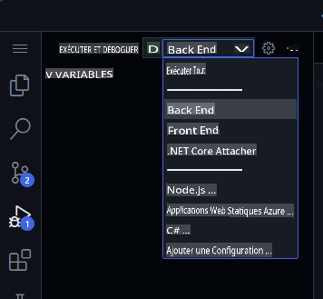  

Appuyez maintenant sur Run, et le projet devrait se construire et s'exécuter. Une fois le projet en cours d'exécution, nous pouvons tester l'URL originale en utilisant l'URL de votre Codespace et l'endpoint original :  

```bash
https://< your code space url >.app.github.dev/WeatherForecast
```  

Et le nouvel endpoint sera également prêt à être testé. Voici quelques exemples d'URLs avec différentes villes :  
```bash
https://< your code space url >.app.github.dev/WeatherForecastByCity/Toronto

https://< your code space url >.app.github.dev/WeatherForecastByCity/Madrid

https://< your code space url >.app.github.dev/WeatherForecastByCity/<AnyCityName>
```  

Les deux tests en cours d'exécution devraient ressembler à ceci :  

  

🚀 Félicitations, au cours de cet exercice, vous n'avez pas seulement utilisé GitHub Copilot pour générer du code, mais vous l'avez également fait de manière interactive et amusante ! Vous pouvez utiliser GitHub Copilot non seulement pour générer du code, mais aussi pour rédiger de la documentation, tester vos applications et bien plus encore.  

### ✨ Bonus : Ajoutez de nouvelles fonctionnalités avec GitHub Copilot Edits  

Utilisons **Copilot Edits** pour démarrer une session d'édition de code alimentée par l'IA et itérer rapidement sur des modifications de code dans plusieurs fichiers en utilisant un langage naturel. Copilot Edits applique les modifications directement dans l'éditeur, où vous pouvez les examiner sur place, avec le contexte complet du code environnant.  

Ajoutons une nouvelle fonctionnalité pour que l'utilisateur puisse entrer la ville qu'il souhaite rechercher et appeler notre nouvel endpoint API.  

1. Ouvrez la fenêtre **Edits** dans GitHub Copilot Chat.  

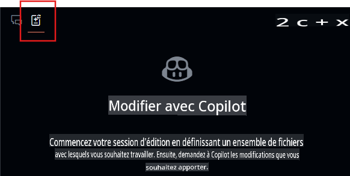  
2. Sélectionnez le bouton **+Add Files...** dans la fenêtre Edits et ajoutez **FetchData.razor** et **WeatherForecastClient.cs**.  
3. Entrez dans le chat : `Mettez à jour l'interface utilisateur pour demander à l'utilisateur la ville dont il veut connaître la météo, utilisez le client forecast pour appeler le nouvel endpoint pour la ville, et mettez à jour le tableau pour afficher également la ville.`  
4. Sélectionnez le bouton **Envoyer**, et maintenant Edits générera un plan d'itération pour les modifications.  
5. Examinez les modifications et appuyez sur **Accepter** dans la fenêtre Edits pour accepter toutes les modifications aux fichiers.  
6. Exécutez l'application.  

> Note : Si l'application ne fonctionne pas ou n'appelle pas le nouvel endpoint, validez les modifications dans les fichiers modifiés et assurez-vous que l'endpoint est appelé correctement.  

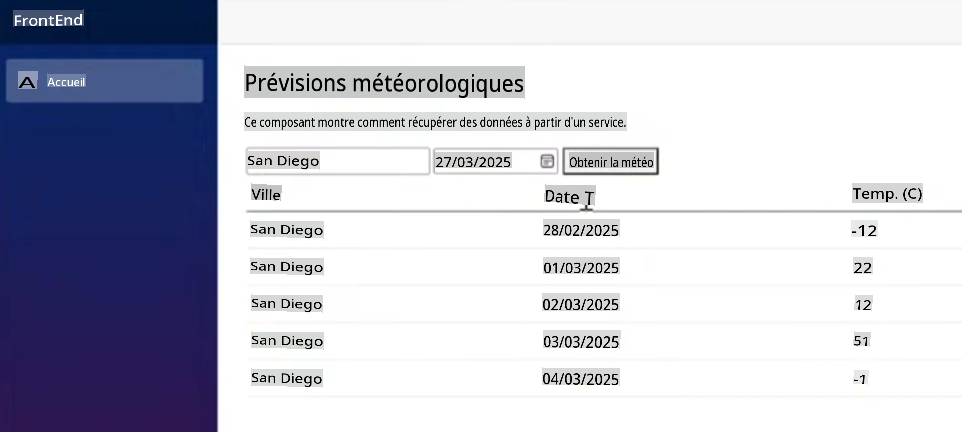  

À partir de là, vous pouvez continuer à itérer et poser des questions sur le style ou d'autres fonctionnalités à ajouter à l'application.  

## Mentions légales  

Microsoft et tout contributeur vous accordent une licence pour la documentation Microsoft et les autres contenus de ce dépôt sous la [Licence publique internationale Creative Commons Attribution 4.0](https://creativecommons.org/licenses/by/4.0/legalcode), consultez le fichier [LICENSE](../../../04-Using-GitHub-Copilot-with-CSharp/LICENSE), et vous accordent une licence pour tout code dans le dépôt sous la [Licence MIT](https://opensource.org/licenses/MIT), consultez le fichier [LICENSE-CODE](../../../04-Using-GitHub-Copilot-with-CSharp/LICENSE-CODE).  

Microsoft, Windows, Microsoft Azure et/ou d'autres produits et services Microsoft mentionnés dans la documentation peuvent être des marques déposées ou des marques de Microsoft aux États-Unis et/ou dans d'autres pays.  
Les licences de ce projet ne vous accordent pas de droits d'utilisation des noms, logos ou marques de Microsoft.  
Les directives générales de Microsoft en matière de marques sont disponibles sur http://go.microsoft.com/fwlink/?LinkID=254653.  

Les informations sur la confidentialité sont disponibles sur https://privacy.microsoft.com/en-us/  

Microsoft et tout contributeur se réservent tous les autres droits, qu'ils relèvent de leurs droits d'auteur, brevets ou marques respectifs, que ce soit par implication, estoppel ou autre.  

**Avertissement** :  
Ce document a été traduit à l'aide de services de traduction automatisés basés sur l'intelligence artificielle. Bien que nous nous efforcions d'assurer l'exactitude, veuillez noter que les traductions automatisées peuvent contenir des erreurs ou des inexactitudes. Le document original dans sa langue d'origine doit être considéré comme la source faisant autorité. Pour des informations critiques, il est recommandé de faire appel à une traduction humaine professionnelle. Nous déclinons toute responsabilité en cas de malentendus ou d'interprétations erronées résultant de l'utilisation de cette traduction.