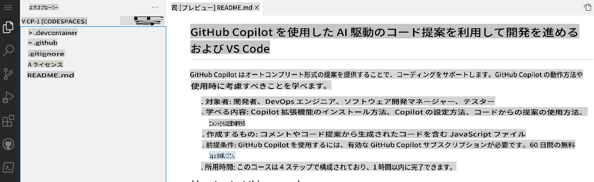
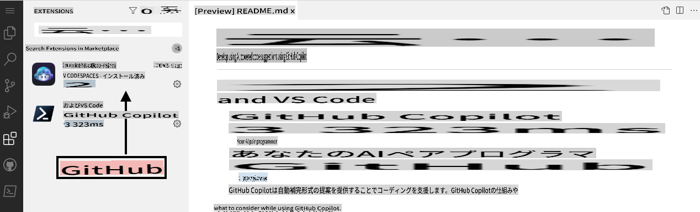

## ステップ 1: VS CodeでCodespacesを活用してCopilotを使う

_「GitHub CopilotとVS Codeを使ったAI駆動のコード提案で開発しよう」へようこそ！ :wave:_

GitHub Copilotは、コードをより速く、そして少ない労力で書けるようにするAIペアプログラマーです。コメントやコードの文脈を読み取り、個々の行や関数全体を即座に提案します。GitHub CopilotはOpenAIが開発した生成型事前学習言語モデル「OpenAI Codex」によって動作しています。

**Copilotは、VS Code、Visual Studio、JetBrains IDE、Neovimなど多くのコードエディターで利用可能です。**

さらに、GitHub Copilotは公開リポジトリに現れるすべての言語でトレーニングされています。言語ごとに提案の品質は、その言語に対するトレーニングデータの量や多様性に依存する場合があります。

Codespace内でCopilotを使用することで、GitHubの[コラボレーションコーディング](https://github.com/features#features-collaboration)ツールを簡単に利用開始できることがわかります。

> **Note**
> このスキル演習では、GitHub Codespaceを活用することに焦点を当てます。この演習を進める前に、GitHubスキルの[Codespaces](https://github.com/skills/code-with-codespaces)を完了することをお勧めします。

### ⌨️ アクティビティ: Codespace内でCopilotを有効化する

[](https://codespaces.new/microsoft/mastering-github-copilot-for-dotnet-csharp-developers?devcontainer_path=.devcontainer%2Fintroduction%2Fdevcontainer.json)

**以下のアクティビティを進める際には、これらの手順を参照できるように別のブラウザタブを開くことをお勧めします。**

リポジトリでCodespaceを開く前に、開発コンテナを作成し、Codespaceで使用またはインストールされる特定の拡張機能や設定を定義することができます。この開発コンテナを作成し、拡張機能リストにCopilotを追加しましょう。

1. **.devcontainer/introduction/devcontainer.json** ファイルの本文に、以下の内容があることを確認してください:
   ```
   {
       // Name this configuration
       "name": "Introduction to Copilot",
       "customizations": {
           "vscode": {
               "extensions": [
                   "GitHub.copilot",
                   "ms-dotnettools.csdevkit"
               ]
           }
       }
   }
   ```

もし途中で問題が発生した場合は、新しいCodespaceを作成することができます:

1. 画面左上にある **Code** タブをクリックして、リポジトリのホームページに戻ります。
1. ページ中央にある **Code** ボタンをクリックします。
1. 表示されるボックスの **Codespaces** タブをクリックします。
1. **Create codespace on main** ボタンをクリックし、「Introduction to Copilot」を選択します。

   **Codespaceが起動するまで約2分待ちます。**

1. Codespaceが実行中であることを確認します。ブラウザにはVS Codeのウェブ版エディターが表示され、以下のようなターミナルが存在するはずです:
   
1. `copilot` 拡張機能がVS Codeの拡張機能リストに表示されることを確認します。拡張機能サイドバータブをクリックしてください。以下のように表示されるはずです:
   

[演習のパート2へ進む](./2-skills-dotnet.md)

**免責事項**:  
本書類は、機械翻訳AIサービスを使用して翻訳されています。正確性を追求しておりますが、自動翻訳にはエラーや不正確な部分が含まれる可能性があります。原文（原言語で記載された文書）が正式な情報源とみなされるべきです。重要な情報については、専門の人間による翻訳を推奨します。本翻訳の利用に起因する誤解や誤認について、当社は一切の責任を負いかねます。