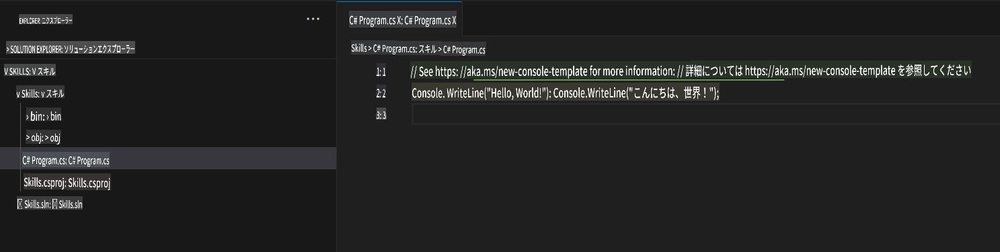
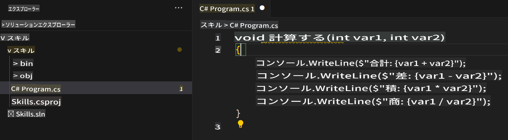

## ステップ 2: C# ファイルで Seeing AI のコード提案を試してみよう！

_おめでとうございます！🎉 devcontainer ファイルを使用して Codespace を作成し、Copilot をインストールしましたね！_

GitHub Copilot は多くのプログラミング言語やさまざまなフレームワークに対応しており、特に Python、JavaScript、TypeScript、Ruby、Go、C#、C++ で優れた提案を行います。以下のサンプルは C# を使用していますが、他の言語でも同様に機能します。

それでは、C# を使って Copilot を試してみましょう。

> **Note**:  
> 上記で Codespace を閉じた場合は、再度開くか新しい Codespace を作成してください。

### ⌨️ アクティビティ: C# ファイルを追加してコードを書いてみよう

> **Note**:  
> **Solution Explorer** を開いて、プロジェクトを簡単に追加・実行できる整理されたビューを確認してください。

1. `.NET: New Project...` コマンドを使用して新しい .NET プロジェクトを作成し、`Console App` を選択します。  
1. **code** フォルダーを選択し、プロジェクト名を **Skills** にします。  
1. `Program.cs` を開きます。  
1. 新しいファイルが次のようになっていることを確認します。  
   

1. `Program.cs` ファイル内のコードをすべて削除し、次の関数ヘッダーを入力します。

   ```csharp
   void CalculateNumbers(int var1, int var2)
   {
   ```

   GitHub Copilot が自動的に関数の全体のコードをグレーのテキストで提案します。以下は、最も一般的に表示される例ですが、提案内容は多少異なる場合があります。  
   

5. `Tab` キーを押して提案を受け入れます。

### ⌨️ アクティビティ: Codespace からリポジトリにコードをプッシュする

GitHub Copilot を使用して変更内容を要約し、その後コードをコミットしましょう。

1. **Source Control** タブを開きます。  
2. **Message** 入力欄の ✨ ボタンをクリックして、Copilot にメッセージを生成させます。  


3. **Commit** ボタンをクリックします。

[演習のパート 3](./3-copilot-hub.md) に進みましょう。

**免責事項**:  
この文書は、機械翻訳AIサービスを使用して翻訳されています。正確性を追求しておりますが、自動翻訳には誤りや不正確さが含まれる場合があります。元の言語で記載された原文が公式な情報源とみなされるべきです。重要な情報については、専門の人間による翻訳を推奨します。この翻訳の使用に起因する誤解や解釈の誤りについて、当社は一切の責任を負いかねます。