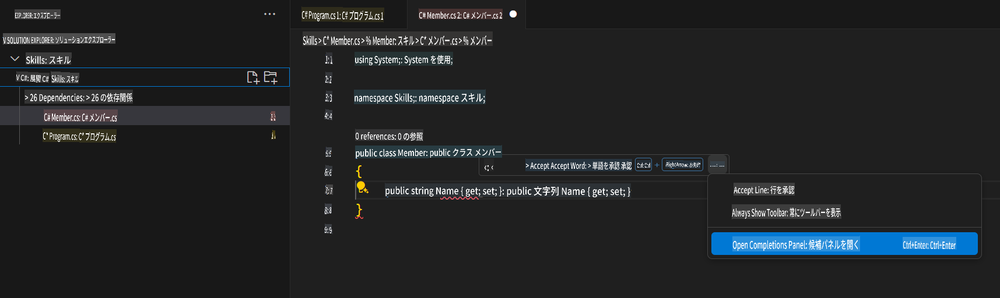

## ステップ 3: 複数の提案を含む GitHub Copilot タブを表示する

_お疲れさまです！GitHub Copilot を使って C# ファイル内で AI コード提案を利用しましたね :sparkles:_

Copilot を使い続ける中で、GitHub Copilot が提示する提案の中には必要ないものもあるかもしれません。GitHub Copilot は新しいタブで複数の提案を表示します。

### ⌨️ アクティビティ: 別の C# メソッドを追加して、すべての提案を確認する

1. Solution Explorer 内でプロジェクトを右クリックし、新しいファイルを作成します。

> Note: 上記で Codespace を閉じた場合は、再度開くか新しい Codespace を作成してください。

2. **Class** を選択し、ファイル名を `Members.cs` に設定します。
3. `Members.cs` ファイル内で、`Member` クラスの中に次の関数を記述します。
   ```
   public strin
   ```
4. タイピングを止め、赤い波線の下にある灰色のテキストにカーソルを合わせて Copilot の提案を確認します。その後、`...`
5. Click `Open Completions Panel`. 

   > **Note**
   > If you don't see the copilot code block suggestion or the red squiggly and the three dots `...`, you can type `control + enter` to bring up the GitHub Copilot completions panel.

6. Copilot will synthesize around 10 different code suggestions or press CTRL+Enter. You should see something like this:
   
7. Find a solution you like and click `Accept Solution`.
8. Your `Member.cs` ファイルが提案を反映して更新されます。

### ⌨️ アクティビティ: Codespace からリポジトリにコードをプッシュする

GitHub Copilot を使って変更内容を要約し、コードをコミットしましょう。

1. **Source Control** タブを開きます。
2. **Message** 入力欄にある ✨ ボタンをクリックして、Copilot にメッセージを生成させます。


3. **Commit** ボタンをクリックします。

[演習のパート 4 へ進む](./4-copilot-comment.md)

**免責事項**:  
この文書は、機械翻訳AIサービスを使用して翻訳されています。正確性を追求しておりますが、自動翻訳には誤りや不正確な箇所が含まれる可能性があります。原文（元の言語で記載された文書）を正式な情報源としてご参照ください。重要な情報については、専門の人間による翻訳を推奨いたします。この翻訳の使用により生じる誤解や誤認について、当方は一切の責任を負いかねます。