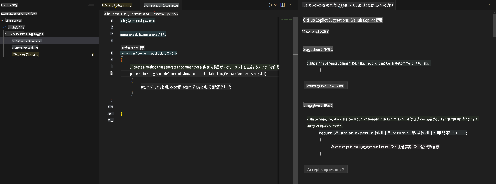
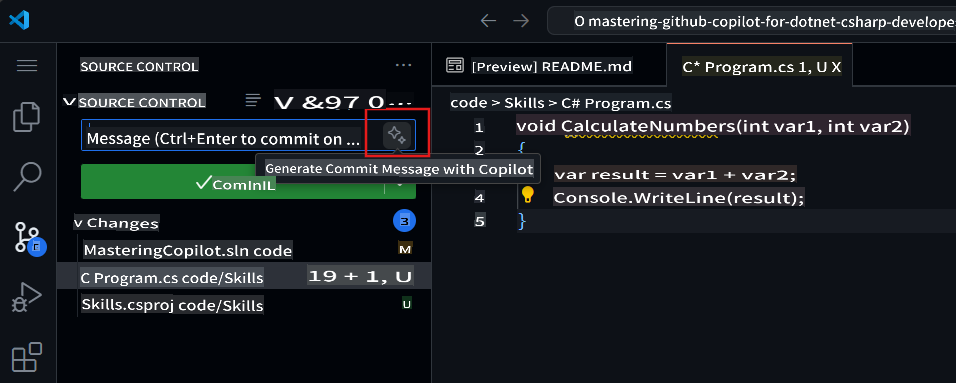

## ステップ 4: コメントを使ってCopilotでコードを生成する

_素晴らしいですね、Copilotタブを活用しています！_ 🎉

ここまでで、Copilotのクイックタブの自動提案やCopilotハブを利用してAIが生成した提案を受け入れる方法を学びました。

次に、コメントを活用してCopilotの提案を生成する方法を見ていきましょう！

### ⌨️ アクティビティ: コメントからCopilot提案コードを生成する

1. Solution Explorer内でコードスペースを開き、プロジェクトを右クリックして新しいファイルを作成します。

> Note: もし先ほどコードスペースを閉じた場合は、再度開くか新しいコードスペースを作成してください。

2. **Class**を選択し、ファイル名を`Comments.cs`にします。
3. **Comments**クラス内に次のコメントを入力します：
   ```
   // create a method that generates a comment for a given skill
   ```
4. `enter` to go to a new line.
5. Copilot will suggest a code block.
6. Hover over the red squiggly and select the `...`

   > **Note**
   > If you don't see the copilot code block suggestion or the red squiggly and the three dots `...`, you can type `control + enter` to bring up the GitHub Copilot completions panel.

7. Click `Open Completions Panel`. Copilot will synthesise around 10 different code suggestions. You should see something like this:
   
8. Find a solution you like and click `Accept Solution`を押します。
9. `Comments.cs`ファイルが解決策で更新されます。

### ⌨️ アクティビティ: コードスペースからリポジトリにコードをプッシュする

GitHub Copilotを使って変更内容を要約し、コードをコミットしましょう。

1. **Source Control**タブを開きます。
2. **Message**入力欄で ✨ ボタンをタップし、Copilotにメッセージを生成させます。



3. **Commit**ボタンをクリックします。

[Exercise 4 - Using GitHub Copilot with C#](../../04-Using-GitHub-Copilot-with-CSharp/README.md) に進みましょう。

**免責事項**:  
この文書は、機械ベースのAI翻訳サービスを使用して翻訳されています。正確性を期すよう努めておりますが、自動翻訳には誤りや不正確な表現が含まれる場合があります。元の言語で作成された原文が正式な情報源として優先されるべきです。重要な情報については、専門の人間による翻訳をお勧めします。本翻訳の使用に起因する誤解や誤認について、当社は一切の責任を負いません。