- **対象者**: 開発者、DevOpsエンジニア、ソフトウェア開発マネージャー、テスター  
- **学べること**: GitHub Copilotを使ってコードを作成し、作業にコメントを追加する方法  
- **構築するもの**: Copilot AIがコードとコメントの提案を生成するC#ファイル  
- **前提条件**: GitHub Copilotは無料で利用可能です。[GitHub Copilot](https://gh.io/copilot)にサインアップしてください。  
- **所要時間**: このコースは1時間以内で完了できます。  

このモジュールの終了時には、以下のスキルを習得できます:

- GitHub Copilotから提案を生成するためのプロンプトを作成  
- GitHub Copilotをプロジェクトに活用して改善  

## 前提知識の読解:
- [GitHub Copilotを使ったプロンプトエンジニアリング入門](https://learn.microsoft.com/training/modules/introduction-prompt-engineering-with-github-copilot)  

- [Visual Studio用GitHub Copilot拡張機能とは?](https://learn.microsoft.com/en-us/visualstudio/ide/visual-studio-github-copilot-extension?view=vs-2022)  

## 必要条件

1. [GitHub Copilotサービスを有効化](https://github.com/github-copilot/signup)  
1. [このリポジトリとCodespaces](https://github.com/github/dotnet-codespaces)に慣れる  

## 💪🏽 演習

**以下のCodespacesボタンを右クリックして、新しいタブでCodespaceを開いてください**  

[](https://codespaces.new/github/dotnet-codespaces)  

「**GitHub Codespaces ♥️ .NET**」リポジトリはMinimal APIを使用してWeather APIを構築し、Swaggerを開いてAPIを呼び出してテストし、Blazorと.NETを使用したWebアプリケーションにデータを表示します。  

ここでは、新しいエンドポイントを追加して特定の場所をリクエストし、その場所の天気予報を返す方法を学びます。  

### 🤔 ステップ0: 「GitHub Codespaces ♥️ .NET」リポジトリに慣れる

リポジトリをCodespacesで開くと、完全に動作するCodespaceを含む新しいブラウザウィンドウが表示されます。このリポジトリのすべてはこの1つのCodespace内に含まれています。例えば、エクスプローラーパネルでは、バックエンドとフロントエンドプロジェクトの主要なコードを確認できます。  

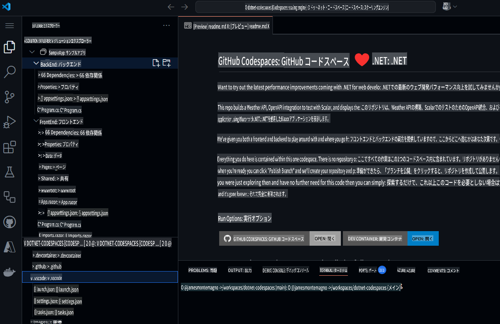  

プロジェクトを実行する前に、GitHub Copilot Chatを使用してプロジェクトの内容やさまざまなコンポーネントについて質問してみましょう。  

1. メインナビゲーションバーから**GitHub Copilot Chat**を開きます。  
1. `What is this project doing, and what are the key components?` を入力し、**送信**をクリックします。  

GitHub Copilot Chatはプロジェクト全体を確認し、プロジェクトが何をするものか、使用している技術、主要なコンポーネントなどの概要を教えてくれます。  

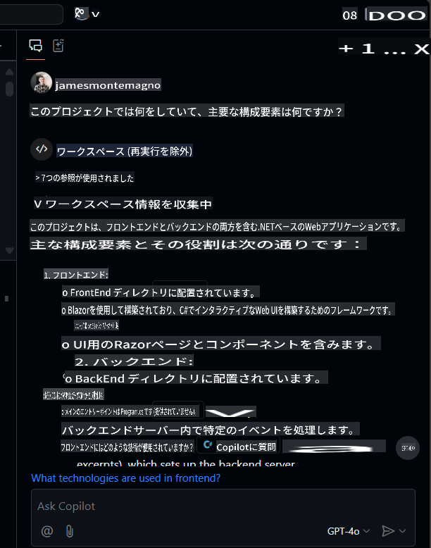  

ここから、ファイルをクリックして移動したり、`What APIs are available?`のようなフォローアップ質問をすることができます。  

### 🚀 ステップ1: プロジェクトを実行する

プロジェクトの内容を理解したら、実際に実行してみましょう。  
バックエンドプロジェクトを実行するには、「Run and Debug」パネルに移動し、「BackEnd」プロジェクトを選択します。  

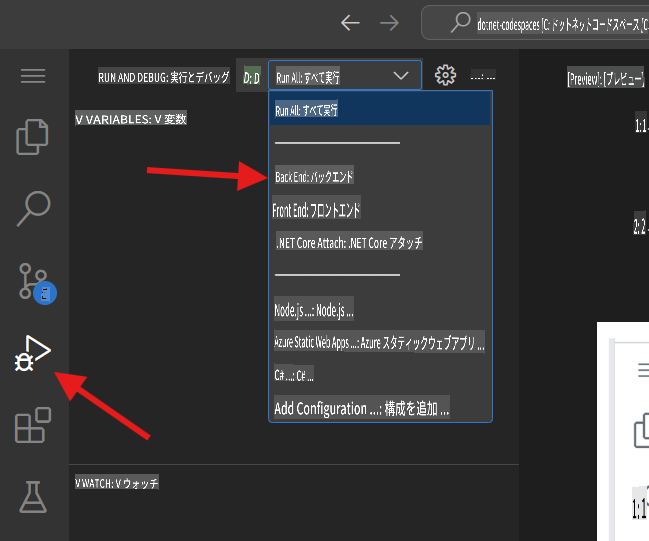  

選択したプロジェクトをデバッグ開始します。Weather APIプロジェクト、つまりバックエンドプロジェクトはポート8080で実行されます。*Ports*パネルから公開されたURLをコピーできます。  

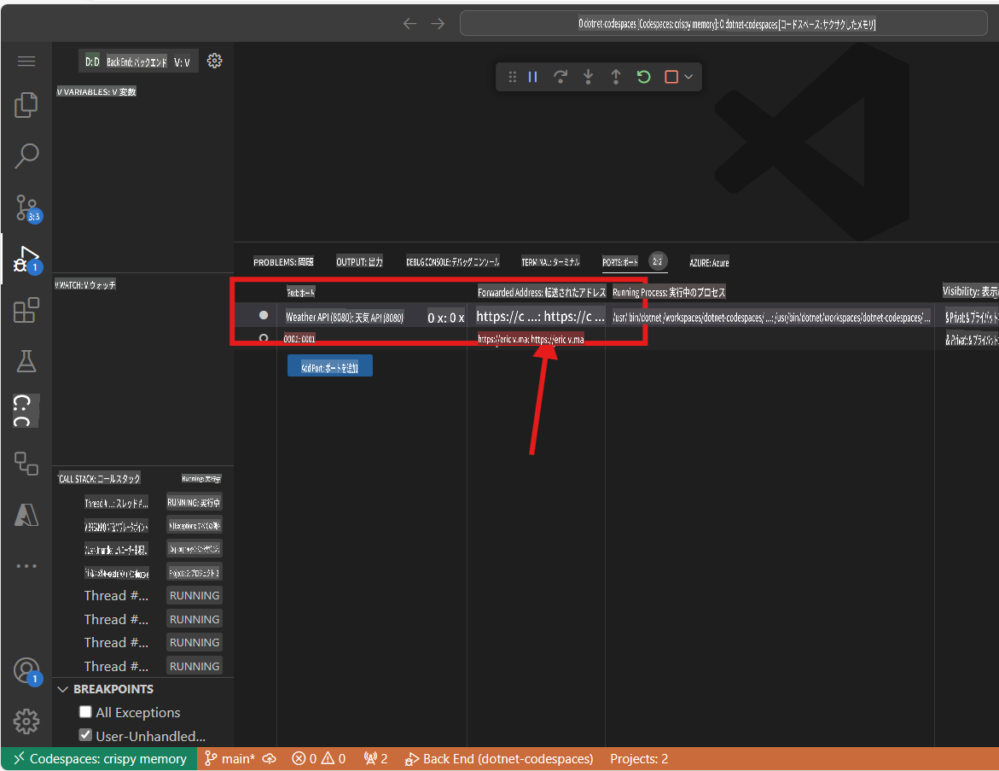  

> 注意: アプリケーションを実行すると「このページは動作していません」というエラーメッセージが表示されることがあります。これは、以下で詳述するエンドポイントにアクセスする必要があるためです。  

バックエンドアプリケーションはランダムな予報データを生成する`weatherforecast`という名前のエンドポイントを公開しています。現在実行中のアプリケーションをテストするには、公開されたURLに`/weatherforecast`を追加します。最終的なURLは以下のようになります。  

```bash
https://< your url>.app.github.dev/weatherforecast
```  
ブラウザで実行中のアプリケーションは以下のようになります。  

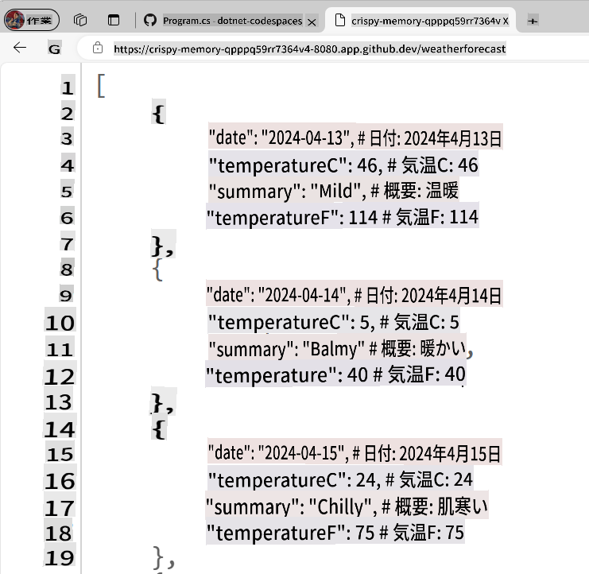  

次に、アプリケーションにブレークポイントを追加して、APIへの各呼び出しをデバッグします。`Program.cs` file in the BackEnd project. The file is in the following path `SampleApp\BackEnd\Program.cs`. 

Add a breakpoint in line 24 (press F9) and refresh the browser with the Url to test the endpoint. The browser should not show the weather forecast, and in the Visual Studio Editor we can see how the program execution was paused at line 24.

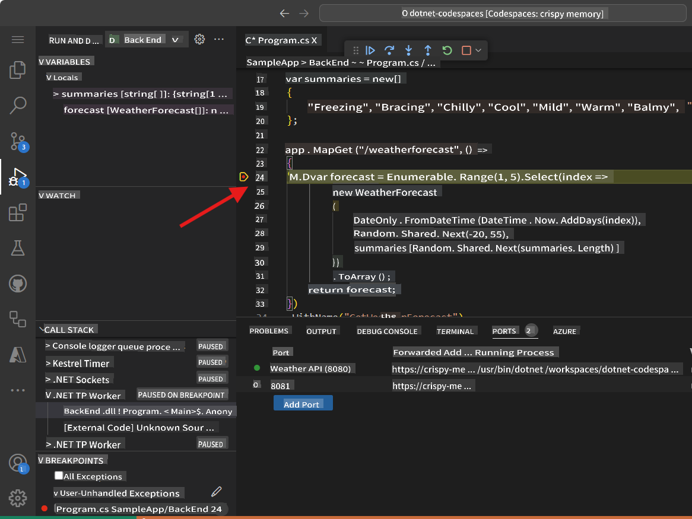

Pressing F10 we can debug step-by-step until line 32, where we can see the generated values. The application should have been generated samples Weather values for the next 5 days. The variable `forecast` has an array containing these values.

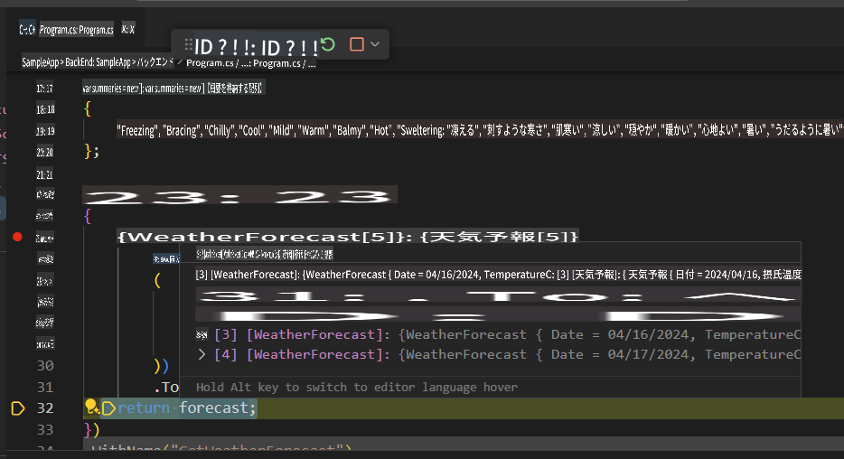

You can stop debugging now.

Congratulations! Now you are ready to add more features into the app using GitHub Copilot.

### 🗒️ Step 2: Get familiarized with GitHub Copilot Slash Commands

As we start working in our codebase, we usually need to refactor some code, or get more context or explanations about it. Using GitHub Copilot Chat, we can have AI-driven conversations to perform these tasks. 

Open the file `Program.cs` in the BackEnd project. The file is in the following path `SampleApp\BackEnd\Program.cs`. 

Now let's use a slash command, in GitHub Copilot to understand a piece of code. Select lines 22-35, press `CTRL + I` to open the inline chat, and type `/explain` に移動します。  

  

GitHub Copilotのバージョンに応じて、インライン応答またはチャットパネルの更新が表示されます。GitHub Copilotは選択されたコードの詳細な説明を作成します。要約版は以下のようになります:  

```
The selected C# code is part of an ASP.NET Core application using the minimal API feature. It defines a GET endpoint at "/weatherforecast" that generates an array of WeatherForecast objects. Each object is created with a date, a random temperature, and a random summary. The endpoint is named "GetWeatherForecast" and has OpenAPI support for standardized API structure documentation.
```  

**スラッシュコマンド**は、コードに対して特定のアクションを実行するためにチャットで使用できる特別なコマンドです。例えば、以下を使用できます:  
- `/doc` to add a documentation comment 
- `/explain` to explain the code 
- `/fix` to propose a fix for the problems in the selected code 
- `/generate` to generate code to answer your question

Let's use the `/tests` command to generate tests to the code. Select lines 39-42, press `CTRL + I` to open the inline chat, and type `/tests` (or select the /tests slash command) to generate a new set of tests for this record.


At this point, GitHub Copilot will suggest a new class. You need to first press [Accept] to create the new file. 

A new class `ProgramTests.cs` was created and added to the project. This tests are using XUnit, however, you can ask to generate tests using another Unit Test library with a command like this one `/tests use MSTests for unit testing`.

***Important:** We are not going to use the test file in this project. You must delete the generated test file to continue.*

Finally, let's use the `/doc` to generate automatic documentation to the code. Select lines 39-42, press `CTRL + I` to open the inline chat, and type `/doc` (or select the command) to generate the documentation for this record.


Inline chat, the Chat Panel, and slash commands are part of the amazing tools that support our development experience with GitHub Copilot. Now we are ready to add new features to this App.


### 🗒️ Step 3: Generate a new Record that includes the city name

Go to the `Program.cs` file in the BackEnd project. The file is in the following path `SampleApp\BackEnd\Program.cs`  

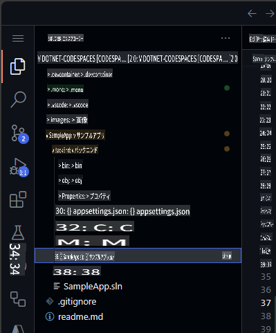  

ファイルの最後に移動し、Copilotに都市名を含む新しいレコードを生成するよう依頼します。  

```csharp
// create a new internal record named WeatherForecastByCity that request the following parameters: City, Date, TemperatureC, Summary
```  

生成されたコードは以下のようになります:  

```csharp
// create a new internal record named WeatherForecastByCity that request the following parameters: City, Date, TemperatureC, Summary
internal record WeatherForecastByCity(string City, DateOnly Date, int TemperatureC, string? Summary)
{
    public int TemperatureF => 32 + (int)(TemperatureC / 0.5556);
}
```  

プロンプトが動作している様子は以下のアニメーションで確認できます:  

  

### 🔎 ステップ4: 都市の天気予報を取得する新しいエンドポイントを生成する

次に、`/weatherforecast`と類似した新しいAPIエンドポイントを生成します。このエンドポイントには都市名も含まれます。新しいAPIエンドポイントの名前は**`/weatherforecastbycity`**とします。  

***重要:** コードは必ず`.WithOpenApi();`行の後に配置してください。この行は36行目から始まります。また、提案された各新しい行でTABキーを押して、エンドポイント全体が定義されるまで受け入れてください。*  

次に、以下のコメントを追加してGitHub Copilotで新しいエンドポイントを生成します:  

```csharp
// Create a new endpoint named /WeatherForecastByCity/{city}, that accepts a city name in the urls as a paremeter and generates a random forecast for that city
```  
以下の例では、前のエンドポイントの後にいくつかの空行を追加し、GitHub Copilotが新しいエンドポイントを生成しました。エンドポイントのコアコードが生成された後、GitHub Copilotはエンドポイント名（49行目）とOpenAPI仕様（50行目）のコードも提案しました。これらの提案を受け入れるには、[TAB]キーを押してください。  

  

***重要**: このプロンプトは複数行のC#コードを生成します。生成されたコードが意図した通りに動作するか確認するため、必ずコードをチェックしてください。*  

生成されたコードは以下のようになります:  

```csharp
// Create a new endpoint named /WeatherForecastByCity/{city}, that accepts a city name in the urls as a paremeter and generates a random forecast for that city
app.MapGet("/WeatherForecastByCity/{city}", (string city) =>
{
    var forecast = new WeatherForecastByCity
    (
        city,
        DateOnly.FromDateTime(DateTime.Now),
        Random.Shared.Next(-20, 55),
        summaries[Random.Shared.Next(summaries.Length)]
    );
    return forecast;
})
.WithName("GetWeatherForecastByCity")
.WithOpenApi();
```  

### 🐍 ステップ5: 新しいエンドポイントをテストする

最後に、新しいエンドポイントが動作していることを確認します。「Run and Debug」パネルからプロジェクトを開始します。  
「Run and Debug」を選択し、BackEndプロジェクトを選択します。  

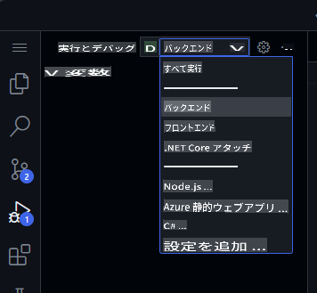  

次に実行ボタンを押すと、プロジェクトがビルドされて実行されます。プロジェクトが実行中の場合、Codespace URLと元のエンドポイントを使用して元のURLをテストできます:  

```bash
https://< your code space url >.app.github.dev/WeatherForecast
```  

新しいエンドポイントもテスト可能になります。以下は異なる都市を使ったサンプルURLです:  
```bash
https://< your code space url >.app.github.dev/WeatherForecastByCity/Toronto

https://< your code space url >.app.github.dev/WeatherForecastByCity/Madrid

https://< your code space url >.app.github.dev/WeatherForecastByCity/<AnyCityName>
```  

両方のテスト実行は以下のようになります:  

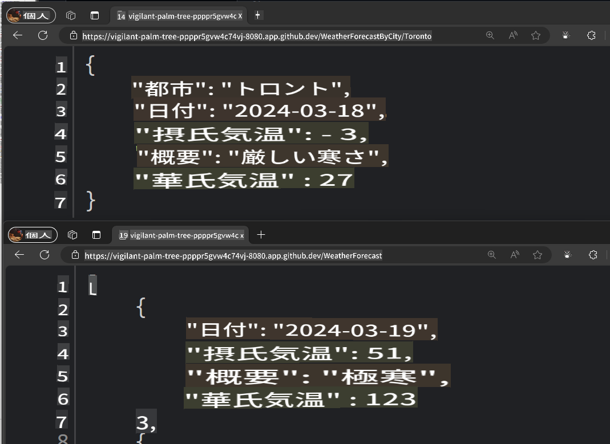  

🚀 おめでとうございます！この演習を通じて、GitHub Copilotを使用してコードを生成するだけでなく、それをインタラクティブで楽しい方法で実行しました！GitHub Copilotはコード生成だけでなく、ドキュメントの作成やアプリケーションのテストなどにも使用できます。  

### ✨ ボーナス: GitHub Copilot Editsで新しい機能を追加する

**Copilot Edits**を使用してAIを活用したコード編集セッションを開始し、自然言語を使用して複数のファイルでコード変更を迅速に繰り返します。Copilot Editsは、編集内容をエディタ内で直接適用し、周囲のコードの完全なコンテキストでその場でレビューできます。  

新しい機能を追加して、ユーザーが検索したい都市を入力し、新しいAPIを呼び出せるようにしましょう。  

1. GitHub Copilot Chatで**Edits**モードウィンドウを開きます。  

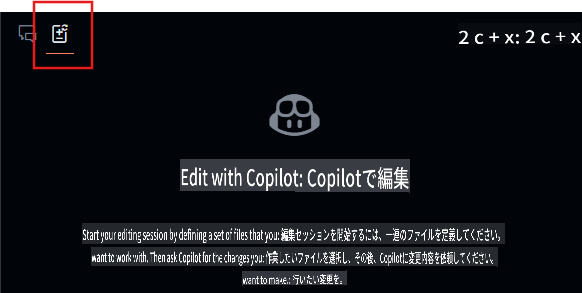  
2. Editsウィンドウから**+Add Files...**ボタンを選択し、**FetchData.razor**と**WeatherForecastClient.cs**を追加します。  
3. チャットに以下を入力します: `ユーザーインターフェイスを更新して、天気を知りたい都市を入力できるようにし、新しいエンドポイントを呼び出して都市もテーブルに表示するようにしてください。`  
4. **送信**ボタンを選択すると、Editsが変更のための反復プランを生成します。  
5. 編集内容を確認し、Editsウィンドウで**Accept**をクリックしてすべての変更を承認します。  
6. アプリケーションを実行します。  

> 注意: アプリケーションが実行されない場合や新しいエンドポイントを呼び出さない場合、変更されたファイルを確認し、エンドポイントが正しく呼び出されていることを確認してください。  

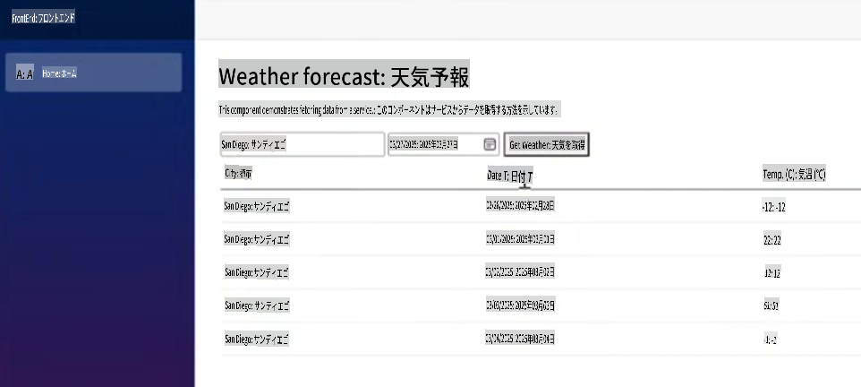  

ここから、スタイリングや他の機能を追加するためにさらに繰り返し作業を行ったり、質問をしたりすることができます。  

## 法的通知

Microsoftおよびその他の寄稿者は、このリポジトリ内のMicrosoftのドキュメントおよびその他のコンテンツに関して[Creative Commons Attribution 4.0 International Public License](https://creativecommons.org/licenses/by/4.0/legalcode)の下でライセンスを付与します。詳細は[LICENSE](../../../04-Using-GitHub-Copilot-with-CSharp/LICENSE)ファイルを参照してください。また、このリポジトリ内のコードについては[MIT License](https://opensource.org/licenses/MIT)の下でライセンスを付与します。詳細は[LICENSE-CODE](../../../04-Using-GitHub-Copilot-with-CSharp/LICENSE-CODE)ファイルを参照してください。  

Microsoft、Windows、Microsoft Azure、その他Microsoft製品およびサービスは、米国およびその他の国でのMicrosoftの商標または登録商標である場合があります。このプロジェクトのライセンスは、Microsoftの名前、ロゴ、商標を使用する権利を付与するものではありません。Microsoftの一般的な商標ガイドラインは[こちら](http://go.microsoft.com/fwlink/?LinkID=254653)で確認できます。  

プライバシーに関する情報は[こちら](https://privacy.microsoft.com/en-us/)で確認できます。  

Microsoftおよびその他の寄稿者は、著作権、特許、商標に関するその他の権利を明示的または黙示的に留保します。

**免責事項**:  
この文書は、機械ベースのAI翻訳サービスを使用して翻訳されています。正確性を期すよう努めておりますが、自動翻訳には誤りや不正確さが含まれる場合があります。元の言語で記載された原文が信頼できる情報源と見なされるべきです。重要な情報については、専門の人間による翻訳をお勧めします。この翻訳の利用によって生じた誤解や誤読について、当方は一切の責任を負いません。