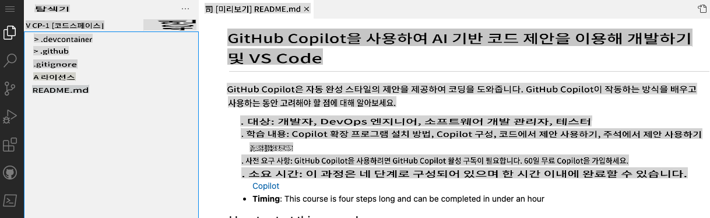
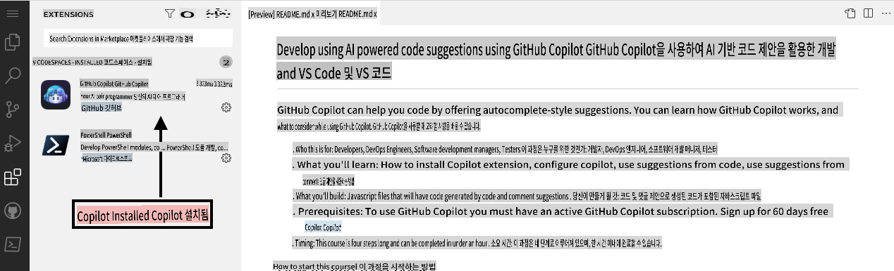

## 1단계: VS Code와 Codespaces를 활용하여 Copilot 사용하기

_"GitHub Copilot과 VS Code를 사용한 AI 코드 추천 개발"에 오신 것을 환영합니다! :wave:_

GitHub Copilot은 코드를 더 빠르고 간편하게 작성할 수 있도록 도와주는 AI 페어 프로그래머입니다. 이 도구는 주석과 코드에서 문맥을 파악하여 개별 코드 줄이나 전체 함수까지 즉시 제안합니다. GitHub Copilot은 OpenAI의 Codex, 즉 OpenAI가 만든 생성형 사전 학습 언어 모델로 구동됩니다.

**Copilot은 VS Code, Visual Studio, JetBrains IDE, Neovim을 포함한 여러 코드 편집기와 호환됩니다.**

또한, GitHub Copilot은 공개 저장소에 등장하는 모든 언어를 학습했습니다. 언어마다 학습 데이터의 양과 다양성에 따라 제안 품질이 달라질 수 있습니다.

Codespace 내에서 Copilot을 사용하면 GitHub의 [협업 코딩](https://github.com/features#features-collaboration) 도구 모음을 얼마나 쉽게 시작할 수 있는지 알 수 있습니다.

> **Note**
> 이 스킬 연습에서는 GitHub Codespace 활용에 중점을 둡니다. 이 연습을 진행하기 전에 GitHub 스킬 [Codespaces](https://github.com/skills/code-with-codespaces)를 완료하는 것을 권장합니다.

### ⌨️ 활동: Codespace에서 Copilot 활성화하기

[](https://codespaces.new/microsoft/mastering-github-copilot-for-dotnet-csharp-developers?devcontainer_path=.devcontainer%2Fintroduction%2Fdevcontainer.json)

**다음 활동을 진행하면서 이 지침을 참조할 수 있도록 별도의 브라우저 탭을 열어 작업하는 것을 추천합니다.**

저장소에서 Codespace를 열기 전에 개발 컨테이너를 생성하고, Codespace에서 사용되거나 설치될 특정 확장 프로그램이나 설정을 정의할 수 있습니다. 이 개발 컨테이너를 생성하고 Copilot을 확장 목록에 추가해 보겠습니다.

1. **.devcontainer/introduction/devcontainer.json** 파일의 본문에 다음 내용을 확인하세요:
   ```
   {
       // Name this configuration
       "name": "Introduction to Copilot",
       "customizations": {
           "vscode": {
               "extensions": [
                   "GitHub.copilot",
                   "ms-dotnettools.csdevkit"
               ]
           }
       }
   }
   ```

작업 중 문제가 발생하면 새 Codespace를 생성할 수 있습니다:

1. 화면 왼쪽 상단의 **Code** 탭을 클릭하여 저장소의 홈 페이지로 이동합니다.
1. 화면 중간에 위치한 **Code** 버튼을 클릭합니다.
1. 팝업 상자에서 **Codespaces** 탭을 클릭합니다.
1. **Create codespace on main** 버튼을 클릭하고 Introduction to Copilot을 선택합니다.

   **Codespace가 준비되기까지 약 2분 정도 기다리세요.**

1. Codespace가 실행 중인지 확인합니다. 브라우저에는 VS Code 웹 기반 편집기와 터미널이 아래와 같이 표시되어야 합니다:
   
1. `copilot` 확장이 VS Code 확장 목록에 표시되어야 합니다. 확장 사이드바 탭을 클릭하면 다음과 같은 화면을 볼 수 있습니다:
   

[연습 2부로 이동하기](./2-skills-dotnet.md)

**면책 조항**:  
이 문서는 기계 기반 AI 번역 서비스를 사용하여 번역되었습니다. 정확성을 위해 최선을 다하고 있지만, 자동 번역에는 오류나 부정확성이 포함될 수 있습니다. 원어로 작성된 원본 문서를 권위 있는 자료로 간주해야 합니다. 중요한 정보의 경우, 전문적인 인간 번역을 권장합니다. 이 번역 사용으로 인해 발생하는 오해나 잘못된 해석에 대해서는 당사가 책임을 지지 않습니다.