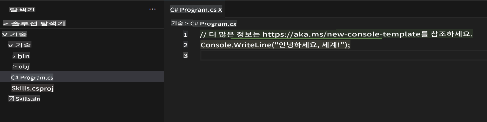
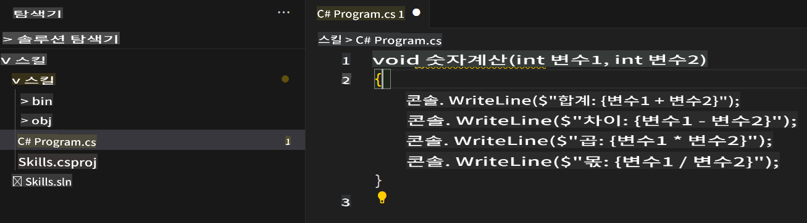

## 2단계: C# 파일에서 Seeing AI 코드 제안 확인하기!

_잘하셨습니다! :tada: Copilot을 설치하는 devcontainer 파일을 사용해 Codespace를 생성하셨네요!_

GitHub Copilot은 다양한 언어와 프레임워크에서 제안을 제공하지만, 특히 Python, JavaScript, TypeScript, Ruby, Go, C# 및 C++에서 뛰어난 성능을 발휘합니다. 아래 예제는 C#로 작성되었지만, 다른 언어에서도 비슷하게 작동합니다.

이번에는 C#을 활용해 Copilot을 사용해 보겠습니다.

> **Note**:
> 위에서 만든 Codespace를 닫았다면, 다시 열거나 새 Codespace를 생성하세요.

### ⌨️ 활동: C# 파일 추가하고 코드 작성하기

> **Note**:
> **Solution Explorer**를 열어 새로운 프로젝트를 추가하고 실행하기 쉽게 정리된 뷰를 확인하세요.

1. `.NET: New Project...` 명령어를 사용해 새 .NET 프로젝트를 생성하고 `Console App`를 선택하세요.
2. **code** 폴더를 선택하고 프로젝트 이름을 **Skills**로 지정하세요.
3. `Program.cs`을 엽니다.
4. 새 파일이 아래와 같이 보이는지 확인하세요.
   

5. `Program.cs` 파일에서 모든 코드를 삭제하고 다음 함수 헤더를 입력하세요.

   ```csharp
   void CalculateNumbers(int var1, int var2)
   {
   ```

   GitHub Copilot이 자동으로 함수 본문 전체를 회색 텍스트로 제안합니다. 아래는 가장 일반적으로 볼 수 있는 예제이지만, 정확한 제안 내용은 다를 수 있습니다.
   

6. `Tab` 키를 눌러 제안을 수락하세요.

### ⌨️ 활동: Codespace에서 코드 저장소로 푸시하기

GitHub Copilot을 사용해 변경 사항을 요약한 다음 코드를 커밋해 보겠습니다.

1. **Source Control** 탭을 엽니다.
2. **Message** 입력란에서 Copilot이 메시지를 생성하도록 ✨ 버튼을 누릅니다.


3. **Commit** 버튼을 클릭합니다.

[연습의 3단계](./3-copilot-hub.md)로 이동하세요.

**면책 조항**:  
이 문서는 기계 기반 AI 번역 서비스를 사용하여 번역되었습니다. 정확성을 위해 최선을 다하고 있지만, 자동 번역에는 오류나 부정확성이 포함될 수 있음을 유의하시기 바랍니다. 원본 문서(원어로 작성된 문서)가 권위 있는 자료로 간주되어야 합니다. 중요한 정보에 대해서는 전문적인 인간 번역을 권장합니다. 이 번역 사용으로 인해 발생하는 오해나 잘못된 해석에 대해 당사는 책임을 지지 않습니다.