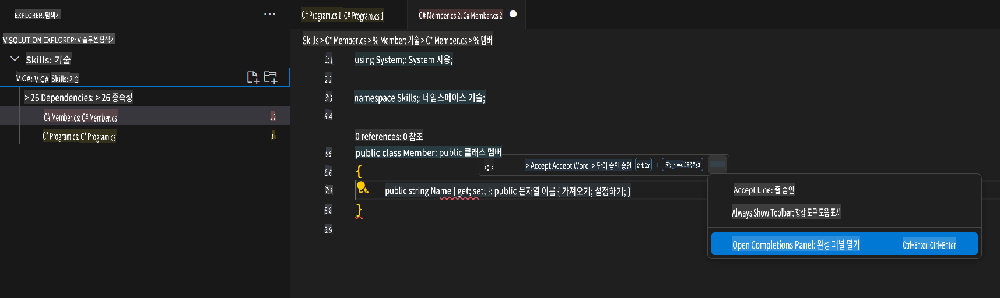

## 3단계: 여러 제안을 볼 수 있는 GitHub Copilot 탭 확인하기

_잘하셨습니다! 이제 C# 파일에서 GitHub Copilot을 사용하여 AI 코드 제안을 활용하셨습니다. :sparkles:_

Copilot을 계속 사용하다 보면 GitHub Copilot이 제공하는 일부 제안을 원하지 않을 수도 있습니다. GitHub Copilot은 새로운 탭에서 여러 제안을 보여줍니다.

### ⌨️ 활동: C# 메서드를 하나 더 추가하고 모든 제안을 확인하기

1. Solution Explorer에서 코드스페이스 안에서 프로젝트를 우클릭하고 새 파일을 생성합니다.

> 참고: 위에서 코드스페이스를 닫았다면 다시 열거나 새 코드스페이스를 생성하세요.

2. **Class**를 선택하고 파일 이름을 `Members.cs`로 지정합니다.
3. `Members.cs` 파일에서 `Member` 클래스 내부에 다음 함수를 작성합니다.  
   ```
   public strin
   ```
4. 입력을 멈추고 빨간 물결선 위에 마우스를 올려 Copilot 제안을 확인한 뒤 `...`
5. Click `Open Completions Panel`. 

   > **Note**
   > If you don't see the copilot code block suggestion or the red squiggly and the three dots `...`, you can type `control + enter` to bring up the GitHub Copilot completions panel.

6. Copilot will synthesize around 10 different code suggestions or press CTRL+Enter. You should see something like this:
   
7. Find a solution you like and click `Accept Solution`.
8. Your `Member.cs` 파일이 솔루션으로 업데이트됩니다.

### ⌨️ 활동: 코드스페이스에서 저장소로 코드 푸시하기

GitHub Copilot을 사용하여 변경 내용을 요약하고 코드를 커밋해 봅시다.

1. **Source Control** 탭을 엽니다.
2. **Message** 입력란에서 ✨ 버튼을 눌러 Copilot이 메시지를 생성하도록 합니다.


3. **Commit** 버튼을 클릭합니다.

[연습의 4단계로 이동하기](./4-copilot-comment.md)

**면책 조항**:  
이 문서는 기계 기반 AI 번역 서비스를 사용하여 번역되었습니다. 정확성을 위해 최선을 다하고 있지만, 자동 번역에는 오류나 부정확성이 포함될 수 있습니다. 원문이 작성된 언어의 문서를 권위 있는 자료로 간주해야 합니다. 중요한 정보의 경우, 전문적인 인간 번역을 권장합니다. 이 번역 사용으로 인해 발생하는 오해나 잘못된 해석에 대해서는 당사가 책임을 지지 않습니다.