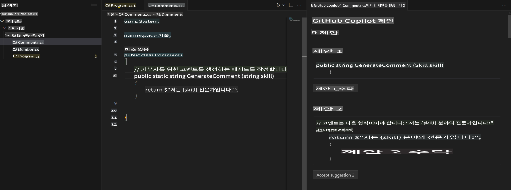
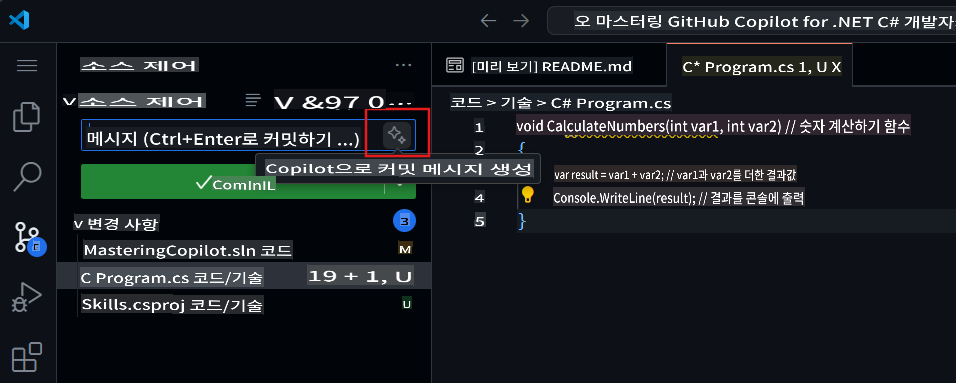

## 4단계: Copilot을 사용해 주석으로 코드 생성하기

_Copilot 탭을 잘 활용하셨네요!_ 🎉

이제 Copilot 빠른 탭 자동 제안과 Copilot 허브를 활용하여 AI가 생성한 제안을 수락하는 방법을 익히셨습니다.

이번에는 주석을 활용하여 Copilot 제안을 생성하는 방법을 알아보겠습니다!

### ⌨️ 활동: 주석으로 Copilot 추천 코드를 생성하기

1. **Solution Explorer**에서 Codespace 안으로 들어가 프로젝트를 우클릭한 후, 새 파일을 생성하세요.

> 참고: 위에서 Codespace를 닫았다면 다시 열거나 새 Codespace를 생성하세요.

2. **Class**를 선택하고 파일 이름을 `Comments.cs`으로 지정하세요.
3. **Comments** 클래스 안에 다음 주석을 입력하세요:
   ```
   // create a method that generates a comment for a given skill
   ```
4. `enter` to go to a new line.
5. Copilot will suggest a code block.
6. Hover over the red squiggly and select the `...`

   > **Note**
   > If you don't see the copilot code block suggestion or the red squiggly and the three dots `...`, you can type `control + enter` to bring up the GitHub Copilot completions panel.

7. Click `Open Completions Panel`. Copilot will synthesise around 10 different code suggestions. You should see something like this:
   
8. Find a solution you like and click `Accept Solution`을 눌러주세요.
9. `Comments.cs` 파일이 솔루션으로 업데이트됩니다.

### ⌨️ 활동: Codespace에서 코드 저장소로 푸시하기

이번에는 GitHub Copilot을 사용해 변경 사항을 요약하고 코드를 커밋해 보겠습니다.

1. **Source Control** 탭을 엽니다.
2. **Message** 입력란에서 ✨ 버튼을 눌러 Copilot이 메시지를 생성하도록 합니다.



3. **Commit** 버튼을 클릭합니다.

[Exercise 4 - Using GitHub Copilot with C#](../../04-Using-GitHub-Copilot-with-CSharp/README.md)로 이동하세요.

**면책 조항**:  
이 문서는 AI 기반 기계 번역 서비스를 사용하여 번역되었습니다. 정확성을 위해 최선을 다하고 있으나, 자동 번역에는 오류나 부정확성이 포함될 수 있습니다. 원어로 작성된 원본 문서를 신뢰할 수 있는 권위 있는 자료로 간주해야 합니다. 중요한 정보의 경우, 전문적인 인간 번역을 권장합니다. 이 번역 사용으로 인해 발생하는 오해나 잘못된 해석에 대해 당사는 책임을 지지 않습니다.