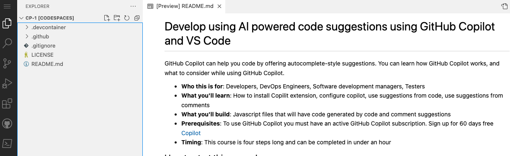
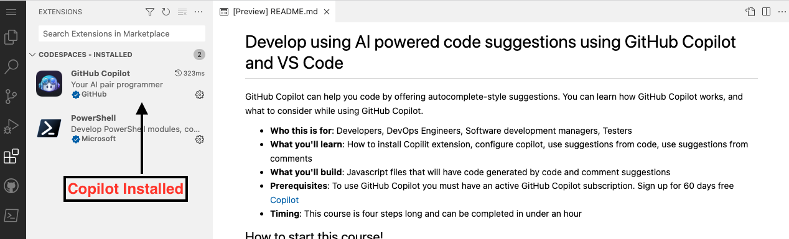

## Etapa 1: Aproveite o Codespaces com o VS Code para o Copilot

_Bem-vindo(a) ao "Desenvolva com Sugestões de Código com Inteligência Artificial Usando GitHub Copilot e VS Code"! :wave:_

O GitHub Copilot é um programador parceiro com IA que ajuda você a escrever código mais rápido e com menos esforço. Ele utiliza o contexto de comentários e código para sugerir linhas individuais e funções completas instantaneamente. O GitHub Copilot é alimentado pelo OpenAI Codex, um modelo de linguagem generativa pré-treinado criado pela OpenAI.

**O Copilot funciona com muitos editores de código, incluindo VS Code, Visual Studio, JetBrains IDE e Neovim.**

Além disso, o GitHub Copilot é treinado em todas as linguagens que aparecem em repositórios públicos. Para cada linguagem, a qualidade das sugestões que você recebe pode depender do volume e da diversidade dos dados de treinamento para essa linguagem.

Usar o Copilot dentro de um Codespace mostra como é fácil começar a usar o conjunto de ferramentas de [Colaboração em Código](https://github.com/features#features-collaboration) do GitHub.

> **Nota**
> Este exercício de habilidades focará em aproveitar o GitHub Codespace. É recomendado que você complete a habilidade do GitHub, [Codespaces](https://github.com/skills/code-with-codespaces), antes de prosseguir com este exercício.

### ⌨️ Atividade: Habilitar o Copilot dentro de um Codespace

[](https://codespaces.new/microsoft/mastering-github-copilot-for-dotnet-csharp-developers?devcontainer_path=.devcontainer%2Fintroduction%2Fdevcontainer.json)

**Recomendamos abrir outra aba do navegador para realizar as atividades a seguir, assim você pode manter estas instruções abertas para referência.**

Antes de abrir um codespace em um repositório, você pode criar um container de desenvolvimento e definir extensões ou configurações específicas que serão usadas ou instaladas no seu codespace. Vamos criar este container de desenvolvimento e adicionar o Copilot à lista de extensões.

1. Observe no corpo do arquivo **.devcontainer/introduction/devcontainer.json** o seguinte conteúdo:
   ```
   {
       // Name this configuration
       "name": "Introduction to Copilot",
       "customizations": {
           "vscode": {
               "extensions": [
                   "GitHub.copilot",
                   "ms-dotnettools.csdevkit"
               ]
           }
       }
   }
   ```

Se você encontrar problemas a qualquer momento, pode criar um novo codespace:

1. Navegue de volta à página inicial do seu repositório clicando na aba **Code** localizada no canto superior esquerdo da tela.
1. Clique no botão **Code** localizado no meio da página.
1. Clique na aba **Codespaces** na caixa que aparece.
1. Clique no botão **Create codespace on main** e selecione Introduction to Copilot.

   **Aguarde cerca de 2 minutos para o codespace ser iniciado.**

1. Verifique se o seu codespace está em execução. O navegador deve conter um editor baseado no VS Code e um terminal deve estar presente, como mostrado abaixo:
   
1. A extensão `copilot` deve aparecer na lista de extensões do VS Code. Clique na aba lateral de extensões. Você deve ver o seguinte:
   

Vá para a [Parte 2 do Exercício](./2-skills-dotnet.md)

**Aviso Legal**:  
Este documento foi traduzido utilizando serviços de tradução baseados em IA. Embora nos esforcemos para garantir a precisão, esteja ciente de que traduções automáticas podem conter erros ou imprecisões. O documento original em seu idioma nativo deve ser considerado a fonte oficial. Para informações críticas, recomenda-se a tradução profissional realizada por humanos. Não nos responsabilizamos por quaisquer mal-entendidos ou interpretações equivocadas decorrentes do uso desta tradução.