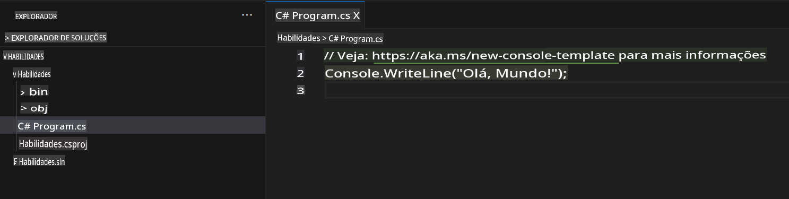
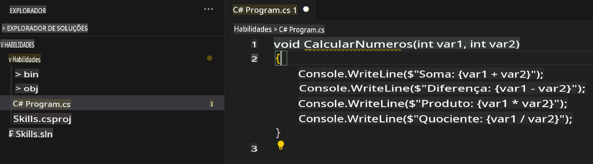

## Etapa 2: Vendo sugestões de código da AI em um arquivo C#!

_Bom trabalho! :tada: Você criou um Codespace usando um arquivo devcontainer que instalou o Copilot!_

O GitHub Copilot oferece sugestões para diversas linguagens e uma ampla variedade de frameworks, mas funciona especialmente bem com Python, JavaScript, TypeScript, Ruby, Go, C# e C++. Os exemplos a seguir estão em C#, mas outras linguagens funcionarão de forma semelhante.

Vamos testar isso utilizando C# com o Copilot.

> **Note**:
> Se você fechou o Codespace mencionado acima, reabra-o ou crie um novo Codespace.

### ⌨️ Atividade: Adicione um arquivo C# e comece a escrever código

> **Note**:
> Certifique-se de abrir o **Solution Explorer** para visualizar os arquivos de forma organizada e adicionar novos projetos facilmente, além de executá-los.

1. Crie um novo projeto .NET usando o comando `.NET: New Project...` e selecionando `Console App`.
1. Selecione a pasta **code** e nomeie o projeto como **Skills**.
1. Abra `Program.cs`.
1. Verifique se o novo arquivo está como mostrado abaixo:
   

1. No arquivo `Program.cs`, remova qualquer código e digite o seguinte cabeçalho de função.

   ```csharp
   void CalculateNumbers(int var1, int var2)
   {
   ```

   O GitHub Copilot sugerirá automaticamente um corpo inteiro da função em texto cinza. Abaixo está um exemplo do que você provavelmente verá, mas a sugestão exata pode variar.
   

5. Pressione `Tab` para aceitar a sugestão.

### ⌨️ Atividade: Enviar código para seu repositório a partir do Codespace

Vamos usar o GitHub Copilot para resumir nossas alterações e depois fazer o commit do código.

1. Abra a aba **Source Control**.
2. Clique no botão ✨ na entrada **Message** para que o Copilot gere sua mensagem.


3. Clique no botão **Commit**.

Vá para [Parte 3 do Exercício](./3-copilot-hub.md)

**Aviso Legal**:  
Este documento foi traduzido utilizando serviços de tradução automática baseados em IA. Embora nos esforcemos para alcançar precisão, esteja ciente de que traduções automatizadas podem conter erros ou imprecisões. O documento original em seu idioma nativo deve ser considerado a fonte oficial. Para informações críticas, recomenda-se a tradução profissional feita por humanos. Não nos responsabilizamos por quaisquer mal-entendidos ou interpretações equivocadas decorrentes do uso desta tradução.