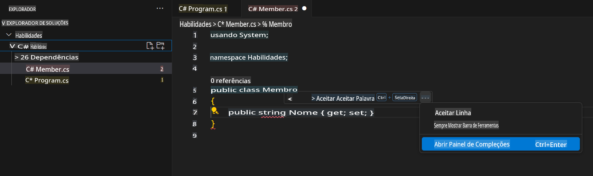

## Etapa 3: Visualize a aba do GitHub Copilot com várias sugestões

_Bom trabalho! Você acabou de usar sugestões de código com IA dentro de um arquivo C# utilizando o GitHub Copilot :sparkles:_

Lembre-se de que, à medida que você continuar usando o Copilot, pode haver sugestões que você não queira aceitar. O GitHub Copilot exibirá várias sugestões em uma nova aba.

### ⌨️ Atividade: Adicione outro método em C# e visualize todas as sugestões

1. Dentro do codespace no Solution Explorer, clique com o botão direito no projeto e crie um novo arquivo.

> Nota: Se você fechou o Codespace anteriormente, reabra-o ou crie um novo Codespace.

2. Selecione **Class** e nomeie o arquivo como `Members.cs`.
3. No arquivo `Members.cs`, digite a seguinte função dentro da classe `Member`.
   ```
   public strin
   ```
4. Pare de digitar e visualize a sugestão do Copilot ao passar o mouse sobre o texto cinza sublinhado em vermelho e selecione `...`
5. Click `Open Completions Panel`. 

   > **Note**
   > If you don't see the copilot code block suggestion or the red squiggly and the three dots `...`, you can type `control + enter` to bring up the GitHub Copilot completions panel.

6. Copilot will synthesize around 10 different code suggestions or press CTRL+Enter. You should see something like this:
   
7. Find a solution you like and click `Accept Solution`.
8. Your ``. O arquivo `Member.cs` será atualizado com sua solução.

### ⌨️ Atividade: Envie o código para seu repositório a partir do codespace

Vamos usar o GitHub Copilot para resumir nossas alterações e, em seguida, fazer o commit do código.

1. Abra a aba **Source Control**.
2. Toque no botão ✨ na entrada **Message** para que o Copilot gere sua mensagem.


3. Clique no botão **Commit**.

Acesse [Parte 4 do Exercício](./4-copilot-comment.md)

**Aviso Legal**:  
Este documento foi traduzido utilizando serviços de tradução automática baseados em IA. Embora nos esforcemos para garantir a precisão, esteja ciente de que traduções automatizadas podem conter erros ou imprecisões. O documento original em seu idioma nativo deve ser considerado a fonte oficial. Para informações críticas, recomenda-se a tradução profissional humana. Não nos responsabilizamos por quaisquer mal-entendidos ou interpretações equivocadas decorrentes do uso desta tradução.