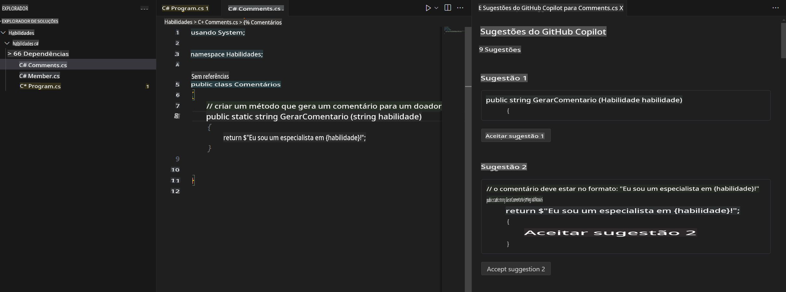

## Etapa 4: Usando comentários para gerar código com o Copilot

_Bom trabalho utilizando a aba do Copilot!_ :partying_face:

Agora você aproveitou a sugestão rápida da aba do Copilot, bem como o hub do Copilot, para aceitar sugestões geradas por IA.

Agora vamos ver como você pode usar comentários para gerar sugestões do Copilot!

### ⌨️ Atividade: Gerar código sugerido pelo Copilot a partir de comentários.

1. Dentro do codespace no Solution Explorer, clique com o botão direito no projeto e crie um novo arquivo.

> Nota: Se você fechou o Codespace anteriormente, reabra-o ou crie um novo Codespace.

2. Selecione **Class** e nomeie o arquivo como `Comments.cs`.
3. Digite o seguinte comentário no arquivo dentro da classe **Comments**:
   ```
   // create a method that generates a comment for a given skill
   ```
4. Pressione `enter` to go to a new line.
5. Copilot will suggest a code block.
6. Hover over the red squiggly and select the `...`

   > **Note**
   > If you don't see the copilot code block suggestion or the red squiggly and the three dots `...`, you can type `control + enter` to bring up the GitHub Copilot completions panel.

7. Click `Open Completions Panel`. Copilot will synthesise around 10 different code suggestions. You should see something like this:
   
8. Find a solution you like and click `Accept Solution`.
9. Seu arquivo `Comments.cs` será atualizado com sua solução.

### ⌨️ Atividade: Enviar código para o seu repositório a partir do codespace

Vamos usar o GitHub Copilot para resumir nossas mudanças e, em seguida, fazer o commit do código.

1. Abra a aba **Source Control**.
2. Clique no botão ✨ na entrada **Message** para que o Copilot gere sua mensagem.


3. Clique no botão **Commit**.

Acesse [Exercício 4 - Usando o GitHub Copilot com C#](../../04-Using-GitHub-Copilot-with-CSharp/README.md)

**Aviso Legal**:  
Este documento foi traduzido utilizando serviços de tradução baseados em IA. Embora nos esforcemos para garantir a precisão, esteja ciente de que traduções automáticas podem conter erros ou imprecisões. O documento original em seu idioma nativo deve ser considerado a fonte autoritativa. Para informações críticas, recomenda-se a tradução profissional humana. Não nos responsabilizamos por quaisquer mal-entendidos ou interpretações equivocadas decorrentes do uso desta tradução.