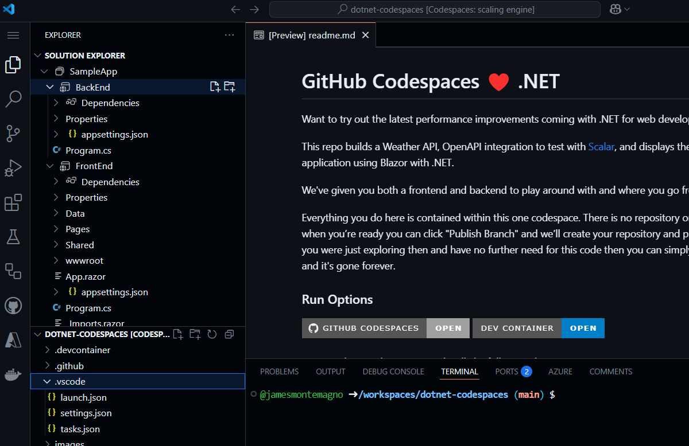
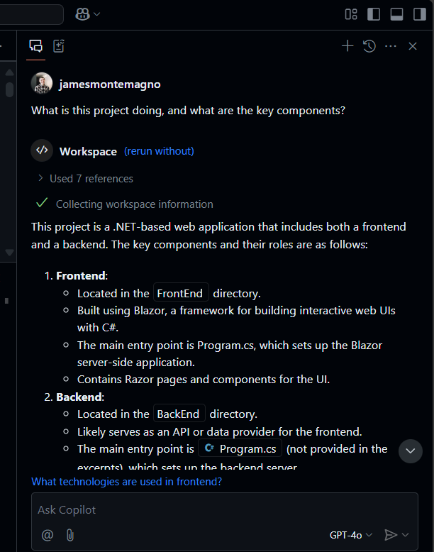
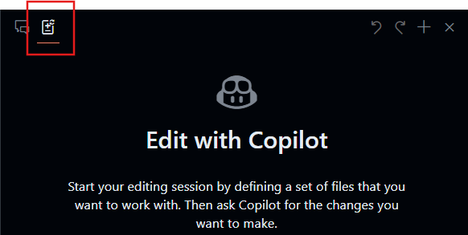
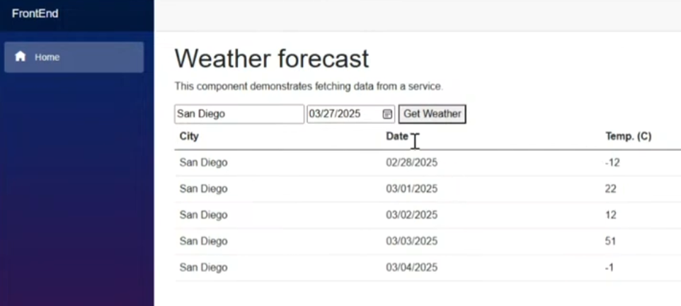

- **Para quem é**: Desenvolvedores, Engenheiros DevOps, Gerentes de desenvolvimento de software, Testadores.  
- **O que você aprenderá**: Como usar o GitHub Copilot para criar código e adicionar comentários ao seu trabalho.  
- **O que você construirá**: Arquivos em C# com código gerado pela IA do Copilot, incluindo sugestões de código e comentários.  
- **Pré-requisitos**: O GitHub Copilot está disponível gratuitamente. Inscreva-se no [GitHub Copilot](https://gh.io/copilot).  
- **Tempo estimado**: Este curso pode ser concluído em menos de uma hora.  

Ao final deste módulo, você terá adquirido habilidades para:  

- Criar prompts para gerar sugestões com o GitHub Copilot.  
- Aplicar o GitHub Copilot para melhorar seus projetos.  

## Leitura pré-requisito:  
- [Introdução à engenharia de prompts com GitHub Copilot](https://learn.microsoft.com/training/modules/introduction-prompt-engineering-with-github-copilot)  

- [O que é a extensão GitHub Copilot para Visual Studio?](https://learn.microsoft.com/en-us/visualstudio/ide/visual-studio-github-copilot-extension?view=vs-2022)  

## Requisitos  

1. Ative seu [serviço GitHub Copilot](https://github.com/github-copilot/signup).  

1. Familiarize-se com [este repositório usando Codespaces](https://github.com/github/dotnet-codespaces).  

## 💪🏽 Exercício  

**Clique com o botão direito no botão Codespaces abaixo para abrir seu Codespace em uma nova aba**  

[](https://codespaces.new/github/dotnet-codespaces)  

O repositório "**GitHub Codespaces ♥️ .NET**" constrói uma API de Clima usando Minimal APIs, abre o Swagger para que você possa chamar e testar a API, e exibe os dados em uma aplicação web usando Blazor com .NET.  

Vamos revisar os passos para atualizar o aplicativo BackEnd de Clima adicionando um novo endpoint que solicita uma localização específica e retorna a previsão do tempo para essa localização.  

### 🤔 Passo 0: Familiarize-se com o repositório "GitHub Codespaces ♥️ .NET"  

Ao abrir o repositório no Codespaces, você verá uma nova janela do navegador com um Codespace totalmente funcional. Tudo neste repositório está contido dentro deste único Codespace. Por exemplo, no painel do explorador, podemos ver o código principal do projeto BackEnd e FrontEnd.  

  

Antes de executar o projeto, vamos usar o GitHub Copilot Chat para perguntar sobre o que é o projeto e os diferentes componentes.  

1. Abra o **GitHub Copilot Chat** na barra de navegação principal.  
1. Digite `What is this project doing, and what are the key components?` e clique em **Enviar**  

O GitHub Copilot Chat agora analisará todo o projeto e nos dará um resumo sobre o que os projetos fazem, quais tecnologias utilizam e quais são seus componentes principais.  

  

A partir daqui, você pode clicar nos arquivos para navegar por eles e fazer perguntas adicionais, como `What APIs are available?`.  

### 🚀 Passo 1: Execute os projetos  

Agora que entendemos o que está no projeto, vamos executá-lo e ver como funciona.  
Para executar o projeto BackEnd, vá ao painel "Run and Debug" e selecione o projeto "BackEnd".  

  

Inicie a depuração do projeto selecionado. O projeto Weather API, nosso projeto BackEnd, agora estará rodando na porta 8080. Podemos copiar a URL publicada no painel *Ports*.  

  

> Nota: Quando você executar a aplicação, verá a mensagem de erro "Esta página não está funcionando". Isso ocorre porque precisamos navegar até o endpoint, conforme detalhado abaixo.  

A aplicação BackEnd publicou um endpoint chamado `weatherforecast` que gera dados de previsão aleatórios. Para testar a aplicação em execução, você pode adicionar `/weatherforecast` à URL publicada. A URL final deve ser semelhante a esta:  

```bash
https://< your url>.app.github.dev/weatherforecast
```  
A aplicação em execução no navegador deve se parecer com esta:  

  

Agora, vamos adicionar um ponto de interrupção em nossa aplicação para depurar cada chamada à API. Vá até `Program.cs` file in the BackEnd project. The file is in the following path `SampleApp\BackEnd\Program.cs`. 

Add a breakpoint in line 24 (press F9) and refresh the browser with the Url to test the endpoint. The browser should not show the weather forecast, and in the Visual Studio Editor we can see how the program execution was paused at line 24.


Pressing F10 we can debug step-by-step until line 32, where we can see the generated values. The application should have been generated samples Weather values for the next 5 days. The variable `forecast` has an array containing these values.


You can stop debugging now.

Congratulations! Now you are ready to add more features into the app using GitHub Copilot.

### 🗒️ Step 2: Get familiarized with GitHub Copilot Slash Commands

As we start working in our codebase, we usually need to refactor some code, or get more context or explanations about it. Using GitHub Copilot Chat, we can have AI-driven conversations to perform these tasks. 

Open the file `Program.cs` in the BackEnd project. The file is in the following path `SampleApp\BackEnd\Program.cs`. 

Now let's use a slash command, in GitHub Copilot to understand a piece of code. Select lines 22-35, press `CTRL + I` to open the inline chat, and type `/explain`.  

  

Dependendo da sua versão do GitHub Copilot, você verá uma resposta inline ou uma atualização no painel de chat. O GitHub Copilot criará uma explicação detalhada do código selecionado. Uma versão resumida seria como esta:  

```
The selected C# code is part of an ASP.NET Core application using the minimal API feature. It defines a GET endpoint at "/weatherforecast" that generates an array of WeatherForecast objects. Each object is created with a date, a random temperature, and a random summary. The endpoint is named "GetWeatherForecast" and has OpenAPI support for standardized API structure documentation.
```  

**Comandos de barra** são comandos especiais que você pode usar no chat para realizar ações específicas no seu código. Por exemplo, você pode usar:  
- `/doc` to add a documentation comment 
- `/explain` to explain the code 
- `/fix` to propose a fix for the problems in the selected code 
- `/generate` to generate code to answer your question

Let's use the `/tests` command to generate tests to the code. Select lines 39-42, press `CTRL + I` to open the inline chat, and type `/tests` (or select the /tests slash command) to generate a new set of tests for this record.


At this point, GitHub Copilot will suggest a new class. You need to first press [Accept] to create the new file. 

A new class `ProgramTests.cs` was created and added to the project. This tests are using XUnit, however, you can ask to generate tests using another Unit Test library with a command like this one `/tests use MSTests for unit testing`.

***Important:** We are not going to use the test file in this project. You must delete the generated test file to continue.*

Finally, let's use the `/doc` to generate automatic documentation to the code. Select lines 39-42, press `CTRL + I` to open the inline chat, and type `/doc` (or select the command) to generate the documentation for this record.


Inline chat, the Chat Panel, and slash commands are part of the amazing tools that support our development experience with GitHub Copilot. Now we are ready to add new features to this App.


### 🗒️ Step 3: Generate a new Record that includes the city name

Go to the `Program.cs` file in the BackEnd project. The file is in the following path `SampleApp\BackEnd\Program.cs`.  

  

Navegue até o final do arquivo e peça ao Copilot para gerar um novo registro que inclua o nome da cidade.  

```csharp
// create a new internal record named WeatherForecastByCity that request the following parameters: City, Date, TemperatureC, Summary
```  

O código gerado deve ser semelhante a este:  

```csharp
// create a new internal record named WeatherForecastByCity that request the following parameters: City, Date, TemperatureC, Summary
internal record WeatherForecastByCity(string City, DateOnly Date, int TemperatureC, string? Summary)
{
    public int TemperatureF => 32 + (int)(TemperatureC / 0.5556);
}
```  

Você pode ver o prompt funcionando na animação a seguir:  

  

### 🔎 Passo 4: Gere um novo endpoint para obter a previsão do tempo de uma cidade  

Agora vamos gerar um novo endpoint de API semelhante ao `/weatherforecast` que também inclua o nome da cidade. O novo endpoint de API será chamado **`/weatherforecastbycity`**.  

***Importante:** Você deve colocar o código após a linha '.WithOpenApi();', que começa na linha 36. Lembre-se também de pressionar TAB em cada nova linha sugerida até que o endpoint inteiro esteja definido.*  

Em seguida, gere um novo endpoint com o GitHub Copilot adicionando o comentário:  

```csharp
// Create a new endpoint named /WeatherForecastByCity/{city}, that accepts a city name in the urls as a paremeter and generates a random forecast for that city
```  
No exemplo a seguir, adicionamos algumas linhas em branco extras após o endpoint anterior e, em seguida, o GitHub Copilot gerou o novo endpoint. Depois que o código principal do Endpoint foi gerado, o GitHub Copilot também sugeriu o nome do endpoint (linha 49) e a especificação OpenAPI (linha 50). Lembre-se de aceitar cada uma dessas sugestões pressionando [TAB].  

  

***Importante**: Este prompt gera várias linhas de código em C#. É altamente recomendável revisar o código gerado para garantir que ele funcione conforme o esperado.*  

O código gerado deve ser semelhante a este:  

```csharp
// Create a new endpoint named /WeatherForecastByCity/{city}, that accepts a city name in the urls as a paremeter and generates a random forecast for that city
app.MapGet("/WeatherForecastByCity/{city}", (string city) =>
{
    var forecast = new WeatherForecastByCity
    (
        city,
        DateOnly.FromDateTime(DateTime.Now),
        Random.Shared.Next(-20, 55),
        summaries[Random.Shared.Next(summaries.Length)]
    );
    return forecast;
})
.WithName("GetWeatherForecastByCity")
.WithOpenApi();
```  

### 🐍 Passo 5: Teste o novo endpoint  

Por fim, verifique se o novo endpoint está funcionando iniciando o projeto a partir do painel Run and Debug.  
Selecione Run and Debug e, em seguida, selecione o projeto BackEnd.  

  

Agora pressione Run e o projeto será compilado e executado. Quando o projeto estiver em execução, podemos testar a URL original usando a URL do Codespace e o endpoint original:  

```bash
https://< your code space url >.app.github.dev/WeatherForecast
```  

E o novo endpoint também estará pronto para ser testado. Aqui estão alguns exemplos de URLs com diferentes cidades:  
```bash
https://< your code space url >.app.github.dev/WeatherForecastByCity/Toronto

https://< your code space url >.app.github.dev/WeatherForecastByCity/Madrid

https://< your code space url >.app.github.dev/WeatherForecastByCity/<AnyCityName>
```  

Ambos os testes em execução devem se parecer com estes:  

  

🚀 Parabéns, durante o exercício você não apenas usou o GitHub Copilot para gerar código, mas também o fez de maneira interativa e divertida! Você pode usar o GitHub Copilot não apenas para gerar código, mas também para escrever documentação, testar suas aplicações e muito mais.  

### ✨ Bônus: Adicione novas funcionalidades com GitHub Copilot Edits  

Vamos usar o **Copilot Edits** para iniciar uma sessão de edição de código com suporte de IA e iterar rapidamente mudanças de código em vários arquivos usando linguagem natural. O Copilot Edits aplica as alterações diretamente no editor, onde você pode revisá-las no contexto completo do código ao redor.  

Vamos adicionar uma nova funcionalidade para que o usuário possa inserir a cidade que deseja buscar e chamar nossa nova API.  

1. Abra a janela **Edits** no GitHub Copilot Chat.  

  
2. Selecione o botão **+Add Files...** na janela Edits e adicione **FetchData.razor** e **WeatherForecastClient.cs**.  
3. Digite no chat: `Atualize a interface do usuário para perguntar ao usuário a cidade que deseja consultar o clima, use o cliente de previsão para chamar o novo endpoint para a cidade e atualize a tabela para exibir a cidade também.`  
4. Selecione o botão **Enviar** e agora o Edits gerará um plano de iteração para as mudanças.  
5. Revise as alterações e clique em **Accept** na janela de edições para aceitar todas as mudanças nos arquivos.  
6. Execute a aplicação.  

> Nota: Se a aplicação não rodar ou não chamar o novo endpoint, valide as alterações nos arquivos modificados e certifique-se de que o endpoint está sendo chamado corretamente.  

  

A partir daqui, você pode continuar iterando e fazer perguntas sobre estilo ou outras funcionalidades para adicionar à aplicação.  

## Avisos Legais  

A Microsoft e quaisquer colaboradores concedem a você uma licença para a documentação da Microsoft e outros conteúdos  
neste repositório sob a [Licença Pública Internacional Creative Commons Attribution 4.0](https://creativecommons.org/licenses/by/4.0/legalcode),  
consulte o arquivo [LICENSE](../../../04-Using-GitHub-Copilot-with-CSharp/LICENSE), e concedem a você uma licença para qualquer código no repositório sob a [Licença MIT](https://opensource.org/licenses/MIT), consulte o  
arquivo [LICENSE-CODE](../../../04-Using-GitHub-Copilot-with-CSharp/LICENSE-CODE).  

Microsoft, Windows, Microsoft Azure e/ou outros produtos e serviços Microsoft referenciados na documentação  
podem ser marcas comerciais ou marcas registradas da Microsoft nos Estados Unidos e/ou outros países.  
As licenças para este projeto não concedem a você direitos para usar quaisquer nomes, logotipos ou marcas registradas da Microsoft.  
As diretrizes gerais de marcas comerciais da Microsoft podem ser encontradas em http://go.microsoft.com/fwlink/?LinkID=254653.  

Informações sobre privacidade podem ser encontradas em https://privacy.microsoft.com/en-us/  

A Microsoft e quaisquer colaboradores reservam todos os outros direitos, sejam eles sob seus respectivos direitos autorais, patentes,  
ou marcas registradas, seja por implicação, preclusão ou de outra forma.  

**Aviso Legal**:  
Este documento foi traduzido usando serviços de tradução automática baseados em IA. Embora nos esforcemos para garantir a precisão, esteja ciente de que traduções automatizadas podem conter erros ou imprecisões. O documento original em seu idioma nativo deve ser considerado a fonte autoritária. Para informações críticas, recomenda-se a tradução humana profissional. Não nos responsabilizamos por quaisquer mal-entendidos ou interpretações equivocadas decorrentes do uso desta tradução.