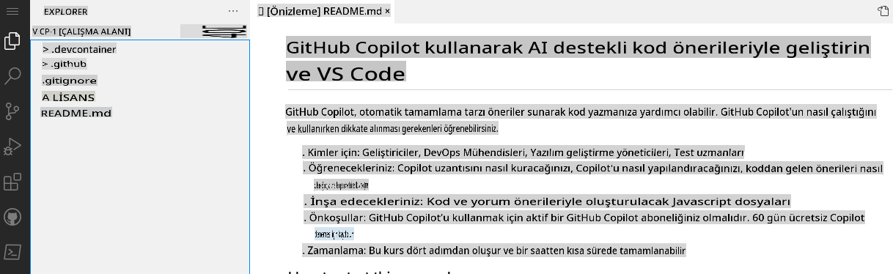
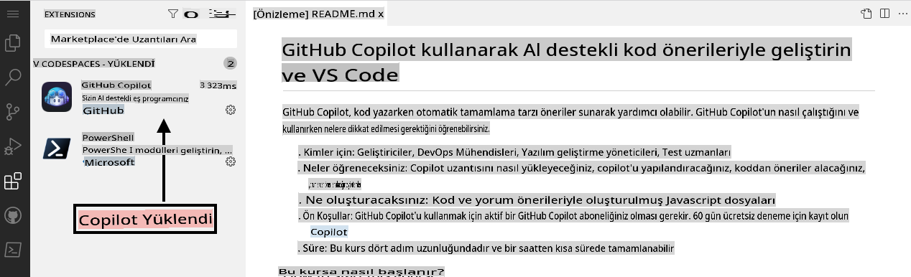

## Adım 1: VS Code ile Codespaces Kullanarak Copilot'tan Yararlanın

_"GitHub Copilot ve VS Code ile AI Destekli Kod Önerileriyle Geliştirme"ye hoş geldiniz! :wave:_

GitHub Copilot, kod yazmayı daha hızlı ve kolay hale getiren bir AI çift programcısıdır. Yorumlardan ve koddan bağlam çıkararak anında tek satırlık veya tüm fonksiyonları önerir. GitHub Copilot, OpenAI tarafından oluşturulan bir üretken önceden eğitilmiş dil modeli olan OpenAI Codex tarafından desteklenmektedir.

**Copilot, VS Code, Visual Studio, JetBrains IDE ve Neovim dahil olmak üzere birçok kod editörüyle çalışır.**

Ayrıca, GitHub Copilot, herkese açık depolarda yer alan tüm diller üzerinde eğitilmiştir. Her dil için aldığınız önerilerin kalitesi, o dil için kullanılan eğitim verilerinin hacmi ve çeşitliliğine bağlı olabilir.

Copilot'ı bir Codespace içinde kullanmak, GitHub'ın [Ortak Çalışma Kodlama](https://github.com/features#features-collaboration) araçlarıyla çalışmaya başlamanın ne kadar kolay olduğunu gösterir.

> **Not**
> Bu beceri alıştırması, GitHub Codespace'ten yararlanmayı ele alacaktır. Bu alıştırmaya geçmeden önce GitHub becerisi olan [Codespaces](https://github.com/skills/code-with-codespaces)'i tamamlamanız önerilir.

### ⌨️ Aktivite: Bir Codespace İçinde Copilot'ı Etkinleştirin

[](https://codespaces.new/microsoft/mastering-github-copilot-for-dotnet-csharp-developers?devcontainer_path=.devcontainer%2Fintroduction%2Fdevcontainer.json)

**Bu talimatları referans olarak açık tutabilmeniz için başka bir tarayıcı sekmesi açarak aşağıdaki aktiviteleri gerçekleştirmenizi öneririz.**

Bir depoda bir codespace açmadan önce, bir geliştirme konteyneri oluşturabilir ve codespace'inizde kullanılacak veya yüklenecek belirli uzantıları ya da yapılandırmaları tanımlayabilirsiniz. Hadi bu geliştirme konteynerini oluşturalım ve copilot'ı uzantı listesine ekleyelim.

1. **.devcontainer/introduction/devcontainer.json** dosyasının içeriğinde aşağıdaki içeriği not alın:
   ```
   {
       // Name this configuration
       "name": "Introduction to Copilot",
       "customizations": {
           "vscode": {
               "extensions": [
                   "GitHub.copilot",
                   "ms-dotnettools.csdevkit"
               ]
           }
       }
   }
   ```

Herhangi bir sorunla karşılaşırsanız, yeni bir codespace oluşturabilirsiniz:

1. Depo ana sayfanıza geri dönmek için ekranın sol üst köşesinde bulunan **Code** sekmesine tıklayın.
1. Sayfanın ortasında bulunan **Code** butonuna tıklayın.
1. Açılan kutucuktaki **Codespaces** sekmesine tıklayın.
1. **Create codespace on main** butonuna tıklayın ve Introduction to Copilot'u seçin.

   **Codespace'in kendisini başlatması için yaklaşık 2 dakika bekleyin.**

1. Codespace'inizin çalıştığını doğrulayın. Tarayıcı, bir VS Code web tabanlı editör içermeli ve aşağıdaki gibi bir terminal mevcut olmalıdır:
   
1. `copilot` uzantısı, VS Code uzantı listesinde görünmelidir. Uzantılar kenar çubuğu sekmesine tıklayın. Aşağıdaki gibi bir görüntü görmelisiniz:
   

[Alıştırmanın 2. Bölümüne Geçin](./2-skills-dotnet.md)

**Feragatname**:  
Bu belge, yapay zeka tabanlı makine çeviri hizmetleri kullanılarak çevrilmiştir. Doğruluk için çaba göstersek de, otomatik çevirilerin hata veya yanlışlıklar içerebileceğini lütfen unutmayın. Belgenin orijinal dili, yetkili kaynak olarak kabul edilmelidir. Kritik bilgiler için profesyonel insan çevirisi önerilir. Bu çevirinin kullanımından kaynaklanan herhangi bir yanlış anlama veya yanlış yorumlama durumunda sorumluluk kabul etmiyoruz.