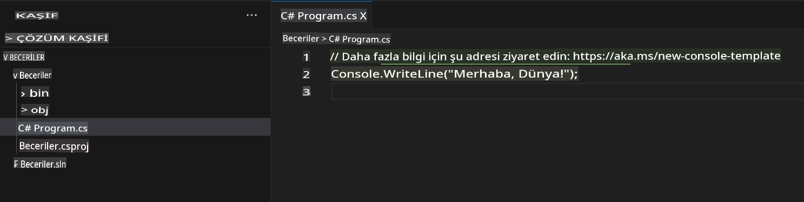
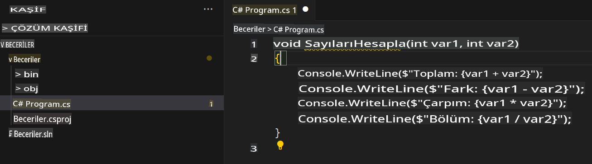
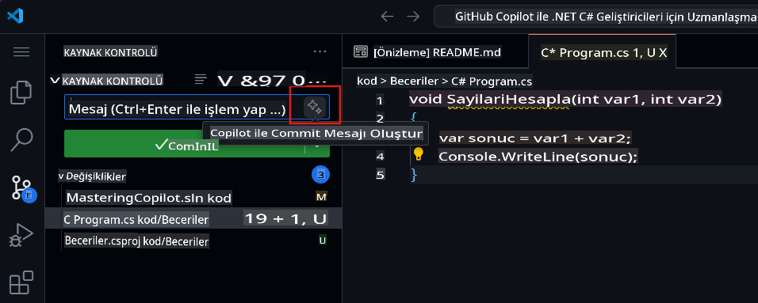

## Adım 2: Bir C# dosyasında Seeing AI kod önerilerini görmek!

_Harika iş çıkardın! :tada: Copilot yükleyen bir devcontainer dosyası kullanarak bir Codespace oluşturdun!_

GitHub Copilot, birçok dil ve geniş bir çerçeve yelpazesi için öneriler sunar, ancak özellikle Python, JavaScript, TypeScript, Ruby, Go, C# ve C++ dillerinde çok iyi çalışır. Aşağıdaki örnekler C# dilindedir, ancak diğer diller de benzer şekilde çalışacaktır.

Haydi, Copilot'u C# kullanarak deneyelim.

> **Not**:
> Eğer yukarıdaki Codespace'i kapattıysanız, lütfen tekrar açın ya da yeni bir Codespace oluşturun.

### ⌨️ Aktivite: Bir C# dosyası ekleyin ve kod yazmaya başlayın

> **Not**:
> Yeni projeler eklemek ve çalıştırmak için düzenli bir görünüm sağlayan **Solution Explorer**'ı açmayı unutmayın.

1. `.NET: New Project...` komutunu kullanarak ve `Console App` seçerek yeni bir .NET projesi oluşturun.
2. **code** klasörünü seçin ve projeye **Skills** adını verin.
3. `Program.cs` dosyasını açın.
4. Yeni dosyanızın şu şekilde göründüğünden emin olun:
   

5. `Program.cs` dosyasındaki tüm kodları silin ve ardından şu fonksiyon başlığını yazın:

   ```csharp
   void CalculateNumbers(int var1, int var2)
   {
   ```

   GitHub Copilot otomatik olarak gri renkte bir fonksiyon gövdesi önerisi sunacaktır. Aşağıda büyük olasılıkla göreceğiniz bir örnek verilmiştir, ancak tam öneri farklılık gösterebilir.
   

6. Öneriyi kabul etmek için `Tab` tuşuna basın.

### ⌨️ Aktivite: Kodunuzu Codespace'ten deposunuza gönderin

Haydi, GitHub Copilot'u değişikliklerimizi özetlemek ve ardından kodu commit etmek için kullanalım.

1. **Source Control** sekmesini açın.
2. **Message** girişindeki ✨ düğmesine dokunarak Copilot'un mesajınızı oluşturmasını sağlayın.



3. **Commit** düğmesine tıklayın.

[Egzersizin 3. Bölümüne geçin](./3-copilot-hub.md)

**Feragatname**:  
Bu belge, makine tabanlı yapay zeka çeviri hizmetleri kullanılarak çevrilmiştir. Doğruluk için çaba göstersek de, otomatik çevirilerin hata veya yanlışlıklar içerebileceğini lütfen unutmayın. Belgenin orijinal dilindeki hali yetkili kaynak olarak kabul edilmelidir. Kritik bilgiler için profesyonel insan çevirisi önerilir. Bu çevirinin kullanımından kaynaklanan yanlış anlama veya yanlış yorumlamalardan sorumlu değiliz.