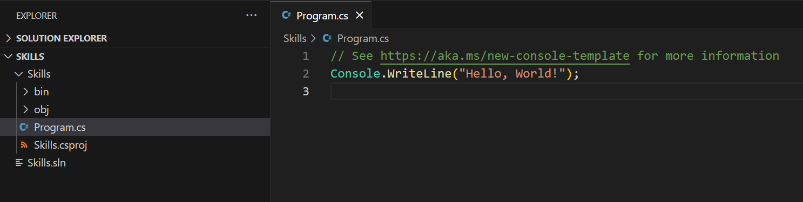
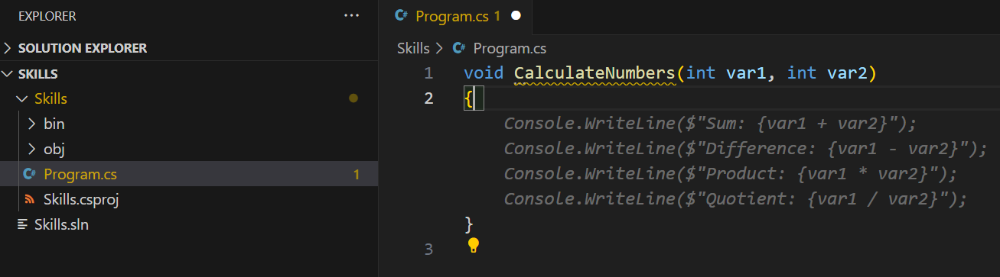

## Adım 2: Bir C# dosyasında Seeing AI kod önerilerini görmek!

_Harika iş çıkardınız! :tada: Copilot'u yükleyen bir devcontainer dosyası kullanarak bir Codespace oluşturdunuz!_

GitHub Copilot, birçok dil ve geniş bir çerçeve yelpazesi için öneriler sunar, ancak özellikle Python, JavaScript, TypeScript, Ruby, Go, C# ve C++ için çok iyi çalışır. Aşağıdaki örnekler C# dilinde verilmiştir, ancak diğer diller de benzer şekilde çalışacaktır.

Hadi, Copilot'u C# kullanarak deneyelim.

> **Not**:
> Yukarıdaki Codespace'i kapattıysanız, lütfen yeniden açın veya yeni bir Codespace oluşturun.

### ⌨️ Aktivite: Bir C# dosyası ekleyin ve kod yazmaya başlayın

> **Not**:
> Yeni projeler eklemek ve çalıştırmak için düzenli bir görünüm sağlayan **Solution Explorer**'ı açtığınızdan emin olun.

1. `.NET: New Project...` komutunu kullanarak ve `Console App` seçerek yeni bir .NET projesi oluşturun.
2. **code** klasörünü seçin ve projeye **Skills** adını verin.
3. `Program.cs` dosyasını açın.
4. Yeni dosyanızın aşağıdaki gibi göründüğünden emin olun:
   

5. `Program.cs` dosyasındaki tüm kodları silin ve ardından aşağıdaki fonksiyon başlığını yazın.

   ```csharp
   void CalculateNumbers(int var1, int var2)
   {
   ```

   GitHub Copilot, otomatik olarak gri metinle bir fonksiyon gövdesi önerisi sunacaktır. Aşağıda muhtemelen göreceğiniz bir örnek verilmiştir, ancak öneriler tam olarak aynı olmayabilir.
   

6. Öneriyi kabul etmek için `Tab` tuşuna basın.

### ⌨️ Aktivite: Codespace'ten kodunuzu depoya gönderin

Hadi, GitHub Copilot'u değişikliklerimizi özetlemek için kullanalım ve ardından kodu commit edelim.

1. **Source Control** sekmesini açın.
2. Copilot'un mesajınızı oluşturması için **Mesaj** girişindeki ✨ butonuna dokunun.


3. **Commit** butonuna tıklayın.

[Egzersizin 3. Bölümüne geçin](./3-copilot-hub.md)

**Feragatname**:  
Bu belge, makine tabanlı yapay zeka çeviri hizmetleri kullanılarak çevrilmiştir. Doğruluk için çaba göstersek de, otomatik çevirilerin hata veya yanlışlıklar içerebileceğini lütfen unutmayın. Belgenin orijinal diliyle yazılmış hali, bağlayıcı kaynak olarak kabul edilmelidir. Kritik bilgiler için profesyonel bir insan çevirisi önerilir. Bu çevirinin kullanımından kaynaklanan herhangi bir yanlış anlama veya yanlış yorumlamadan sorumlu değiliz.