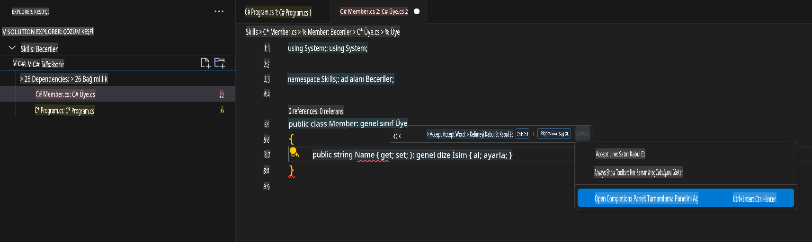

## Adım 3: GitHub Copilot sekmesini birden fazla öneriyle görüntüleme

_Tebrikler! Az önce GitHub Copilot'u kullanarak bir C# dosyasında yapay zeka kod önerilerini kullandınız :sparkles:_

Unutmayın, Copilot'u kullanmaya devam ettikçe GitHub Copilot'un sunduğu bazı önerileri istemeyebilirsiniz. GitHub Copilot, birden fazla öneriyi yeni bir sekmede gösterecektir.

### ⌨️ Aktivite: Başka bir C# metodu ekleyin ve tüm önerileri görüntüleyin

1. Solution Explorer'da kod alanının içindeyken projeye sağ tıklayın ve yeni bir dosya oluşturun.

> Not: Eğer yukarıdaki kod alanını kapattıysanız, lütfen tekrar açın veya yeni bir kod alanı oluşturun.

2. **Class** seçeneğini seçin ve dosyaya `Members.cs` adını verin.
3. `Members.cs` dosyasına, `Member` sınıfının içine şu fonksiyonu yazın:
   ```
   public strin
   ```
4. Yazmayı durdurun ve Copilot önerisini görmek için kırmızı dalgalı gri metnin üzerine gelin, ardından `...`
5. Click `Open Completions Panel`. 

   > **Note**
   > If you don't see the copilot code block suggestion or the red squiggly and the three dots `...`, you can type `control + enter` to bring up the GitHub Copilot completions panel.

6. Copilot will synthesize around 10 different code suggestions or press CTRL+Enter. You should see something like this:
   
7. Find a solution you like and click `Accept Solution`.
8. Your `Member.cs` dosyasının çözümünüzle güncellendiğini göreceksiniz.

### ⌨️ Aktivite: Kodunuzu kod alanından deposuna gönderin

Yaptığımız değişiklikleri özetlemek ve ardından kodu göndermek için GitHub Copilot'u kullanalım.

1. **Source Control** sekmesini açın.
2. **Mesaj** girişindeki ✨ düğmesine dokunun, böylece Copilot mesajınızı oluşturabilir.


3. **Commit** düğmesine tıklayın.

[Egzersizin 4. Bölümüne geçin](./4-copilot-comment.md)

**Feragatname**:  
Bu belge, yapay zeka tabanlı makine çeviri hizmetleri kullanılarak çevrilmiştir. Doğruluk için çaba göstersek de, otomatik çevirilerin hata veya yanlışlıklar içerebileceğini lütfen unutmayın. Belgenin orijinal diliyle hazırlanmış hali, bağlayıcı kaynak olarak kabul edilmelidir. Kritik bilgiler için profesyonel insan çevirisi önerilir. Bu çevirinin kullanımından kaynaklanan yanlış anlamalar veya yanlış yorumlamalardan sorumlu değiliz.