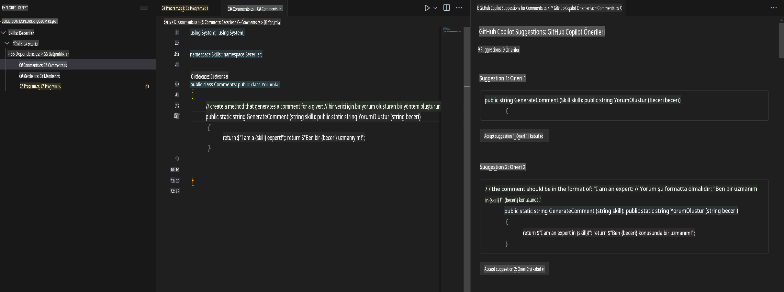

## Adım 4: Yorumları kullanarak Copilot ile kod oluşturma

_Copilot sekmesini kullanarak harika bir iş çıkardınız!_ 🎉

Artık Copilot hızlı sekme otomatik önerilerini ve Copilot hub'ını kullanarak yapay zeka tarafından oluşturulan önerileri kabul etmiş oldunuz.

Şimdi, yorumları nasıl kullanarak Copilot önerileri alabileceğinizi görelim!

### ⌨️ Aktivite: Yorumlardan Copilot önerili kod oluşturma.

1. Solution Explorer'daki kod alanında projeye sağ tıklayın ve yeni bir dosya oluşturun.

> Not: Yukarıdaki kod alanını kapattıysanız lütfen tekrar açın ya da yeni bir kod alanı oluşturun.

2. **Class** seçeneğini seçin ve dosyayı `Comments.cs` olarak adlandırın.
3. **Comments** sınıfının içine şu yorumu yazın:
   ```
   // create a method that generates a comment for a given skill
   ```
4. `enter` to go to a new line.
5. Copilot will suggest a code block.
6. Hover over the red squiggly and select the `...`

   > **Note**
   > If you don't see the copilot code block suggestion or the red squiggly and the three dots `...`, you can type `control + enter` to bring up the GitHub Copilot completions panel.

7. Click `Open Completions Panel`. Copilot will synthesise around 10 different code suggestions. You should see something like this:
   
8. Find a solution you like and click `Accept Solution` tuşlarına basın.
9. `Comments.cs` dosyanız çözümünüzle güncellenecek.

### ⌨️ Aktivite: Kod alanından kodu depoya gönderme

Değişikliklerimizi özetlemek için GitHub Copilot'u kullanalım ve ardından kodu commit edelim.

1. **Source Control** sekmesini açın.
2. **Message** girişinde Copilot'un mesajınızı oluşturması için ✨ düğmesine tıklayın.


3. **Commit** düğmesine tıklayın.

[Alıştırma 4 - GitHub Copilot'u C# ile Kullanma](../../04-Using-GitHub-Copilot-with-CSharp/README.md) bölümüne gidin.

**Feragatname**:  
Bu belge, makine tabanlı yapay zeka çeviri hizmetleri kullanılarak çevrilmiştir. Doğruluk için çaba göstersek de, otomatik çevirilerin hata veya yanlışlık içerebileceğini lütfen unutmayın. Belgenin orijinal diliyle hazırlanmış hali, yetkili kaynak olarak kabul edilmelidir. Kritik bilgiler için profesyonel insan çevirisi önerilir. Bu çevirinin kullanımından kaynaklanan yanlış anlamalar veya yanlış yorumlamalar için sorumluluk kabul edilmez.