- **Kimler için**: Geliştiriciler, DevOps Mühendisleri, Yazılım geliştirme yöneticileri, Test uzmanları.  
- **Ne öğreneceksiniz**: GitHub Copilot'u kullanarak kod oluşturmayı ve işinize yorum eklemeyi.  
- **Ne oluşturacaksınız**: Kod ve yorum önerileri için Copilot AI tarafından oluşturulan kod içeren C# dosyaları.  
- **Ön koşullar**: GitHub Copilot ücretsiz olarak kullanılabilir, [GitHub Copilot](https://gh.io/copilot) için kaydolun.  
- **Süre**: Bu kurs bir saatten kısa sürede tamamlanabilir.  

Bu modülün sonunda, şu becerileri kazanmış olacaksınız:

- GitHub Copilot'tan öneriler oluşturmak için istemler hazırlama.  
- GitHub Copilot'u projelerinizi geliştirmek için uygulama.  

## Ön koşul okuma:  
- [GitHub Copilot ile istem mühendisliğine giriş](https://learn.microsoft.com/training/modules/introduction-prompt-engineering-with-github-copilot)  

- [Visual Studio için GitHub Copilot uzantısı nedir?](https://learn.microsoft.com/en-us/visualstudio/ide/visual-studio-github-copilot-extension?view=vs-2022)  

## Gereksinimler  

1. [GitHub Copilot hizmetinizi etkinleştirin](https://github.com/github-copilot/signup)  

1. [Bu Codespaces deposuna](https://github.com/github/dotnet-codespaces) aşina olun  

## 💪🏽 Egzersiz  

**Codespaces'i yeni bir sekmede açmak için aşağıdaki Codespaces butonuna sağ tıklayın**  

[](https://codespaces.new/github/dotnet-codespaces)  

"**GitHub Codespaces ♥️ .NET**" deposu, Minimal API'ler kullanarak bir Hava Durumu API'si oluşturur, Swagger'ı açar, böylece API'yi çağırabilir ve test edebilir, ardından verileri .NET ile Blazor kullanarak bir web uygulamasında görüntüler.  

Hava Durumu BackEnd Uygulamasını belirli bir konumu isteyen ve o konum için hava durumu tahmini döndüren yeni bir uç nokta ekleyerek nasıl güncelleyeceğimizi gözden geçireceğiz.  

### 🤔 Adım 0: "GitHub Codespaces ♥️ .NET" deposuna aşina olun  

Depoyu Codespaces'te açtığınızda, tamamen işlevsel bir Codespace içeren yeni bir tarayıcı penceresi göreceksiniz. Bu depodaki her şey bu tek Codespace içinde yer alır. Örneğin, keşif panelinde BackEnd ve FrontEnd projelerinin ana kodunu görebiliriz.  

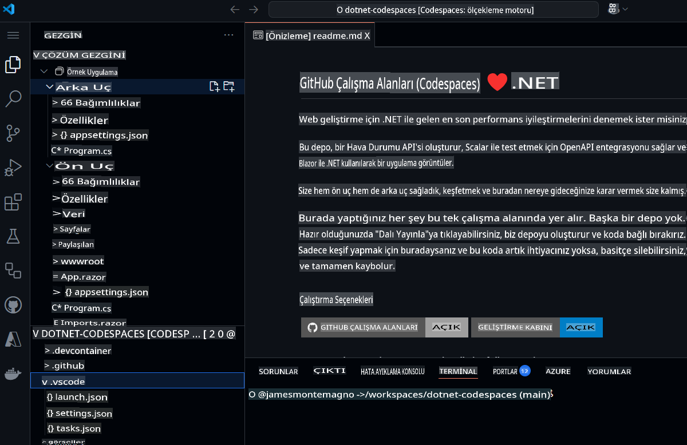  

Projeyi çalıştırmadan önce, projenin ne olduğu ve farklı bileşenler hakkında bilgi edinmek için GitHub Copilot Chat'i kullanalım.  

1. Ana gezinme çubuğundan **GitHub Copilot Chat**'i açın.  
1. `What is this project doing, and what are the key components?` yazın ve **Gönder** butonuna tıklayın.  

GitHub Copilot Chat şimdi tüm projeyi inceleyecek ve projelerin ne yaptığını, hangi teknolojileri kullandığını ve içerdikleri temel bileşenleri özetleyecek.  

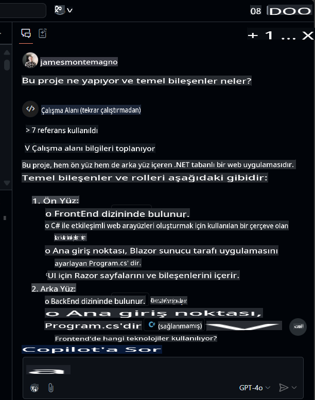  

Buradan dosyalara tıklayarak gezinebilir ve `What APIs are available?` gibi takip soruları sorabilirsiniz.  

### 🚀 Adım 1: Projeleri çalıştırın  

Artık projede neler olduğunu bildiğimize göre, onu çalıştırıp eylemde görelim.  
BackEnd projesini çalıştırmak için "Çalıştır ve Hata Ayıkla" paneline gidin ve "BackEnd" Projesini seçin.  

  

Seçili projeyi hata ayıklamaya başlayın. Hava Durumu API projesi, BackEnd projemiz artık 8080 portunda çalışacak. *Ports* panelinden yayınlanan URL'yi kopyalayabiliriz.  

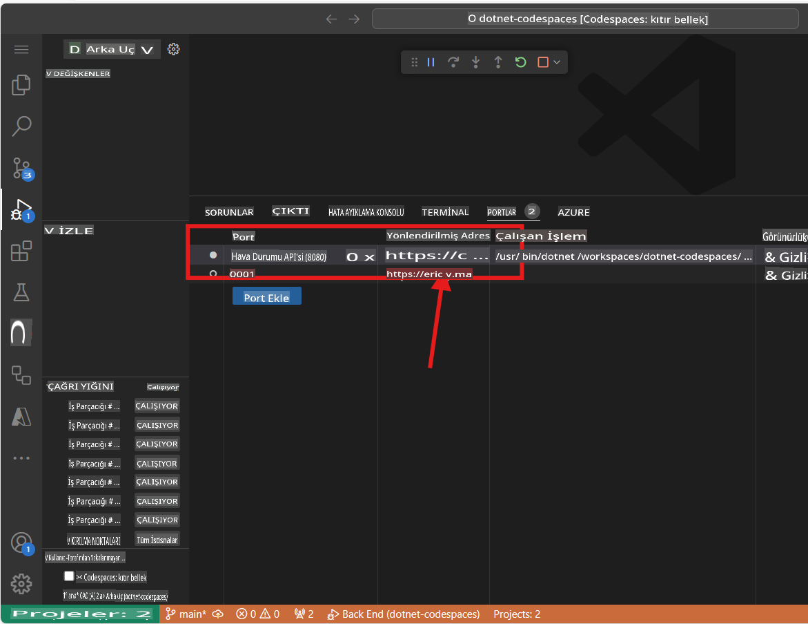  

> Not: Uygulamayı çalıştırdığınızda "Bu sayfa çalışmıyor" hata mesajını göreceksiniz. Bunun nedeni, aşağıda detaylandırılan uç noktaya gitmemiz gerektiğidir.  

BackEnd uygulaması, rastgele tahmin verileri üreten `weatherforecast` adlı bir uç nokta yayınladı. Çalışan uygulamayı test etmek için yayınlanan URL'ye `/weatherforecast` ekleyebilirsiniz. Nihai URL şu şekilde olmalıdır:  

```bash
https://< your url>.app.github.dev/weatherforecast
```  
Tarayıcıda çalışan uygulama bu şekilde görünmelidir.  

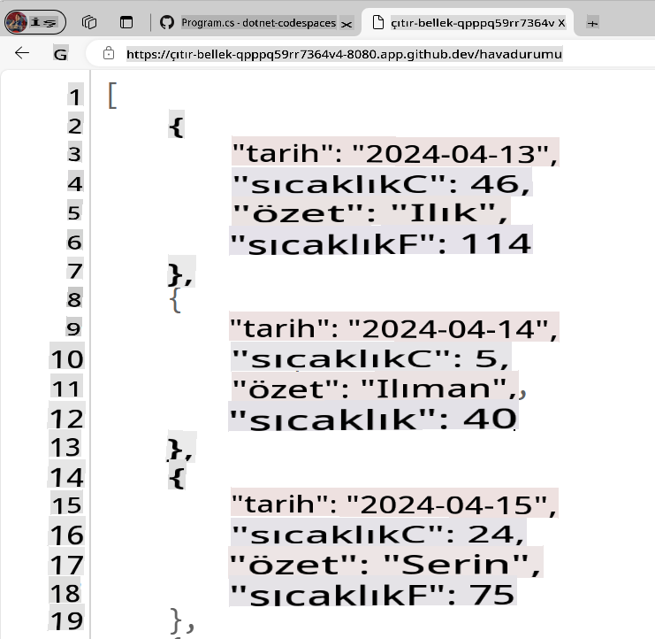  

Şimdi uygulamamızdaki her API çağrısını hata ayıklamak için bir durak noktası ekleyelim. `Program.cs` file in the BackEnd project. The file is in the following path `SampleApp\BackEnd\Program.cs`. 

Add a breakpoint in line 24 (press F9) and refresh the browser with the Url to test the endpoint. The browser should not show the weather forecast, and in the Visual Studio Editor we can see how the program execution was paused at line 24.

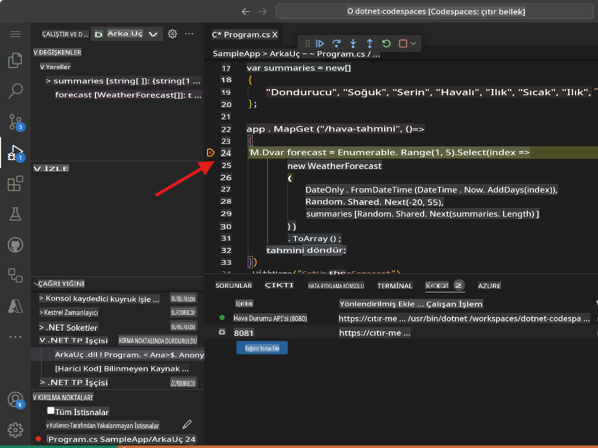

Pressing F10 we can debug step-by-step until line 32, where we can see the generated values. The application should have been generated samples Weather values for the next 5 days. The variable `forecast` has an array containing these values.

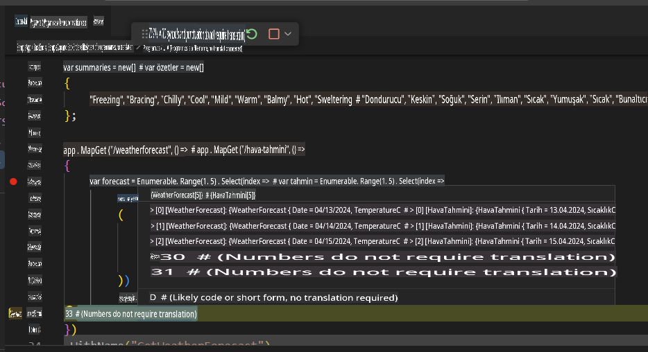

You can stop debugging now.

Congratulations! Now you are ready to add more features into the app using GitHub Copilot.

### 🗒️ Step 2: Get familiarized with GitHub Copilot Slash Commands

As we start working in our codebase, we usually need to refactor some code, or get more context or explanations about it. Using GitHub Copilot Chat, we can have AI-driven conversations to perform these tasks. 

Open the file `Program.cs` in the BackEnd project. The file is in the following path `SampleApp\BackEnd\Program.cs`. 

Now let's use a slash command, in GitHub Copilot to understand a piece of code. Select lines 22-35, press `CTRL + I` to open the inline chat, and type `/explain` dosyasına gidin.  

  

GitHub Copilot sürümünüze bağlı olarak, ya bir satır içi yanıt ya da Sohbet Panelinde bir güncelleme göreceksiniz. GitHub Copilot seçilen kodun ayrıntılı bir açıklamasını oluşturacak. Özetlenmiş bir versiyonu şu şekilde olacaktır:  

```
The selected C# code is part of an ASP.NET Core application using the minimal API feature. It defines a GET endpoint at "/weatherforecast" that generates an array of WeatherForecast objects. Each object is created with a date, a random temperature, and a random summary. The endpoint is named "GetWeatherForecast" and has OpenAPI support for standardized API structure documentation.
```  

**Eğik çizgi komutları**, kodunuzda belirli işlemleri gerçekleştirmek için sohbette kullanabileceğiniz özel komutlardır. Örneğin, şunları kullanabilirsiniz:  
- `/doc` to add a documentation comment 
- `/explain` to explain the code 
- `/fix` to propose a fix for the problems in the selected code 
- `/generate` to generate code to answer your question

Let's use the `/tests` command to generate tests to the code. Select lines 39-42, press `CTRL + I` to open the inline chat, and type `/tests` (or select the /tests slash command) to generate a new set of tests for this record.


At this point, GitHub Copilot will suggest a new class. You need to first press [Accept] to create the new file. 

A new class `ProgramTests.cs` was created and added to the project. This tests are using XUnit, however, you can ask to generate tests using another Unit Test library with a command like this one `/tests use MSTests for unit testing`.

***Important:** We are not going to use the test file in this project. You must delete the generated test file to continue.*

Finally, let's use the `/doc` to generate automatic documentation to the code. Select lines 39-42, press `CTRL + I` to open the inline chat, and type `/doc` (or select the command) to generate the documentation for this record.


Inline chat, the Chat Panel, and slash commands are part of the amazing tools that support our development experience with GitHub Copilot. Now we are ready to add new features to this App.


### 🗒️ Step 3: Generate a new Record that includes the city name

Go to the `Program.cs` file in the BackEnd project. The file is in the following path `SampleApp\BackEnd\Program.cs`.  

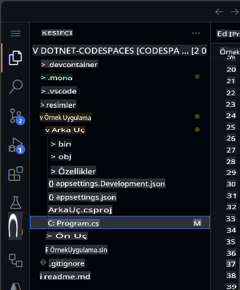  

Dosyanın sonuna gidin ve Copilot'tan şehir adını içeren yeni bir kayıt oluşturmasını isteyin.  

```csharp
// create a new internal record named WeatherForecastByCity that request the following parameters: City, Date, TemperatureC, Summary
```  

Oluşturulan kod şu şekilde olmalıdır:  

```csharp
// create a new internal record named WeatherForecastByCity that request the following parameters: City, Date, TemperatureC, Summary
internal record WeatherForecastByCity(string City, DateOnly Date, int TemperatureC, string? Summary)
{
    public int TemperatureF => 32 + (int)(TemperatureC / 0.5556);
}
```  

Aşağıdaki animasyonda istemin nasıl çalıştığını görebilirsiniz:  

  

### 🔎 Adım 4: Bir şehir için hava durumu tahmini almak üzere yeni bir uç nokta oluşturun  

Şimdi `/weatherforecast`'e benzer, ancak şehir adını da içeren yeni bir API uç noktası oluşturalım. Yeni API uç noktasının adı **`/weatherforecastbycity`** olacaktır.  

***Önemli:** Kodun '.WithOpenApi();' satırından sonra yerleştirilmesi gerektiğini unutmayın, bu satır 36. satırda başlıyor. Ayrıca, tüm uç nokta tanımlanana kadar önerilen her yeni satırı kabul etmek için TAB tuşuna basmayı unutmayın.*  

Ardından, şu yorumu ekleyerek GitHub Copilot ile yeni bir uç nokta oluşturun:  

```csharp
// Create a new endpoint named /WeatherForecastByCity/{city}, that accepts a city name in the urls as a paremeter and generates a random forecast for that city
```  
Aşağıdaki örnekte, önceki uç noktadan sonra birkaç ekstra boş satır ekledik ve ardından GitHub Copilot yeni uç noktayı oluşturdu. Uç Nokta'nın çekirdek kodu oluşturulduktan sonra, GitHub Copilot uç nokta adı (satır 49) ve OpenAPI spesifikasyonu (satır 50) için de kod önerdi. Bu önerileri kabul etmek için her biri için [TAB] tuşuna basmayı unutmayın.  

  

***Önemli**: Bu istem, birkaç satır C# kodu oluşturur. Oluşturulan kodun istenen şekilde çalıştığından emin olmak için kontrol edilmesi ve gözden geçirilmesi şiddetle tavsiye edilir.*  

Oluşturulan kod şu şekilde görünmelidir:  

```csharp
// Create a new endpoint named /WeatherForecastByCity/{city}, that accepts a city name in the urls as a paremeter and generates a random forecast for that city
app.MapGet("/WeatherForecastByCity/{city}", (string city) =>
{
    var forecast = new WeatherForecastByCity
    (
        city,
        DateOnly.FromDateTime(DateTime.Now),
        Random.Shared.Next(-20, 55),
        summaries[Random.Shared.Next(summaries.Length)]
    );
    return forecast;
})
.WithName("GetWeatherForecastByCity")
.WithOpenApi();
```  

### 🐍 Adım 5: Yeni uç noktayı test edin  

Son olarak, projeyi "Çalıştır ve Hata Ayıkla" panelinden başlatarak yeni uç noktanın çalıştığını doğrulayın.  
"Çalıştır ve Hata Ayıkla"yı seçin, ardından BackEnd projesini seçin.  

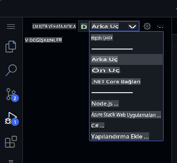  

Şimdi Çalıştır'a basın ve proje derlenip çalıştırılmalıdır. Proje çalıştırıldığında, Codespace URL'inizi ve orijinal uç noktayı kullanarak orijinal URL'yi test edebiliriz:  

```bash
https://< your code space url >.app.github.dev/WeatherForecast
```  

Ve yeni uç nokta da test edilmeye hazır olacaktır. Farklı şehirlerle bazı örnek URL'ler şunlardır:  
```bash
https://< your code space url >.app.github.dev/WeatherForecastByCity/Toronto

https://< your code space url >.app.github.dev/WeatherForecastByCity/Madrid

https://< your code space url >.app.github.dev/WeatherForecastByCity/<AnyCityName>
```  

Her iki test de şu şekilde görünmelidir:  

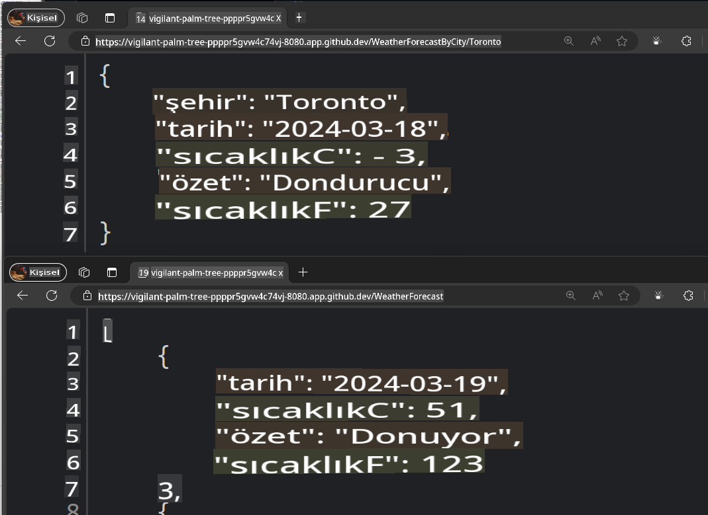  

🚀 Tebrikler, bu egzersiz boyunca GitHub Copilot'u yalnızca kod oluşturmak için değil, aynı zamanda bunu etkileşimli ve eğlenceli bir şekilde yapmak için kullandınız! GitHub Copilot'u yalnızca kod oluşturmak için değil, aynı zamanda dokümantasyon yazmak, uygulamalarınızı test etmek ve daha fazlası için kullanabilirsiniz.  

### ✨ Bonus: GitHub Copilot Edits ile yeni yetenekler ekleyin  

Hadi **Copilot Edits**'i kullanarak bir yapay zeka destekli kod düzenleme oturumu başlatalım ve birden fazla dosyada doğal dil kullanarak hızlıca kod değişiklikleri yapalım. Copilot Edits, düzenlemeleri doğrudan editörde uygular, böylece çevredeki kodun tam bağlamıyla yerinde inceleyebilirsiniz.  

Kullanıcının istediği şehri girebileceği ve yeni API'mizi çağırabileceği bir işlevsellik ekleyelim.  

1. GitHub Copilot Chat'teki **Edits** mod penceresini açın  

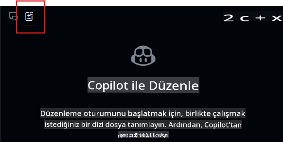  
2. Edits penceresinden **+Add Files...** butonunu seçin ve **FetchData.razor** ve **WeatherForecastClient.cs** dosyalarını ekleyin.  
3. Sohbete şu metni yazın: `Kullanıcı arayüzünü, kullanıcının hava durumu istediği şehri sormak için güncelle, yeni uç noktayı şehir için çağırmak için tahmin istemcisini kullan ve tabloyu şehri de gösterecek şekilde güncelle.`  
4. **Gönder** butonuna tıklayın ve Edits, değişiklikler için bir yineleme planı oluşturacaktır.  
5. Düzenlemeleri gözden geçirin ve **Kabul Et** butonuna basarak dosyalardaki tüm değişiklikleri kabul edin.  
6. Uygulamayı çalıştırın  

> Not: Uygulama çalışmazsa veya yeni uç noktayı çağırmazsa, değiştirilen dosyalardaki değişiklikleri doğrulayın ve uç noktanın doğru şekilde çağrıldığından emin olun.  

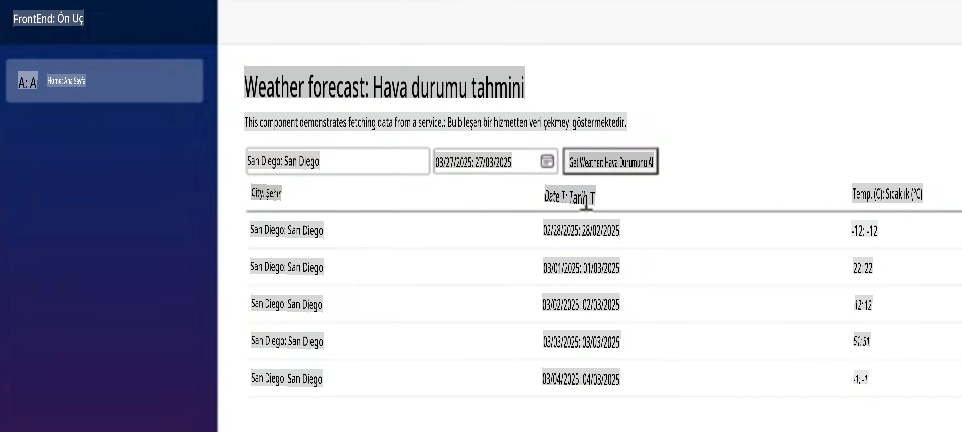  

Buradan, uygulamaya eklemek istediğiniz stil veya diğer işlevsellikler hakkında sorular sormaya ve yinelemeye devam edebilirsiniz.  

## Yasal Bildirimler  

Microsoft ve katkıda bulunanlar, bu depodaki Microsoft dokümantasyonu ve diğer içeriklere [Creative Commons Attribution 4.0 International Public License](https://creativecommons.org/licenses/by/4.0/legalcode) altında bir lisans verir, [LICENSE](../../../04-Using-GitHub-Copilot-with-CSharp/LICENSE) dosyasına bakın, ve bu depodaki herhangi bir kod için [MIT License](https://opensource.org/licenses/MIT) altında bir lisans verir, [LICENSE-CODE](../../../04-Using-GitHub-Copilot-with-CSharp/LICENSE-CODE) dosyasına bakın.  

Microsoft, Windows, Microsoft Azure ve/veya dokümantasyonda atıfta bulunulan diğer Microsoft ürün ve hizmetleri, Amerika Birleşik Devletleri ve/veya diğer ülkelerde Microsoft'un ticari markaları veya tescilli ticari markaları olabilir.  
Bu proje için lisanslar, Microsoft'un adlarını, logolarını veya ticari markalarını kullanma hakkı vermez.  
Microsoft'un genel ticari marka yönergeleri şu adreste bulunabilir: http://go.microsoft.com/fwlink/?LinkID=254653.  

Gizlilik bilgileri şu adreste bulunabilir: https://privacy.microsoft.com/en-us/  

Microsoft ve katkıda bulunanlar, telif hakları, patentler veya ticari markalar altında ima, engel veya başka bir şekilde olsun, diğer tüm hakları saklı tutar.  

**Feragatname**:  
Bu belge, yapay zeka tabanlı makine çeviri hizmetleri kullanılarak çevrilmiştir. Doğruluk için çaba göstersek de, otomatik çevirilerin hata veya yanlışlıklar içerebileceğini lütfen unutmayın. Orijinal belge, kendi ana dilindeki haliyle yetkili kaynak olarak kabul edilmelidir. Kritik bilgiler için profesyonel insan çevirisi önerilir. Bu çevirinin kullanımından kaynaklanan yanlış anlamalar veya yanlış yorumlamalar için sorumluluk kabul etmiyoruz.