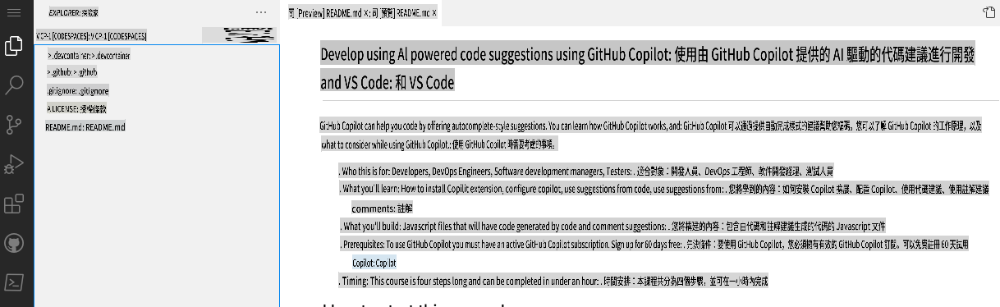
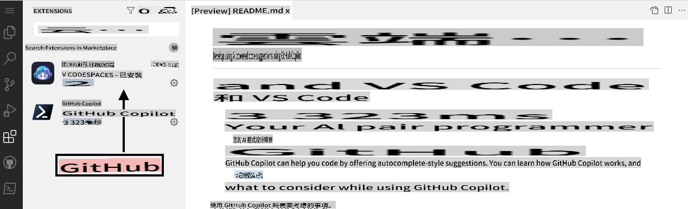

## 第一步：在 Codespaces 中結合 VS Code 使用 Copilot

_歡迎來到「利用 GitHub Copilot 和 VS Code 開發 AI 驅動的程式碼建議」！:wave:_

GitHub Copilot 是一個 AI 配對程式員，能幫助你更快速、更輕鬆地撰寫程式碼。它會根據註解和程式碼的上下文，即時提供單行或整個函式的建議。GitHub Copilot 是由 OpenAI Codex 提供技術支援，這是一個由 OpenAI 開發的生成式預訓練語言模型。

**Copilot 支援多種程式碼編輯器，包括 VS Code、Visual Studio、JetBrains IDE 和 Neovim。**

此外，GitHub Copilot 的訓練數據涵蓋所有公開倉庫中出現的程式語言。對於每種語言，你收到的建議品質可能取決於該語言的訓練數據量與多樣性。

在 Codespace 中使用 Copilot，能展示出 GitHub 的 [協作編程](https://github.com/features#features-collaboration) 工具套件是多麼簡單易用。

> **注意**
> 本技能練習將專注於利用 GitHub Codespace。建議在進行此練習前，先完成 GitHub 技能課程 [Codespaces](https://github.com/skills/code-with-codespaces)。

### ⌨️ 活動：在 Codespace 中啟用 Copilot

[](https://codespaces.new/microsoft/mastering-github-copilot-for-dotnet-csharp-developers?devcontainer_path=.devcontainer%2Fintroduction%2Fdevcontainer.json)

**建議開啟另一個瀏覽器分頁來進行以下活動，這樣可以方便參考這些指引。**

在開啟一個倉庫的 Codespace 之前，你可以建立一個開發容器，並定義將在 Codespace 中使用或安裝的特定擴展或配置。我們來建立這個開發容器，並將 Copilot 加入擴展列表中。

1. 注意 **.devcontainer/introduction/devcontainer.json** 檔案的內容如下：
   ```
   {
       // Name this configuration
       "name": "Introduction to Copilot",
       "customizations": {
           "vscode": {
               "extensions": [
                   "GitHub.copilot",
                   "ms-dotnettools.csdevkit"
               ]
           }
       }
   }
   ```

如果你在任何時候遇到問題，可以建立一個新的 Codespace：

1. 點擊螢幕左上角的 **Code** 分頁，返回到倉庫的首頁。
2. 點擊頁面中間的 **Code** 按鈕。
3. 在彈出的框中，點擊 **Codespaces** 分頁。
4. 點擊 **Create codespace on main** 按鈕，並選擇 Introduction to Copilot。

   **等待大約 2 分鐘，讓 Codespace 自行啟動。**

5. 確認你的 Codespace 已啟動。瀏覽器應顯示一個基於網頁的 VS Code 編輯器，並且應包含一個終端機，如下圖所示：
   
6. `copilot` 擴展應該會出現在 VS Code 的擴展列表中。點擊擴展側邊欄標籤，你應該會看到以下內容：
   

前往 [練習的第二部分](./2-skills-dotnet.md)

**免責聲明**：  
本文件使用機器翻譯AI服務進行翻譯。雖然我們努力確保準確性，但請注意，自動翻譯可能包含錯誤或不精確之處。原文文件（以其原始語言編寫）應被視為具有權威性的來源。對於關鍵資訊，建議尋求專業人工翻譯。我們對因使用此翻譯而產生的任何誤解或錯誤解釋不承擔責任。