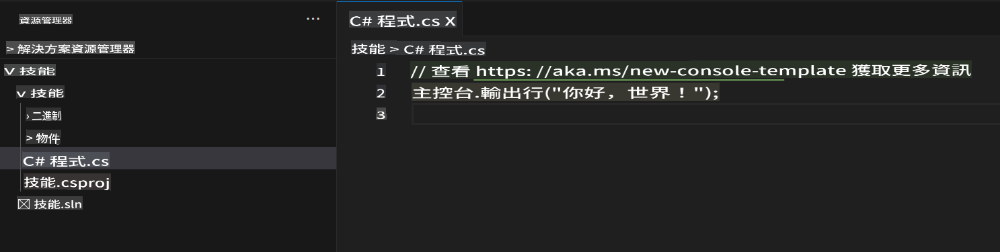
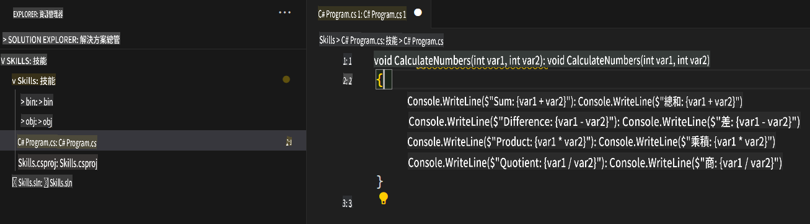

## 步驟 2：在 C# 文件中查看 AI 程式碼建議！

_做得好！🎉 你使用 devcontainer 文件創建了一個 Codespace，並安裝了 Copilot！_

GitHub Copilot 提供了對多種語言和框架的建議，特別是在 Python、JavaScript、TypeScript、Ruby、Go、C# 和 C++ 中表現尤為出色。以下範例使用 C#，但其他語言的使用方式類似。

讓我們嘗試使用 C# 來體驗 Copilot 的功能。

> **注意**：
> 如果你之前關閉了 Codespace，請重新打開或創建一個新的 Codespace。

### ⌨️ 活動：新增一個 C# 文件並開始編寫程式碼

> **注意**：
> 請確保開啟 **Solution Explorer**，以便查看更有條理的視圖，輕鬆新增新專案並執行它們。

1. 使用 `.NET: New Project...` 指令並選擇 `Console App`，創建一個新的 .NET 專案。
2. 選擇 **code** 資料夾，並將專案命名為 **Skills**。
3. 開啟 `Program.cs`
4. 確認你的新文件看起來像這樣：
   

5. 在 `Program.cs` 文件中，移除任何程式碼，然後輸入以下函式標頭。

   ```csharp
   void CalculateNumbers(int var1, int var2)
   {
   ```

   GitHub Copilot 將自動以灰色文字建議整個函式的內容。以下是你可能會看到的範例，但具體建議可能有所不同。
   

6. 按下 `Tab` 接受建議。

### ⌨️ 活動：從 Codespace 將程式碼推送到你的儲存庫

讓我們使用 GitHub Copilot 來總結我們的變更，然後提交程式碼。

1. 打開 **Source Control** 標籤。
2. 點擊 **Message** 輸入框中的 ✨ 按鈕，讓 Copilot 生成你的提交訊息。


3. 點擊 **Commit** 按鈕。

前往 [練習的第 3 部分](./3-copilot-hub.md)。

**免責聲明**：  
本文件使用機器翻譯AI服務進行翻譯。我們努力確保翻譯的準確性，但請注意，自動翻譯可能會包含錯誤或不準確之處。應以原始語言的文件作為權威來源。對於關鍵信息，建議尋求專業人工翻譯。我們對因使用本翻譯而產生的任何誤解或誤讀概不負責。