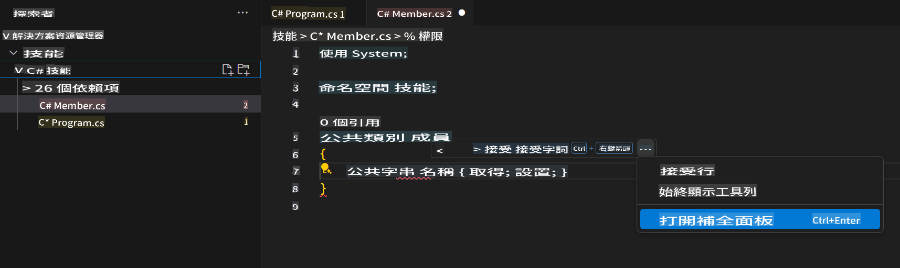
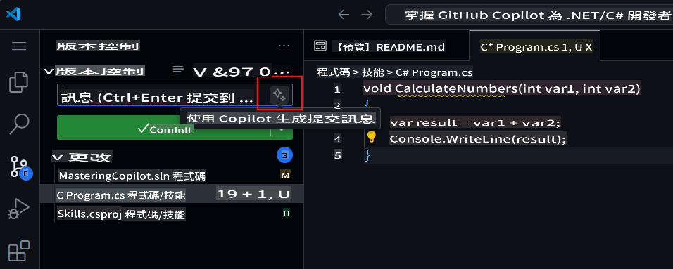

## 步驟 3：查看 GitHub Copilot 標籤中的多個建議

_做得好！你剛剛透過 GitHub Copilot 在 C# 文件中使用了 AI 代碼建議功能 :sparkles:_

請記住，隨著你持續使用 Copilot，你可能不需要 GitHub Copilot 提供的某些建議。GitHub Copilot 會在新標籤中顯示多個建議。

### ⌨️ 活動：新增另一個 C# 方法並查看所有建議

1. 在 Solution Explorer 的 Codespace 中，右鍵點擊專案，建立一個新檔案。

> 注意：如果你之前關閉了 Codespace，請重新打開它或建立一個新的 Codespace。

2. 選擇 **Class** 並將檔案命名為 `Members.cs`  
3. 在 `Members.cs` 檔案中，在 `Member` 類別內鍵入以下函數。  
   ```
   public strin
   ```  
4. 停止鍵入，透過將滑鼠懸停於紅色波浪線的灰色文字末端，查看 Copilot 建議，並選擇 `...`
5. Click `Open Completions Panel`. 

   > **Note**
   > If you don't see the copilot code block suggestion or the red squiggly and the three dots `...`, you can type `control + enter` to bring up the GitHub Copilot completions panel.

6. Copilot will synthesize around 10 different code suggestions or press CTRL+Enter. You should see something like this:
   
7. Find a solution you like and click `Accept Solution`.
8. Your `Member.cs` 檔案將根據你的解決方案更新。

### ⌨️ 活動：從 Codespace 推送代碼到你的儲存庫

讓我們使用 GitHub Copilot 來總結我們的更改，然後提交代碼。

1. 打開 **Source Control** 標籤  
2. 點擊 **Message** 輸入框中的 ✨ 按鈕，讓 Copilot 生成你的提交訊息。



3. 點擊 **Commit** 按鈕。

前往 [練習的第 4 部分](./4-copilot-comment.md)

**免責聲明**：  
本文檔使用基於機器的人工智能翻譯服務進行翻譯。儘管我們努力保證翻譯的準確性，但請注意，自動翻譯可能包含錯誤或不準確之處。應以原始語言的文件作為權威來源。對於關鍵信息，建議尋求專業的人工作翻譯。我們對因使用此翻譯而產生的任何誤解或錯誤解釋不承擔責任。