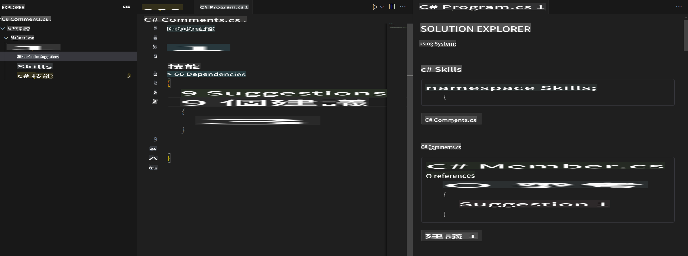

## 第 4 步：使用註解來生成 Copilot 代碼

_很好地利用了 Copilot 標籤！_ :partying_face:

你現在已經利用了 Copilot 快速標籤的自動建議功能以及 Copilot 中心來接受 AI 生成的建議。

現在讓我們來看看如何通過註解來生成 Copilot 的建議！

### ⌨️ 活動：通過註解生成 Copilot 建議的代碼

1. 在 Solution Explorer 的代碼空間內，右鍵點擊專案，創建一個新文件。

> 注意：如果你之前關閉了代碼空間，請重新打開或創建一個新的代碼空間。

2. 選擇 **Class** 並將文件命名為 `Comments.cs`  
3. 在 **Comments** 類內輸入以下註解：  
   ```
   // create a method that generates a comment for a given skill
   ```  
4. 按下 `enter` to go to a new line.
5. Copilot will suggest a code block.
6. Hover over the red squiggly and select the `...`

   > **Note**
   > If you don't see the copilot code block suggestion or the red squiggly and the three dots `...`, you can type `control + enter` to bring up the GitHub Copilot completions panel.

7. Click `Open Completions Panel`. Copilot will synthesise around 10 different code suggestions. You should see something like this:
   
8. Find a solution you like and click `Accept Solution`。  
9. 你的 `Comments.cs` 文件將會更新為你的解決方案。

### ⌨️ 活動：從代碼空間推送代碼到你的存儲庫

讓我們利用 GitHub Copilot 來總結我們的變更，然後提交代碼。

1. 打開 **Source Control** 標籤  
2. 點擊 **Message** 輸入框中的 ✨ 按鈕，讓 Copilot 生成提交信息。


3. 點擊 **Commit** 按鈕。

前往 [練習 4 - 使用 GitHub Copilot 與 C#](../../04-Using-GitHub-Copilot-with-CSharp/README.md)

**免責聲明**：  
本文件使用基於機器的人工智能翻譯服務進行翻譯。儘管我們努力確保準確性，但請注意，自動翻譯可能包含錯誤或不準確之處。應以原文文件作為權威來源。對於關鍵資訊，建議使用專業人工翻譯。我們對因使用此翻譯而引起的任何誤解或錯誤解釋概不負責。