- **適用對象**: 開發人員、DevOps 工程師、軟體開發經理、測試人員。
- **你將學到什麼**: 如何使用 GitHub Copilot 來撰寫程式碼並為你的工作添加註解。
- **你將建立什麼**: 包含由 Copilot AI 生成的程式碼和註解建議的 C# 檔案。
- **先決條件**: GitHub Copilot 可免費使用，註冊 [GitHub Copilot](https://gh.io/copilot)。
- **所需時間**: 本課程可在一小時內完成。

完成本模組後，你將具備以下技能：

- 撰寫提示以從 GitHub Copilot 獲取建議。
- 應用 GitHub Copilot 改進你的專案。

## 必備閱讀:
- [GitHub Copilot 提示工程入門](https://learn.microsoft.com/training/modules/introduction-prompt-engineering-with-github-copilot)

- [什麼是 Visual Studio 的 GitHub Copilot 擴展？](https://learn.microsoft.com/en-us/visualstudio/ide/visual-studio-github-copilot-extension?view=vs-2022)

## 要求

1. 啟用你的 [GitHub Copilot 服務](https://github.com/github-copilot/signup)

2. 熟悉 [此帶有 Codespaces 的儲存庫](https://github.com/github/dotnet-codespaces)

## 💪🏽 練習

**右鍵點擊以下的 Codespaces 按鈕以在新標籤頁中打開你的 Codespace**

[](https://codespaces.new/github/dotnet-codespaces)

"**GitHub Codespaces ♥️ .NET**" 儲存庫構建了一個使用 Minimal APIs 的天氣 API，開啟 Swagger 以便你可以調用和測試該 API，並使用 Blazor 與 .NET 在 Web 應用程式中顯示數據。

我們將回顧更新天氣後端應用程式的步驟，通過添加一個新的端點來請求特定位置並返回該位置的天氣預報。

### 🤔 步驟 0：熟悉 "GitHub Codespaces ♥️ .NET" 儲存庫

當你在 Codespaces 中打開儲存庫後，你會看到一個全功能的 Codespace 瀏覽器窗口。該儲存庫的所有內容都包含在這個 Codespace 中。例如，在資源瀏覽面板中，我們可以看到後端和前端專案的主要程式碼。

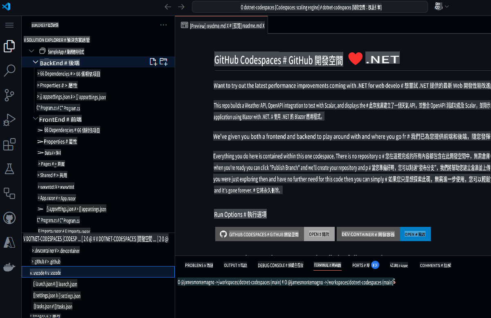

在運行專案之前，我們先使用 GitHub Copilot Chat 來詢問該專案的內容及其不同的組件。

1. 從主導航欄中打開 **GitHub Copilot Chat**。
2. 輸入 `What is this project doing, and what are the key components?` 並點擊 **發送**。

GitHub Copilot Chat 現在將查看整個專案，並給出專案的摘要，包括其功能、使用的技術和關鍵組件。

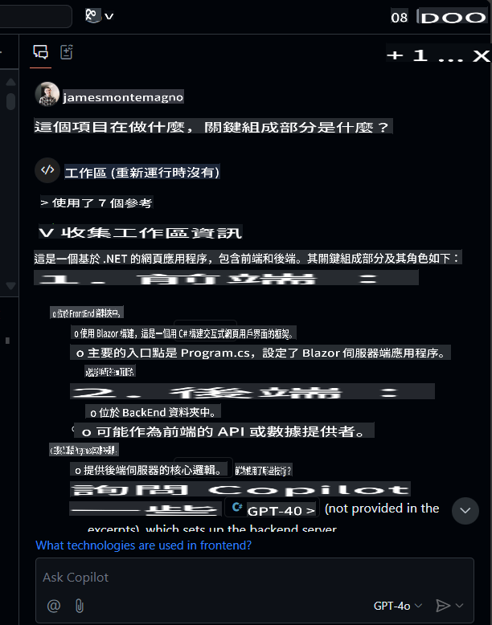

從這裡，你可以點擊檔案進行導航，並且可以詢問後續問題，例如 `What APIs are available?`。

### 🚀 步驟 1：運行專案

現在我們已經了解了專案的內容，讓我們運行它來看看效果。
為了運行後端專案，請進入 "Run and Debug" 面板，並選擇 "BackEnd" 專案。

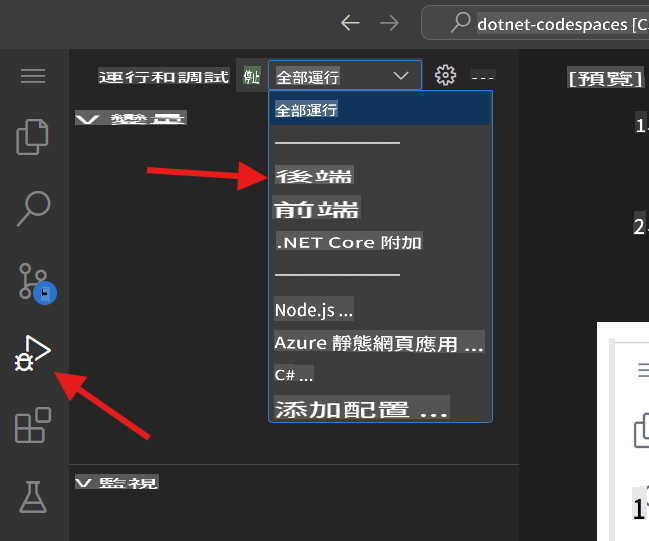

開始調試所選專案。天氣 API 專案（我們的後端專案）現在將在埠 8080 運行。我們可以從 *Ports* 面板中複製發布的 URL。

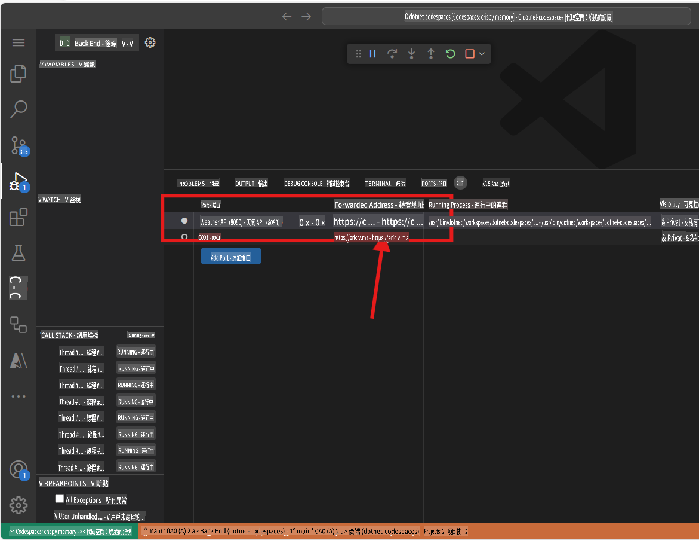

> 注意：當你運行應用程式時，可能會看到 "此頁面無法正常運作" 的錯誤訊息。這是因為我們需要導航到指定的端點，詳情如下。

後端應用程式發布了一個名為 `weatherforecast` 的端點，用於生成隨機的天氣預報數據。要測試當前運行的應用程式，你可以將 `/weatherforecast` 添加到發布的 URL。最終的 URL 應類似於這樣：

```bash
https://< your url>.app.github.dev/weatherforecast
```
在瀏覽器中運行的應用程式應如下所示。

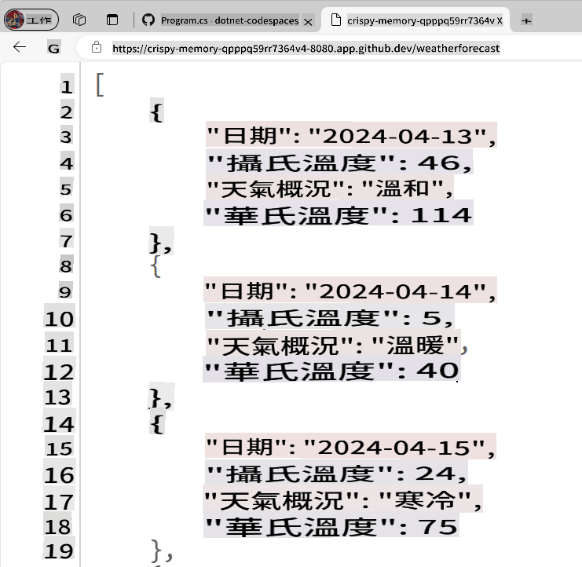

現在讓我們在應用程式中添加一個斷點，以調試每次對 API 的調用。進入 `Program.cs` file in the BackEnd project. The file is in the following path `SampleApp\BackEnd\Program.cs`. 

Add a breakpoint in line 24 (press F9) and refresh the browser with the Url to test the endpoint. The browser should not show the weather forecast, and in the Visual Studio Editor we can see how the program execution was paused at line 24.

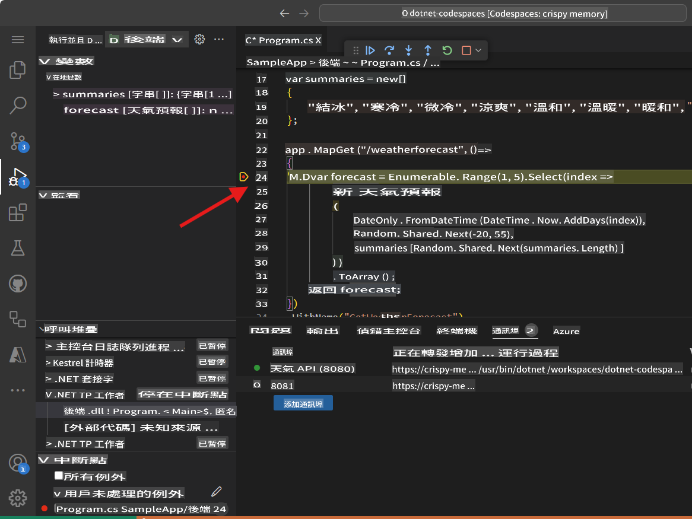

Pressing F10 we can debug step-by-step until line 32, where we can see the generated values. The application should have been generated samples Weather values for the next 5 days. The variable `forecast` has an array containing these values.

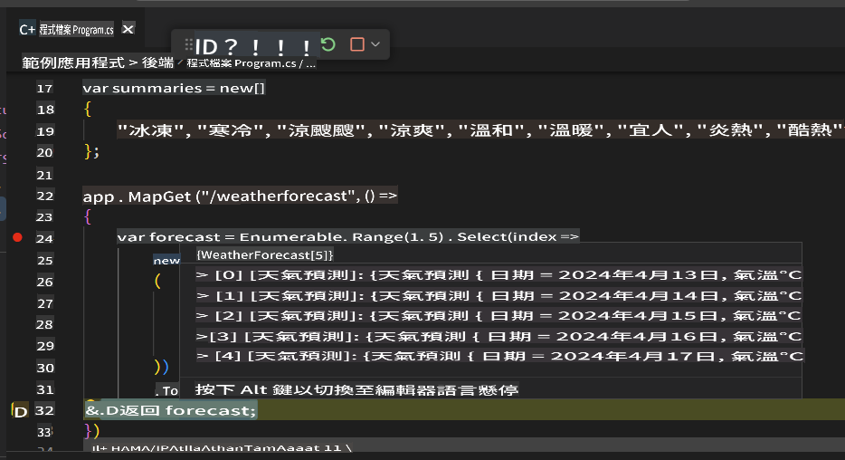

You can stop debugging now.

Congratulations! Now you are ready to add more features into the app using GitHub Copilot.

### 🗒️ Step 2: Get familiarized with GitHub Copilot Slash Commands

As we start working in our codebase, we usually need to refactor some code, or get more context or explanations about it. Using GitHub Copilot Chat, we can have AI-driven conversations to perform these tasks. 

Open the file `Program.cs` in the BackEnd project. The file is in the following path `SampleApp\BackEnd\Program.cs`. 

Now let's use a slash command, in GitHub Copilot to understand a piece of code. Select lines 22-35, press `CTRL + I` to open the inline chat, and type `/explain`。


根據你使用的 GitHub Copilot 版本，你將看到內嵌回應或 Chat 面板中的更新。GitHub Copilot 將為選定的程式碼生成詳細解釋。總結版本如下所示：

```
The selected C# code is part of an ASP.NET Core application using the minimal API feature. It defines a GET endpoint at "/weatherforecast" that generates an array of WeatherForecast objects. Each object is created with a date, a random temperature, and a random summary. The endpoint is named "GetWeatherForecast" and has OpenAPI support for standardized API structure documentation.
```

**斜杠命令** 是一種特殊命令，可用於在聊天中對程式碼執行特定操作。例如，你可以使用：
- `/doc` to add a documentation comment 
- `/explain` to explain the code 
- `/fix` to propose a fix for the problems in the selected code 
- `/generate` to generate code to answer your question

Let's use the `/tests` command to generate tests to the code. Select lines 39-42, press `CTRL + I` to open the inline chat, and type `/tests` (or select the /tests slash command) to generate a new set of tests for this record.


At this point, GitHub Copilot will suggest a new class. You need to first press [Accept] to create the new file. 

A new class `ProgramTests.cs` was created and added to the project. This tests are using XUnit, however, you can ask to generate tests using another Unit Test library with a command like this one `/tests 使用 MSTests 進行單元測試`.

***Important:** We are not going to use the test file in this project. You must delete the generated test file to continue.*

Finally, let's use the `/doc` to generate automatic documentation to the code. Select lines 39-42, press `CTRL + I` to open the inline chat, and type `/doc` (or select the command) to generate the documentation for this record.


Inline chat, the Chat Panel, and slash commands are part of the amazing tools that support our development experience with GitHub Copilot. Now we are ready to add new features to this App.


### 🗒️ Step 3: Generate a new Record that includes the city name

Go to the `Program.cs` file in the BackEnd project. The file is in the following path `SampleApp\BackEnd\Program.cs`。

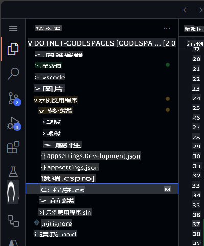

導航到檔案末尾，並要求 Copilot 生成一個包含城市名稱的新記錄。

```csharp
// create a new internal record named WeatherForecastByCity that request the following parameters: City, Date, TemperatureC, Summary
```

生成的程式碼應類似於以下內容：

```csharp
// create a new internal record named WeatherForecastByCity that request the following parameters: City, Date, TemperatureC, Summary
internal record WeatherForecastByCity(string City, DateOnly Date, int TemperatureC, string? Summary)
{
    public int TemperatureF => 32 + (int)(TemperatureC / 0.5556);
}
```

你可以在以下動畫中查看提示的工作過程：


### 🔎 步驟 4：生成一個新端點以獲取特定城市的天氣預報

現在讓我們生成一個類似於 `/weatherforecast` 的新 API 端點，同時包含城市名稱。新 API 端點名稱將為 **`/weatherforecastbycity`**。

***重要事項**: 你必須將程式碼放置在 '.WithOpenApi();' 行之後，這從第 36 行開始。此外，記得在每行新建議的程式碼上按下 TAB，直到整個端點定義完成。*

接下來，通過添加以下註解，使用 GitHub Copilot 生成一個新端點：

```csharp
// Create a new endpoint named /WeatherForecastByCity/{city}, that accepts a city name in the urls as a paremeter and generates a random forecast for that city
```
在以下示例中，我們在上一個端點後添加了一些空行，然後 GitHub Copilot 生成了新端點。當端點核心程式碼生成後，GitHub Copilot 還建議了端點名稱（第 49 行）和 OpenAPI 規範（第 50 行）的程式碼。記得按 [TAB] 接受這些建議。


***重要事項**: 此提示會生成多行 C# 程式碼。強烈建議檢查並審核生成的程式碼，以確保其按預期運作。*

生成的程式碼應類似於以下內容：

```csharp
// Create a new endpoint named /WeatherForecastByCity/{city}, that accepts a city name in the urls as a paremeter and generates a random forecast for that city
app.MapGet("/WeatherForecastByCity/{city}", (string city) =>
{
    var forecast = new WeatherForecastByCity
    (
        city,
        DateOnly.FromDateTime(DateTime.Now),
        Random.Shared.Next(-20, 55),
        summaries[Random.Shared.Next(summaries.Length)]
    );
    return forecast;
})
.WithName("GetWeatherForecastByCity")
.WithOpenApi();
```

### 🐍 步驟 5：測試新端點

最後，通過從 "Run and Debug" 面板啟動專案來驗證新端點是否正常運作。
選擇 "Run and Debug"，然後選擇後端專案。


現在按下運行，專案應該構建並運行。一旦專案運行起來，我們可以使用你的 Codespace URL 和原始端點測試原始 URL：

```bash
https://< your code space url >.app.github.dev/WeatherForecast
```

新的端點也可以進行測試。以下是一些不同城市的示例 URL：
```bash
https://< your code space url >.app.github.dev/WeatherForecastByCity/Toronto

https://< your code space url >.app.github.dev/WeatherForecastByCity/Madrid

https://< your code space url >.app.github.dev/WeatherForecastByCity/<AnyCityName>
```

兩個測試的運行效果應如下所示：

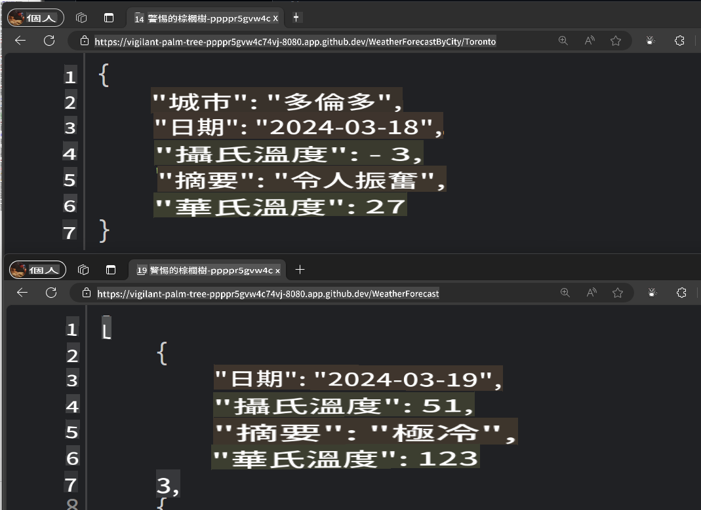

🚀 恭喜！通過這次練習，你不僅使用 GitHub Copilot 生成了程式碼，還以互動且有趣的方式完成了這一過程！你可以使用 GitHub Copilot 不僅生成程式碼，還可以撰寫文件、測試應用程式等。

### ✨ 額外加分: 使用 GitHub Copilot Edits 添加新功能

讓我們使用 **Copilot Edits** 開始一個由 AI 驅動的程式碼編輯會話，並使用自然語言快速對多個檔案進行程式碼更改迭代。Copilot Edits 會直接在編輯器中應用更改，讓你可以在周圍程式碼的完整上下文中審核它們。

讓我們添加一些新功能，讓用戶可以輸入他們想查詢的城市，並調用我們的新 API。

1. 在 GitHub Copilot Chat 中打開 **Edits** 模式窗口。

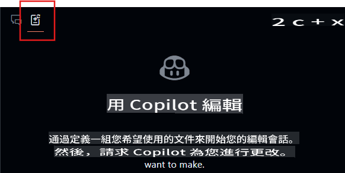
2. 從 Edits 窗口中選擇 **+Add Files...** 按鈕，並添加 **FetchData.razor** 和 **WeatherForecastClient.cs**。
3. 在聊天中輸入：`更新用戶界面，讓用戶輸入他們想查詢天氣的城市，使用 forecast client 調用該城市的新端點，並更新表格以顯示城市名稱。`
4. 選擇 **發送** 按鈕，現在 Edits 將生成一個更改的迭代計劃。
5. 審核更改並點擊 Edits 窗口中的 **接受** 按鈕以接受對檔案的所有更改。
6. 運行應用程式。

> 注意：如果應用程式無法運行或無法調用新端點，請驗證檔案中的更改，確保正確調用了端點。

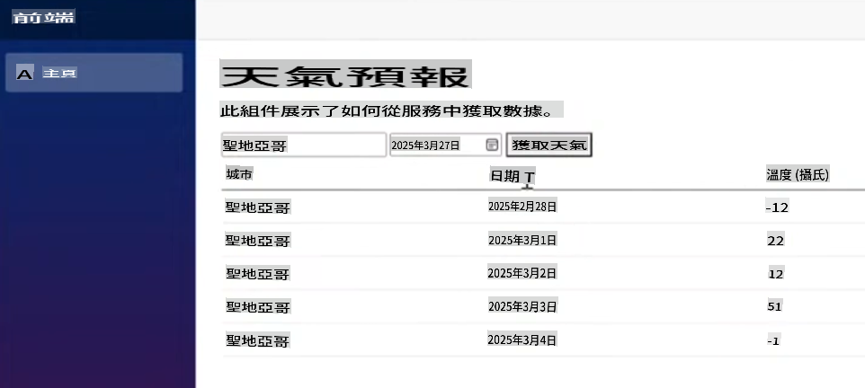

從這裡，你可以繼續進行迭代，並詢問有關樣式或其他功能的問題，進一步完善應用程式。

## 法律聲明

Microsoft 和任何貢獻者授予你許可，根據 [Creative Commons Attribution 4.0 International Public License](https://creativecommons.org/licenses/by/4.0/legalcode) 使用本儲存庫中的 Microsoft 文件和其他內容，請參閱 [LICENSE](../../../04-Using-GitHub-Copilot-with-CSharp/LICENSE) 檔案；並根據 [MIT 許可證](https://opensource.org/licenses/MIT) 授予你使用儲存庫中任何程式碼的許可，請參閱 [LICENSE-CODE](../../../04-Using-GitHub-Copilot-with-CSharp/LICENSE-CODE) 檔案。

Microsoft、Windows、Microsoft Azure 及/或文件中提到的其他 Microsoft 產品和服務可能是 Microsoft 在美國及/或其他國家的商標或註冊商標。本專案的許可不授予你使用任何 Microsoft 名稱、標誌或商標的權利。Microsoft 的一般商標指南可在 http://go.microsoft.com/fwlink/?LinkID=254653 找到。

隱私資訊可在 https://privacy.microsoft.com/en-us/ 找到。

Microsoft 和任何貢獻者保留所有其他權利，無論是根據其各自的版權、專利或商標，還是通過默示、禁止反言或其他方式。

**免責聲明**：  
本文件使用基於機器的AI翻譯服務進行翻譯。雖然我們努力確保準確性，但請注意，自動翻譯可能包含錯誤或不準確之處。原始語言的文件應被視為具有權威性的來源。對於關鍵資訊，建議使用專業的人工作業翻譯。我們對因使用本翻譯而產生的任何誤解或錯誤解釋不承擔責任。