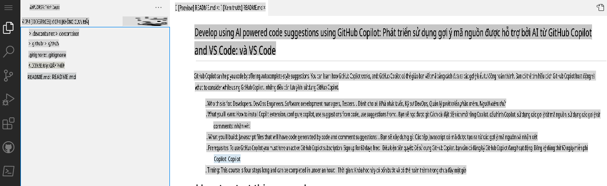

## Bước 1: Sử dụng Codespaces với VS Code cho Copilot

_Chào mừng bạn đến với "Phát triển với gợi ý mã nguồn từ AI sử dụng GitHub Copilot và VS Code"! :wave:_

GitHub Copilot là một lập trình viên đồng hành AI giúp bạn viết mã nhanh hơn và ít công sức hơn. Nó sử dụng ngữ cảnh từ nhận xét và mã nguồn để gợi ý các dòng mã riêng lẻ hoặc toàn bộ hàm một cách tức thì. GitHub Copilot được hỗ trợ bởi OpenAI Codex, một mô hình ngôn ngữ tiền huấn luyện do OpenAI tạo ra.

**Copilot hoạt động với nhiều trình chỉnh sửa mã như VS Code, Visual Studio, JetBrains IDE và Neovim.**

Ngoài ra, GitHub Copilot được huấn luyện trên tất cả các ngôn ngữ xuất hiện trong các kho lưu trữ công khai. Đối với mỗi ngôn ngữ, chất lượng của các gợi ý bạn nhận được có thể phụ thuộc vào khối lượng và sự đa dạng của dữ liệu huấn luyện cho ngôn ngữ đó.

Sử dụng Copilot trong Codespace cho thấy việc bắt đầu và chạy với bộ công cụ [Collaborative Coding](https://github.com/features#features-collaboration) của GitHub dễ dàng như thế nào.

> **Note**
> Bài tập kỹ năng này sẽ tập trung vào việc sử dụng GitHub Codespace. Bạn nên hoàn thành kỹ năng GitHub, [Codespaces](https://github.com/skills/code-with-codespaces), trước khi tiếp tục bài tập này.

### ⌨️ Hoạt động: Kích hoạt Copilot trong Codespace

[](https://codespaces.new/microsoft/mastering-github-copilot-for-dotnet-csharp-developers?devcontainer_path=.devcontainer%2Fintroduction%2Fdevcontainer.json)

**Chúng tôi khuyến nghị bạn mở một tab trình duyệt khác để thực hiện các hoạt động sau, để bạn có thể giữ các hướng dẫn này mở để tham khảo.**

Trước khi bạn mở một codespace trên một kho lưu trữ, bạn có thể tạo một container phát triển và định nghĩa các tiện ích mở rộng hoặc cấu hình cụ thể sẽ được sử dụng hoặc cài đặt trong codespace của bạn. Hãy tạo container phát triển này và thêm Copilot vào danh sách các tiện ích mở rộng.

1. Lưu ý trong nội dung của tệp **.devcontainer/introduction/devcontainer.json**, nội dung sau:
   ```
   {
       // Name this configuration
       "name": "Introduction to Copilot",
       "customizations": {
           "vscode": {
               "extensions": [
                   "GitHub.copilot",
                   "ms-dotnettools.csdevkit"
               ]
           }
       }
   }
   ```

Nếu bạn gặp vấn đề bất kỳ lúc nào, bạn có thể tạo một codespace mới:

1. Điều hướng quay lại trang chủ của kho lưu trữ của bạn bằng cách nhấp vào tab **Code** nằm ở góc trên bên trái màn hình.
1. Nhấp vào nút **Code** nằm ở giữa trang.
1. Nhấp vào tab **Codespaces** trong hộp thoại hiện ra.
1. Nhấp vào nút **Create codespace on main** và chọn Introduction to Copilot.

   **Chờ khoảng 2 phút để codespace tự khởi chạy.**

1. Xác minh rằng codespace của bạn đang chạy. Trình duyệt sẽ hiển thị một trình chỉnh sửa web-based của VS Code và một terminal, tương tự như bên dưới:
   
1. Tiện ích mở rộng `copilot` sẽ xuất hiện trong danh sách tiện ích mở rộng của VS Code. Nhấp vào tab thanh bên tiện ích mở rộng. Bạn sẽ thấy như sau:
   

Hãy chuyển đến [Phần 2 của Bài tập](./2-skills-dotnet.md)

**Tuyên bố miễn trừ trách nhiệm**:  
Tài liệu này đã được dịch bằng các dịch vụ dịch thuật AI tự động. Mặc dù chúng tôi cố gắng đảm bảo độ chính xác, xin lưu ý rằng các bản dịch tự động có thể chứa lỗi hoặc không chính xác. Tài liệu gốc bằng ngôn ngữ ban đầu nên được coi là nguồn thông tin chính thức. Đối với các thông tin quan trọng, nên sử dụng dịch vụ dịch thuật chuyên nghiệp từ con người. Chúng tôi không chịu trách nhiệm về bất kỳ sự hiểu lầm hoặc diễn giải sai nào phát sinh từ việc sử dụng bản dịch này.