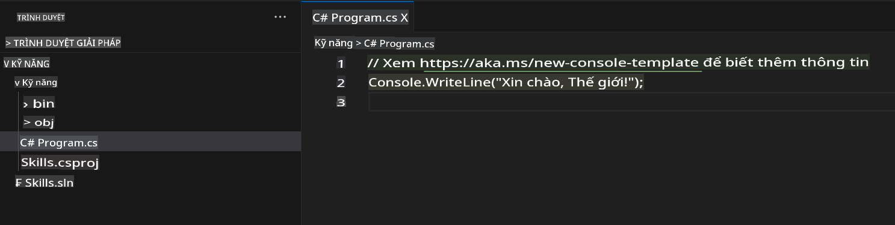
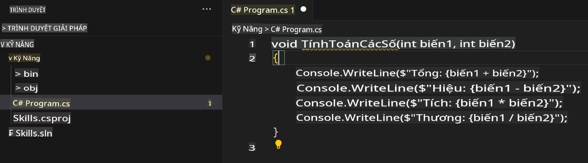

## Bước 2: Xem gợi ý mã của AI trong tệp C#!

_Làm tốt lắm! :tada: Bạn đã tạo một Codespace sử dụng tệp devcontainer và cài đặt Copilot!_

GitHub Copilot cung cấp gợi ý cho nhiều ngôn ngữ và các framework khác nhau, nhưng đặc biệt hiệu quả với Python, JavaScript, TypeScript, Ruby, Go, C# và C++. Các ví dụ dưới đây sẽ sử dụng C#, nhưng các ngôn ngữ khác cũng hoạt động tương tự.

Hãy thử sử dụng C# với Copilot.

> **Note**:
> Nếu bạn đã đóng Codespace ở bước trước, vui lòng mở lại hoặc tạo một Codespace mới.

### ⌨️ Hoạt động: Thêm một tệp C# và bắt đầu viết mã

> **Note**:
> Hãy đảm bảo mở **Solution Explorer** để có cái nhìn tổ chức rõ ràng, giúp dễ dàng thêm các dự án mới và chạy chúng.

1. Tạo một dự án .NET mới bằng cách sử dụng lệnh `.NET: New Project...` và chọn `Console App`. 
1. Chọn thư mục **code** và đặt tên dự án là **Skills**.
1. Mở `Program.cs`.
1. Đảm bảo tệp mới của bạn trông như sau:
   

1. Trong tệp `Program.cs`, xóa bất kỳ mã nào và nhập tiêu đề hàm sau đây.

   ```csharp
   void CalculateNumbers(int var1, int var2)
   {
   ```

   GitHub Copilot sẽ tự động đề xuất toàn bộ nội dung hàm trong văn bản màu xám. Dưới đây là một ví dụ về những gì bạn có thể thấy, nhưng gợi ý cụ thể có thể thay đổi.
   

5. Nhấn `Tab` để chấp nhận gợi ý.

### ⌨️ Hoạt động: Đẩy mã lên kho lưu trữ từ Codespace

Hãy sử dụng GitHub Copilot để tóm tắt các thay đổi của chúng ta và sau đó commit mã. 

1. Mở tab **Source Control**.
2. Nhấn vào nút ✨ trong ô **Message** để Copilot tạo thông điệp commit.


3. Nhấp vào nút **Commit**.

Chuyển đến [Phần 3 của bài tập](./3-copilot-hub.md).

**Tuyên bố từ chối trách nhiệm**:  
Tài liệu này đã được dịch bằng các dịch vụ dịch thuật AI tự động. Mặc dù chúng tôi cố gắng đảm bảo độ chính xác, xin lưu ý rằng các bản dịch tự động có thể chứa lỗi hoặc sự không chính xác. Tài liệu gốc bằng ngôn ngữ bản địa nên được coi là nguồn thông tin đáng tin cậy nhất. Đối với các thông tin quan trọng, nên sử dụng dịch vụ dịch thuật chuyên nghiệp từ con người. Chúng tôi không chịu trách nhiệm về bất kỳ sự hiểu lầm hoặc diễn giải sai nào phát sinh từ việc sử dụng bản dịch này.