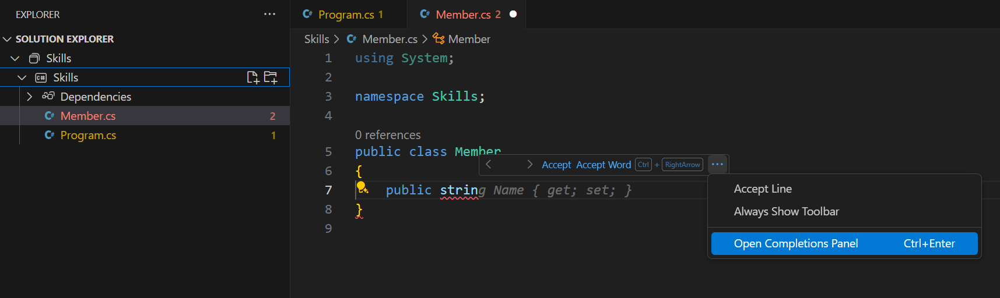

## Bước 3: Xem tab GitHub Copilot với nhiều gợi ý

_Làm tốt lắm! Bạn vừa sử dụng các gợi ý mã từ AI trong tệp C# bằng GitHub Copilot :sparkles:_

Hãy nhớ rằng khi bạn tiếp tục sử dụng Copilot, có thể bạn sẽ không muốn một số gợi ý mà GitHub Copilot đưa ra. GitHub Copilot sẽ hiển thị nhiều gợi ý trong một tab mới.

### ⌨️ Hoạt động: Thêm một phương thức C# khác và xem tất cả các gợi ý

1. Trong Codespace, từ **Solution Explorer**, nhấp chuột phải vào dự án và tạo một tệp mới.

> Lưu ý: Nếu bạn đã đóng Codespace từ bước trước, hãy mở lại hoặc tạo một Codespace mới.

2. Chọn **Class** và đặt tên cho tệp là `Members.cs`.
3. Trong tệp `Members.cs`, gõ hàm sau vào bên trong lớp `Member`.
   ```
   public strin
   ```
4. Dừng gõ và xem gợi ý của Copilot bằng cách di chuột qua phần văn bản màu xám gạch chân đỏ, sau đó chọn `...`
5. Click `Open Completions Panel`. 

   > **Note**
   > If you don't see the copilot code block suggestion or the red squiggly and the three dots `...`, you can type `control + enter` to bring up the GitHub Copilot completions panel.

6. Copilot will synthesize around 10 different code suggestions or press CTRL+Enter. You should see something like this:
   
7. Find a solution you like and click `Accept Solution`.
8. Your ``. Tệp Member.cs sẽ được cập nhật với giải pháp của bạn.

### ⌨️ Hoạt động: Đẩy mã lên kho lưu trữ từ Codespace

Hãy sử dụng GitHub Copilot để tóm tắt các thay đổi của chúng ta và sau đó commit mã.

1. Mở tab **Source Control**.
2. Nhấn vào nút ✨ trong ô **Message** để Copilot tạo thông báo commit cho bạn.


3. Nhấp vào nút **Commit**.

Hãy chuyển sang [Phần 4 của Bài tập](./4-copilot-comment.md).

**Tuyên bố miễn trừ trách nhiệm**:  
Tài liệu này đã được dịch bằng các dịch vụ dịch thuật AI tự động. Mặc dù chúng tôi cố gắng đảm bảo độ chính xác, xin lưu ý rằng các bản dịch tự động có thể chứa lỗi hoặc sự không chính xác. Tài liệu gốc bằng ngôn ngữ ban đầu nên được coi là nguồn thông tin chính thức. Đối với các thông tin quan trọng, khuyến nghị sử dụng dịch vụ dịch thuật chuyên nghiệp từ con người. Chúng tôi không chịu trách nhiệm cho bất kỳ sự hiểu lầm hoặc diễn giải sai nào phát sinh từ việc sử dụng bản dịch này.