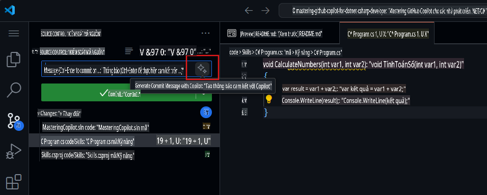

## Bước 4: Sử dụng chú thích để tạo mã với Copilot

_Làm tốt lắm khi sử dụng tab Copilot!_ :partying_face:

Bây giờ bạn đã tận dụng được tính năng gợi ý tự động của tab Copilot nhanh cũng như trung tâm Copilot để chấp nhận các gợi ý do AI tạo ra.

Giờ hãy xem cách bạn có thể tận dụng chú thích để tạo gợi ý từ Copilot!

### ⌨️ Hoạt động: Tạo mã gợi ý từ Copilot bằng chú thích.

1. Từ bên trong Codespace trong Solution Explorer, nhấp chuột phải vào dự án, tạo một tệp mới. 

> [!NOTE]: Nếu bạn đã đóng Codespace ở trên, vui lòng mở lại hoặc tạo một Codespace mới.

2. Chọn **Class** và đặt tên cho tệp là `Comments.cs`  
3. Nhập chú thích sau vào tệp bên trong lớp **Comments**:  
   ```
   // create a method that generates a comment for a given skill
   ```  
4. Nhấn `enter` to go to a new line.
5. Copilot will suggest a code block.
6. Hover over the red squiggly and select the `...`

   > **Note**
   > If you don't see the copilot code block suggestion or the red squiggly and the three dots `...`, you can type `control + enter` to bring up the GitHub Copilot completions panel.

7. Click `Open Completions Panel`. Copilot will synthesise around 10 different code suggestions. You should see something like this:
   
8. Find a solution you like and click `Accept Solution`.  
9. Tệp `Comments.cs` của bạn sẽ được cập nhật với giải pháp của bạn.

### ⌨️ Hoạt động: Đẩy mã lên kho lưu trữ từ Codespace

Hãy sử dụng GitHub Copilot để tóm tắt các thay đổi của chúng ta và sau đó cam kết mã.  

1. Mở tab **Source Control**  
2. Nhấn vào nút ✨ trong mục **Message** để Copilot tạo thông điệp của bạn.



3. Nhấp vào nút **Commit**.

Truy cập [Bài tập 4 - Sử dụng GitHub Copilot với C#](../../04-Using-GitHub-Copilot-with-CSharp/README.md)  

**Tuyên bố miễn trừ trách nhiệm**:  
Tài liệu này đã được dịch bằng các dịch vụ dịch thuật AI tự động. Mặc dù chúng tôi cố gắng đảm bảo độ chính xác, xin lưu ý rằng các bản dịch tự động có thể chứa lỗi hoặc không chính xác. Tài liệu gốc bằng ngôn ngữ ban đầu nên được coi là nguồn thông tin chính thức. Đối với các thông tin quan trọng, khuyến nghị sử dụng dịch vụ dịch thuật chuyên nghiệp bởi con người. Chúng tôi không chịu trách nhiệm cho bất kỳ sự hiểu lầm hoặc diễn giải sai nào phát sinh từ việc sử dụng bản dịch này.