- **Dành cho ai**: Các nhà phát triển, Kỹ sư DevOps, Quản lý phát triển phần mềm, Tester.  
- **Bạn sẽ học được gì**: Cách sử dụng GitHub Copilot để tạo mã và thêm nhận xét vào công việc của bạn.  
- **Bạn sẽ xây dựng gì**: Các tệp C# có mã được tạo bởi Copilot AI cho các đề xuất mã và nhận xét.  
- **Điều kiện tiên quyết**: GitHub Copilot có sẵn để sử dụng miễn phí, đăng ký tại [GitHub Copilot](https://gh.io/copilot).  
- **Thời gian**: Khóa học này có thể hoàn thành trong vòng chưa đầy một giờ.  

Khi hoàn thành module này, bạn sẽ có được các kỹ năng để:  

- Tạo lời nhắc để nhận các đề xuất từ GitHub Copilot.  
- Ứng dụng GitHub Copilot để cải thiện dự án của bạn.  

## Đọc trước:  
- [Giới thiệu về kỹ thuật tạo lời nhắc với GitHub Copilot](https://learn.microsoft.com/training/modules/introduction-prompt-engineering-with-github-copilot)  

- [GitHub Copilot extension cho Visual Studio là gì?](https://learn.microsoft.com/en-us/visualstudio/ide/visual-studio-github-copilot-extension?view=vs-2022)  

## Yêu cầu  

1. Kích hoạt [dịch vụ GitHub Copilot của bạn](https://github.com/github-copilot/signup)  

1. Làm quen với [repository này cùng với Codespaces](https://github.com/github/dotnet-codespaces)  

## 💪🏽 Bài tập  

**Nhấp chuột phải vào nút Codespaces bên dưới để mở Codespace của bạn trong một tab mới**  

[](https://codespaces.new/github/dotnet-codespaces)  

Repository "**GitHub Codespaces ♥️ .NET**" xây dựng một Weather API bằng Minimal APIs, mở Swagger để bạn có thể gọi và kiểm tra API, và hiển thị dữ liệu trong một ứng dụng web sử dụng Blazor với .NET.  

Chúng ta sẽ xem lại các bước để cập nhật ứng dụng Weather BackEnd bằng cách thêm một endpoint mới yêu cầu một vị trí cụ thể và trả về dự báo thời tiết cho vị trí đó.  

### 🤔 Bước 0: Làm quen với repository "GitHub Codespaces ♥️ .NET"  

Khi bạn mở repository trong Codespaces, bạn sẽ thấy một cửa sổ trình duyệt mới với một Codespace đầy đủ chức năng. Mọi thứ trong repository này được chứa trong Codespace này. Ví dụ, trong bảng điều hướng explorer, chúng ta có thể thấy mã chính cho dự án BackEnd và FrontEnd.  

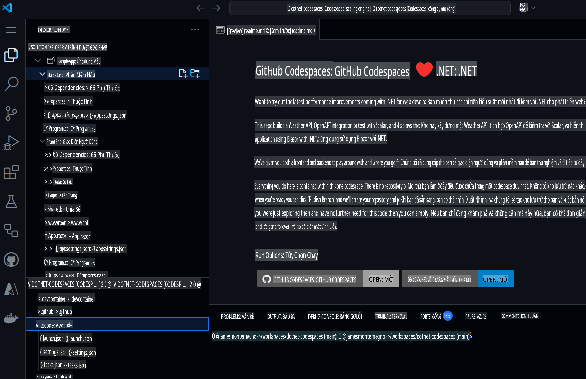  

Trước khi chạy dự án, hãy sử dụng GitHub Copilot Chat để tìm hiểu về dự án và các thành phần khác nhau.  

1. Mở **GitHub Copilot Chat** từ thanh điều hướng chính.  
1. Gõ `What is this project doing, and what are the key components?` và nhấn **Send***  

GitHub Copilot Chat sẽ xem toàn bộ dự án và cung cấp cho chúng ta một tóm tắt về những gì dự án thực hiện, công nghệ nào được sử dụng và bất kỳ thành phần chính nào trong đó.  

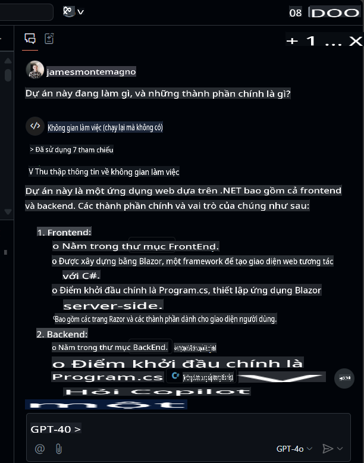  

Từ đây, bạn có thể nhấp vào các tệp để điều hướng đến chúng và bạn có thể đặt câu hỏi tiếp theo như `What APIs are available?`.  

### 🚀 Bước 1: Chạy các dự án  

Bây giờ chúng ta đã hiểu về nội dung của dự án, hãy chạy nó để xem hoạt động.  
Để chạy dự án BackEnd, vào bảng "Run and Debug" và chọn dự án "BackEnd".  

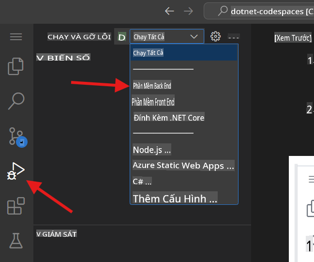  

Bắt đầu Debugging dự án đã chọn. Dự án Weather API, dự án BackEnd của chúng ta sẽ chạy trên cổng 8080. Chúng ta có thể sao chép URL đã xuất bản từ bảng *Ports*.  

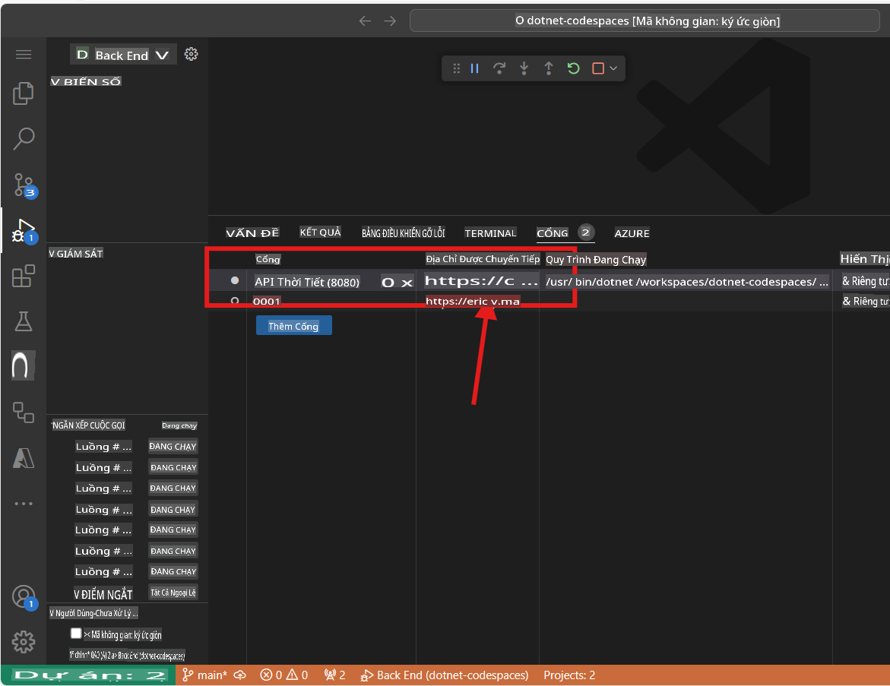  

> Lưu ý: Khi bạn chạy ứng dụng, bạn sẽ thấy thông báo lỗi "This page isn't working". Điều này là vì chúng ta cần điều hướng đến endpoint, chi tiết được đề cập bên dưới.  

Ứng dụng BackEnd đã xuất bản một endpoint tên `weatherforecast` tạo dữ liệu dự báo ngẫu nhiên. Để kiểm tra ứng dụng đang chạy, bạn có thể thêm `/weatherforecast` vào URL đã xuất bản. URL cuối cùng sẽ giống như sau:  

```bash
https://< your url>.app.github.dev/weatherforecast
```  
Ứng dụng đang chạy trên trình duyệt sẽ giống như sau:  

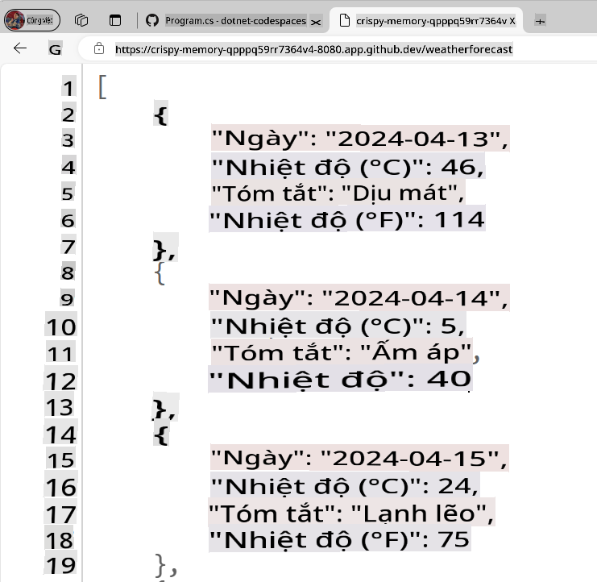  

Bây giờ, hãy thêm một điểm dừng (breakpoint) vào ứng dụng của chúng ta để debug mỗi lần gọi API. Đi đến `Program.cs` file in the BackEnd project. The file is in the following path `SampleApp\BackEnd\Program.cs`. 

Add a breakpoint in line 24 (press F9) and refresh the browser with the Url to test the endpoint. The browser should not show the weather forecast, and in the Visual Studio Editor we can see how the program execution was paused at line 24.

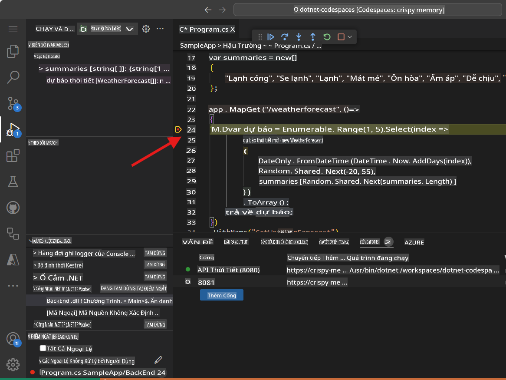

Pressing F10 we can debug step-by-step until line 32, where we can see the generated values. The application should have been generated samples Weather values for the next 5 days. The variable `forecast` has an array containing these values.

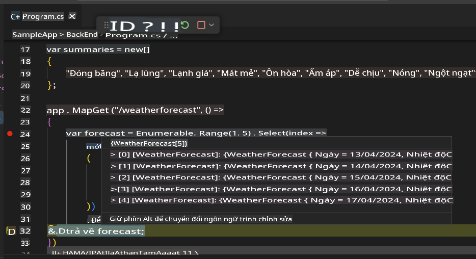

You can stop debugging now.

Congratulations! Now you are ready to add more features into the app using GitHub Copilot.

### 🗒️ Step 2: Get familiarized with GitHub Copilot Slash Commands

As we start working in our codebase, we usually need to refactor some code, or get more context or explanations about it. Using GitHub Copilot Chat, we can have AI-driven conversations to perform these tasks. 

Open the file `Program.cs` in the BackEnd project. The file is in the following path `SampleApp\BackEnd\Program.cs`. 

Now let's use a slash command, in GitHub Copilot to understand a piece of code. Select lines 22-35, press `CTRL + I` to open the inline chat, and type `/explain`.  

  

Dựa trên phiên bản GitHub Copilot của bạn, bạn sẽ thấy phản hồi trực tiếp hoặc bản cập nhật trong Chat Panel. GitHub Copilot sẽ tạo ra một giải thích chi tiết về đoạn mã đã chọn. Một phiên bản tóm tắt sẽ giống như sau:  

```
The selected C# code is part of an ASP.NET Core application using the minimal API feature. It defines a GET endpoint at "/weatherforecast" that generates an array of WeatherForecast objects. Each object is created with a date, a random temperature, and a random summary. The endpoint is named "GetWeatherForecast" and has OpenAPI support for standardized API structure documentation.
```  

**Lệnh Slash** là các lệnh đặc biệt mà bạn có thể sử dụng trong chat để thực hiện các hành động cụ thể trên mã của bạn. Ví dụ, bạn có thể sử dụng:  
- `/doc` to add a documentation comment 
- `/explain` to explain the code 
- `/fix` to propose a fix for the problems in the selected code 
- `/generate` to generate code to answer your question

Let's use the `/tests` command to generate tests to the code. Select lines 39-42, press `CTRL + I` to open the inline chat, and type `/tests` (or select the /tests slash command) to generate a new set of tests for this record.


At this point, GitHub Copilot will suggest a new class. You need to first press [Accept] to create the new file. 

A new class `ProgramTests.cs` was created and added to the project. This tests are using XUnit, however, you can ask to generate tests using another Unit Test library with a command like this one `/tests use MSTests for unit testing`.

***Important:** We are not going to use the test file in this project. You must delete the generated test file to continue.*

Finally, let's use the `/doc` to generate automatic documentation to the code. Select lines 39-42, press `CTRL + I` to open the inline chat, and type `/doc` (or select the command) to generate the documentation for this record.


Inline chat, the Chat Panel, and slash commands are part of the amazing tools that support our development experience with GitHub Copilot. Now we are ready to add new features to this App.


### 🗒️ Step 3: Generate a new Record that includes the city name

Go to the `Program.cs` file in the BackEnd project. The file is in the following path `SampleApp\BackEnd\Program.cs`.  

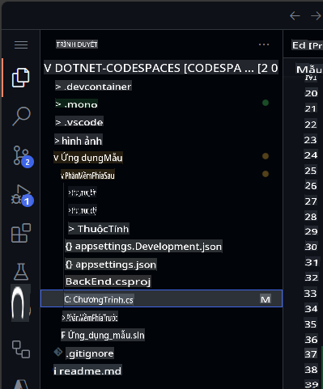  

Đi đến cuối tệp và yêu cầu Copilot tạo một bản ghi mới bao gồm tên thành phố.  

```csharp
// create a new internal record named WeatherForecastByCity that request the following parameters: City, Date, TemperatureC, Summary
```  

Mã được tạo sẽ tương tự như sau:  

```csharp
// create a new internal record named WeatherForecastByCity that request the following parameters: City, Date, TemperatureC, Summary
internal record WeatherForecastByCity(string City, DateOnly Date, int TemperatureC, string? Summary)
{
    public int TemperatureF => 32 + (int)(TemperatureC / 0.5556);
}
```  

Bạn có thể xem cách lời nhắc hoạt động trong hoạt ảnh tiếp theo:  

  

### 🔎 Bước 4: Tạo một endpoint mới để lấy dự báo thời tiết cho một thành phố  

Bây giờ hãy tạo một API endpoint mới tương tự như `/weatherforecast` nhưng cũng bao gồm tên thành phố. Tên endpoint mới sẽ là **`/weatherforecastbycity`**.  

***Quan trọng:** Bạn phải đặt mã sau dòng '.WithOpenApi();', dòng này bắt đầu từ dòng 36. Ngoài ra, hãy nhớ nhấn TAB trong mỗi dòng được đề xuất mới cho đến khi toàn bộ endpoint được định nghĩa.*  

Tiếp theo, tạo một endpoint mới với GitHub Copilot bằng cách thêm nhận xét:  

```csharp
// Create a new endpoint named /WeatherForecastByCity/{city}, that accepts a city name in the urls as a paremeter and generates a random forecast for that city
```  
Trong ví dụ sau, chúng tôi đã thêm một vài dòng trống sau endpoint trước đó và sau đó GitHub Copilot đã tạo endpoint mới. Sau khi mã lõi của Endpoint được tạo, GitHub Copilot cũng đề xuất mã cho tên của endpoint (dòng 49) và đặc tả OpenAPI (dòng 50). Hãy nhớ chấp nhận từng đề xuất này bằng cách nhấn [TAB].  

  

***Quan trọng**: Lời nhắc này tạo ra nhiều dòng mã C#. Rất khuyến khích kiểm tra và xem xét mã được tạo để đảm bảo rằng nó hoạt động theo cách mong muốn.*  

Mã được tạo sẽ giống như sau:  

```csharp
// Create a new endpoint named /WeatherForecastByCity/{city}, that accepts a city name in the urls as a paremeter and generates a random forecast for that city
app.MapGet("/WeatherForecastByCity/{city}", (string city) =>
{
    var forecast = new WeatherForecastByCity
    (
        city,
        DateOnly.FromDateTime(DateTime.Now),
        Random.Shared.Next(-20, 55),
        summaries[Random.Shared.Next(summaries.Length)]
    );
    return forecast;
})
.WithName("GetWeatherForecastByCity")
.WithOpenApi();
```  

### 🐍 Bước 5: Kiểm tra endpoint mới  

Cuối cùng, xác minh endpoint mới đang hoạt động bằng cách khởi chạy dự án từ bảng Run and Debug.  
Chọn Run and Debug, sau đó chọn dự án BackEnd.  

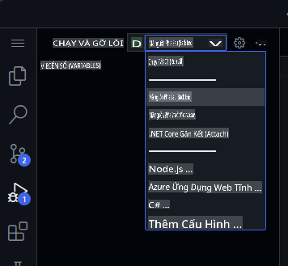  

Bây giờ nhấn Run và dự án sẽ được build và chạy. Khi dự án đang chạy, chúng ta có thể kiểm tra URL ban đầu bằng URL Codespace của bạn và endpoint ban đầu:  

```bash
https://< your code space url >.app.github.dev/WeatherForecast
```  

Và endpoint mới cũng sẽ sẵn sàng để kiểm tra. Dưới đây là một số URL mẫu với các thành phố khác nhau:  
```bash
https://< your code space url >.app.github.dev/WeatherForecastByCity/Toronto

https://< your code space url >.app.github.dev/WeatherForecastByCity/Madrid

https://< your code space url >.app.github.dev/WeatherForecastByCity/<AnyCityName>
```  

Cả hai bài kiểm tra chạy sẽ giống như sau:  

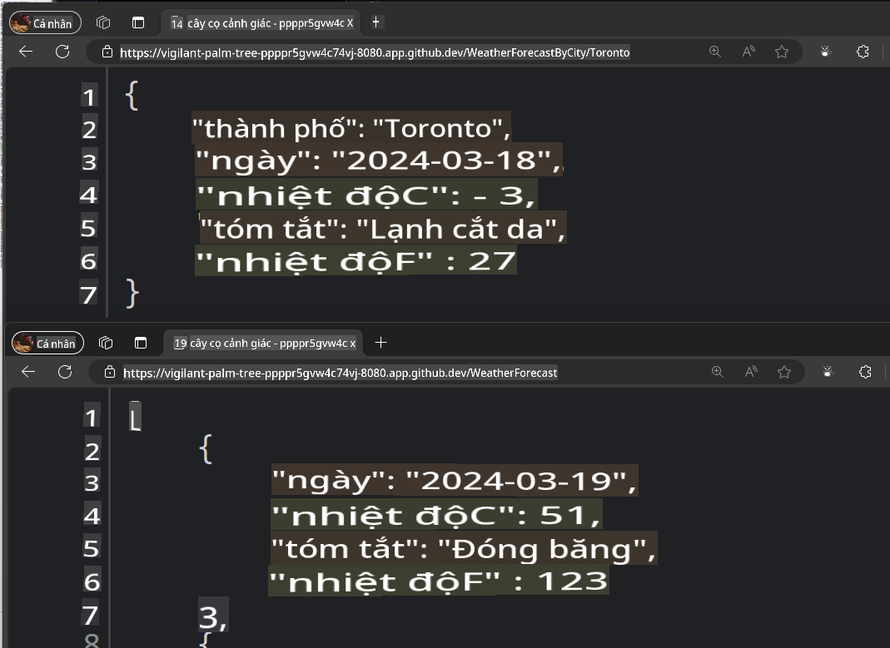  

🚀 Chúc mừng bạn, thông qua bài tập, bạn không chỉ sử dụng GitHub Copilot để tạo mã mà còn thực hiện nó một cách tương tác và thú vị! Bạn có thể sử dụng GitHub Copilot để không chỉ tạo mã mà còn viết tài liệu, kiểm tra ứng dụng và nhiều hơn nữa.  

### ✨ Bonus: Thêm các khả năng mới với GitHub Copilot Edits  

Hãy sử dụng **Copilot Edits** để bắt đầu một phiên chỉnh sửa mã được hỗ trợ bởi AI và nhanh chóng lặp lại các thay đổi mã trên nhiều tệp bằng cách sử dụng ngôn ngữ tự nhiên. Copilot Edits áp dụng các chỉnh sửa trực tiếp trong trình soạn thảo, nơi bạn có thể xem xét chúng ngay tại chỗ, với toàn bộ ngữ cảnh của mã xung quanh.  

Hãy thêm một số chức năng mới để người dùng có thể nhập thành phố mà họ muốn tìm kiếm và gọi API mới của chúng ta.  

1. Mở cửa sổ **Edits** mode trong GitHub Copilot Chat  

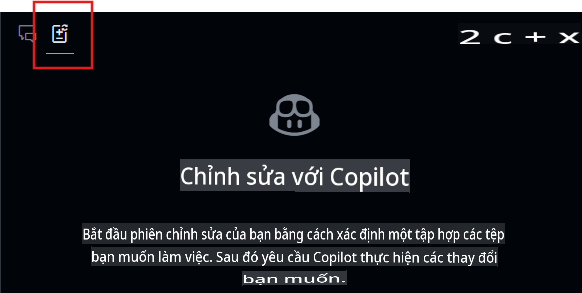  
2. Chọn nút **+Add Files...** từ cửa sổ Edits và thêm **FetchData.razor** và **WeatherForecastClient.cs**.  
3. Nhập vào chat: `Cập nhật giao diện người dùng để hỏi người dùng về thành phố họ muốn xem thời tiết, sử dụng forecast client để gọi endpoint mới cho thành phố, và cập nhật bảng để hiển thị cả thành phố.`  
4. Chọn nút **Send** và bây giờ Edits sẽ tạo một kế hoạch lặp lại cho các thay đổi.  
5. Xem xét các chỉnh sửa và nhấn **Accept** trong cửa sổ Edits để chấp nhận tất cả các thay đổi vào các tệp.  
6. Chạy ứng dụng  

> Lưu ý: Nếu ứng dụng không chạy hoặc không gọi endpoint mới, hãy xác minh các thay đổi trong các tệp đã thay đổi và đảm bảo endpoint được gọi đúng cách.  

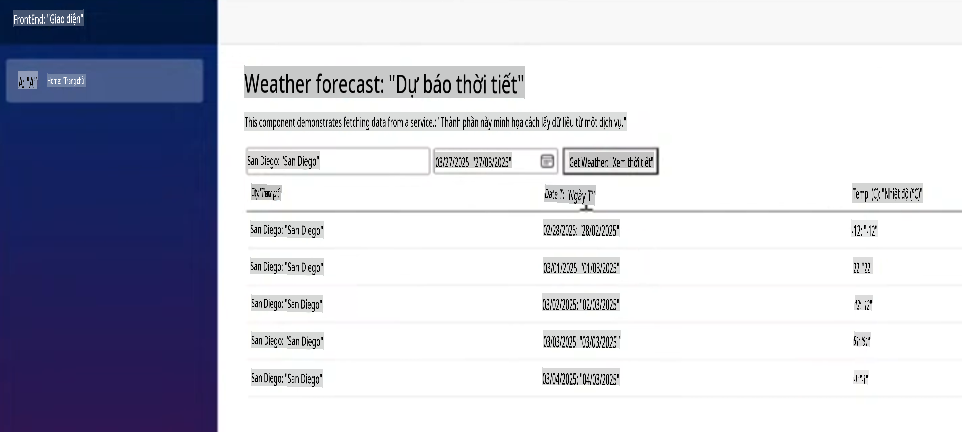  

Từ đây, bạn có thể tiếp tục lặp lại và đặt câu hỏi về việc tạo kiểu hoặc các chức năng khác để thêm vào ứng dụng.  

## Thông báo pháp lý  

Microsoft và bất kỳ người đóng góp nào cấp cho bạn giấy phép đối với tài liệu Microsoft và các nội dung khác  
trong repository này theo [Creative Commons Attribution 4.0 International Public License](https://creativecommons.org/licenses/by/4.0/legalcode),  
xem tệp [LICENSE](../../../04-Using-GitHub-Copilot-with-CSharp/LICENSE), và cấp cho bạn giấy phép đối với bất kỳ mã nào trong repository theo [MIT License](https://opensource.org/licenses/MIT), xem tệp  
[LICENSE-CODE](../../../04-Using-GitHub-Copilot-with-CSharp/LICENSE-CODE).  

Microsoft, Windows, Microsoft Azure và/hoặc các sản phẩm và dịch vụ khác của Microsoft được tham chiếu trong tài liệu  
có thể là nhãn hiệu hoặc nhãn hiệu đã đăng ký của Microsoft tại Hoa Kỳ và/hoặc các quốc gia khác.  
Các giấy phép cho dự án này không cấp cho bạn quyền sử dụng bất kỳ tên, logo hoặc nhãn hiệu nào của Microsoft.  
Hướng dẫn chung về nhãn hiệu của Microsoft có thể được tìm thấy tại http://go.microsoft.com/fwlink/?LinkID=254653.  

Thông tin bảo mật có thể được tìm thấy tại https://privacy.microsoft.com/en-us/  

Microsoft và bất kỳ người đóng góp nào khác bảo lưu tất cả các quyền khác, dù thuộc bản quyền, bằng sáng chế,  
hoặc nhãn hiệu, dù theo ngụ ý, estoppel hoặc cách khác.  

**Tuyên bố miễn trừ trách nhiệm**:  
Tài liệu này đã được dịch bằng các dịch vụ dịch thuật AI tự động. Mặc dù chúng tôi cố gắng đảm bảo độ chính xác, xin lưu ý rằng các bản dịch tự động có thể chứa lỗi hoặc sự không chính xác. Tài liệu gốc bằng ngôn ngữ bản địa nên được coi là nguồn thông tin chính thức. Đối với các thông tin quan trọng, khuyến nghị sử dụng dịch vụ dịch thuật chuyên nghiệp bởi con người. Chúng tôi không chịu trách nhiệm cho bất kỳ sự hiểu lầm hoặc diễn giải sai nào phát sinh từ việc sử dụng bản dịch này.