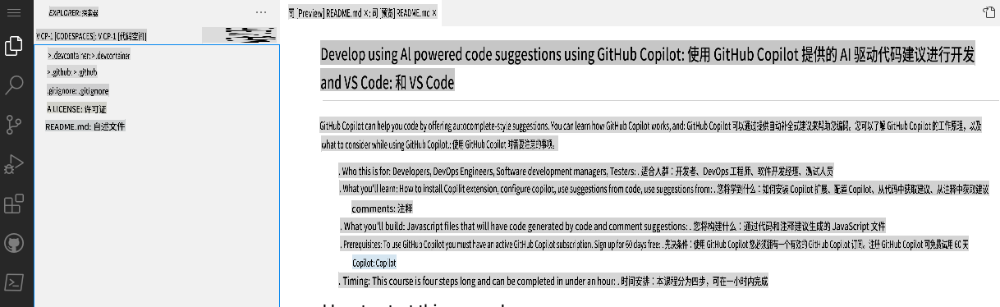
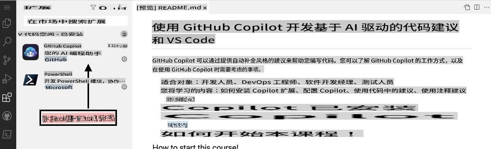

## 第一步：使用 VS Code 和 Codespaces 配合 Copilot

_欢迎来到“使用 GitHub Copilot 和 VS Code 开发 AI 驱动的代码建议”！ :wave:_

GitHub Copilot 是一款 AI 编程助手，可以帮助你更快、更轻松地编写代码。它通过从注释和代码中获取上下文，实时建议单行代码甚至整个函数。GitHub Copilot 基于 OpenAI Codex，这是一种由 OpenAI 创建的生成式预训练语言模型。

**Copilot 支持多种代码编辑器，包括 VS Code、Visual Studio、JetBrains IDE 和 Neovim。**

此外，GitHub Copilot 针对公共代码库中出现的所有语言进行了训练。对于每种语言，你收到的建议质量可能取决于该语言的训练数据量和多样性。

在 Codespace 中使用 Copilot，可以展示如何轻松使用 GitHub 的 [协作编程](https://github.com/features#features-collaboration) 工具套件。

> **Note**
> 本技能练习将重点放在利用 GitHub Codespace 上。建议在继续此练习之前，先完成 GitHub 技能课程 [Codespaces](https://github.com/skills/code-with-codespaces)。

### ⌨️ 活动：在 Codespace 中启用 Copilot

[](https://codespaces.new/microsoft/mastering-github-copilot-for-dotnet-csharp-developers?devcontainer_path=.devcontainer%2Fintroduction%2Fdevcontainer.json)

**建议打开另一个浏览器标签页来完成以下活动，这样你可以将这些说明作为参考。**

在你为某个代码库打开一个 codespace 之前，可以创建一个开发容器，并定义将会在 codespace 中使用或安装的特定扩展或配置。接下来，让我们创建这个开发容器并将 Copilot 添加到扩展列表中。

1. 注意在 **.devcontainer/introduction/devcontainer.json** 文件的主体中，包含以下内容：
   ```
   {
       // Name this configuration
       "name": "Introduction to Copilot",
       "customizations": {
           "vscode": {
               "extensions": [
                   "GitHub.copilot",
                   "ms-dotnettools.csdevkit"
               ]
           }
       }
   }
   ```

如果在任何时候遇到问题，可以创建一个新的 codespace：

1. 点击屏幕左上角的 **Code** 标签，返回到代码库的主页。
1. 点击页面中间的 **Code** 按钮。
1. 在弹出的框中点击 **Codespaces** 标签。
1. 点击 **Create codespace on main** 按钮，并选择 Introduction to Copilot。

   **等待大约 2 分钟，让 codespace 启动完成。**

1. 确认你的 codespace 是否正在运行。浏览器中应该显示基于 Web 的 VS Code 编辑器，并且有一个终端窗口，如下所示：
   
1. `copilot` 扩展应该出现在 VS Code 的扩展列表中。点击扩展侧边栏标签，你应该会看到如下内容：
   

前往 [练习的第二部分](./2-skills-dotnet.md)

**免责声明**：  
本文档是使用基于机器的人工智能翻译服务翻译的。虽然我们尽力确保准确性，但请注意，自动翻译可能包含错误或不准确之处。应以原始语言的原文为权威来源。对于关键信息，建议使用专业的人工翻译。我们对于因使用此翻译而引起的任何误解或误读概不负责。