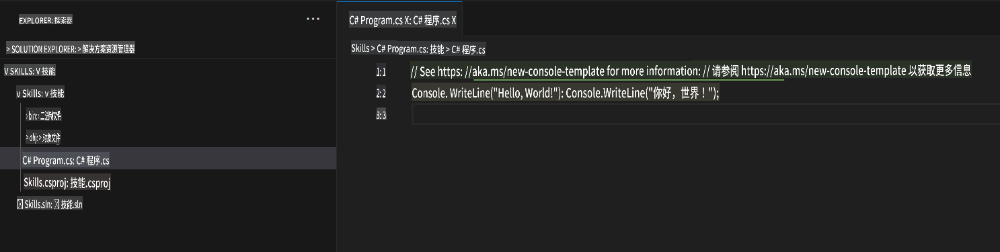
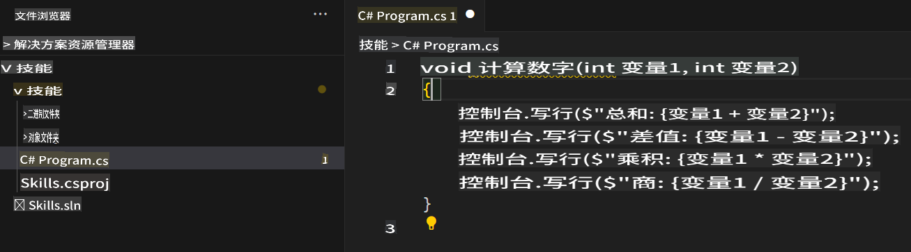

## 第 2 步：在 C# 文件中查看 AI 代码建议！

_干得好！🎉 你已经使用包含 Copilot 的 devcontainer 文件创建了一个 Codespace！_

GitHub Copilot 可以为多种语言和框架提供代码建议，尤其对 Python、JavaScript、TypeScript、Ruby、Go、C# 和 C++ 支持得非常好。以下示例是 C# 的，但其他语言的工作方式类似。

让我们尝试使用 C# 来体验 Copilot。

> **Note**:  
> 如果你关闭了之前的 Codespace，请重新打开它或创建一个新的 Codespace。

### ⌨️ 活动：添加一个 C# 文件并开始编写代码

> **Note**:  
> 请确保打开 **Solution Explorer**，以便以有组织的视图轻松添加新项目并运行它们。

1. 使用 `.NET: New Project...` 命令创建一个新的 .NET 项目，并选择 `Console App`。  
1. 选择 **code** 文件夹，并将项目命名为 **Skills**。  
1. 打开 `Program.cs`  
1. 确保新文件的内容如下所示：  
   

1. 在 `Program.cs` 文件中，删除任何现有代码，然后输入以下函数头。

   ```csharp
   void CalculateNumbers(int var1, int var2)
   {
   ```

   GitHub Copilot 会自动以灰色文本建议整个函数体。下面是你最可能看到的一个示例，但实际建议可能会有所不同。  
   

5. 按下 `Tab` 键接受建议。

### ⌨️ 活动：从 Codespace 将代码推送到你的代码库

让我们使用 GitHub Copilot 来总结我们的更改，然后提交代码。

1. 打开 **Source Control** 标签页  
2. 点击 **Message** 输入框中的 ✨ 按钮，让 Copilot 生成提交消息。


3. 点击 **Commit** 按钮。

前往[练习的第 3 部分](./3-copilot-hub.md)

**免责声明**：  
本文件使用基于机器的人工智能翻译服务进行翻译。尽管我们努力确保准确性，但请注意，自动翻译可能包含错误或不准确之处。应以原文的母语版本作为权威来源。对于关键信息，建议寻求专业人工翻译。我们不对因使用本翻译而引起的任何误解或误读承担责任。