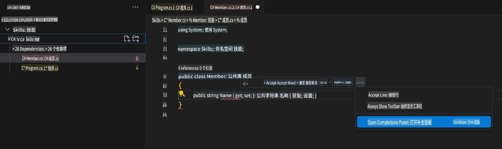

## 第三步：查看 GitHub Copilot 标签页中的多个建议

_干得好！你刚刚通过 GitHub Copilot 在一个 C# 文件中使用了 AI 代码建议 :sparkles:_

请记住，随着你继续使用 Copilot，你可能并不想要 GitHub Copilot 提供的所有建议。GitHub Copilot 会在一个新标签页中展示多个建议。

### ⌨️ 活动：添加另一个 C# 方法并查看所有建议

1. 在 Solution Explorer 中的代码空间内，右键点击项目，创建一个新文件。

> 注意：如果你之前关闭了代码空间，请重新打开或者创建一个新的代码空间。

2. 选择 **Class** 并将文件命名为 `Members.cs`。
3. 在 `Members.cs` 文件中，在 `Member` 类内输入以下函数。
   ```
   public strin
   ```
4. 停止输入，通过将鼠标悬停在红色波浪线灰色文本上查看 Copilot 的建议，并选择 `...`
5. Click `Open Completions Panel`. 

   > **Note**
   > If you don't see the copilot code block suggestion or the red squiggly and the three dots `...`, you can type `control + enter` to bring up the GitHub Copilot completions panel.

6. Copilot will synthesize around 10 different code suggestions or press CTRL+Enter. You should see something like this:
   
7. Find a solution you like and click `Accept Solution`.
8. Your ``，`Member.cs` 文件将会更新为你的解决方案。

### ⌨️ 活动：从代码空间将代码推送到你的仓库

让我们使用 GitHub Copilot 来总结我们的更改并提交代码。

1. 打开 **Source Control** 标签页。
2. 点击 **Message** 输入框中的 ✨ 按钮，让 Copilot 生成你的提交信息。


3. 点击 **Commit** 按钮。

前往 [练习的第四部分](./4-copilot-comment.md)

**免责声明**：  
本文件使用基于机器的人工智能翻译服务进行翻译。尽管我们尽力确保准确性，但请注意，自动翻译可能包含错误或不准确之处。应以原始语言的文件作为权威来源。对于关键信息，建议使用专业的人类翻译服务。我们不对因使用本翻译而产生的任何误解或误读承担责任。