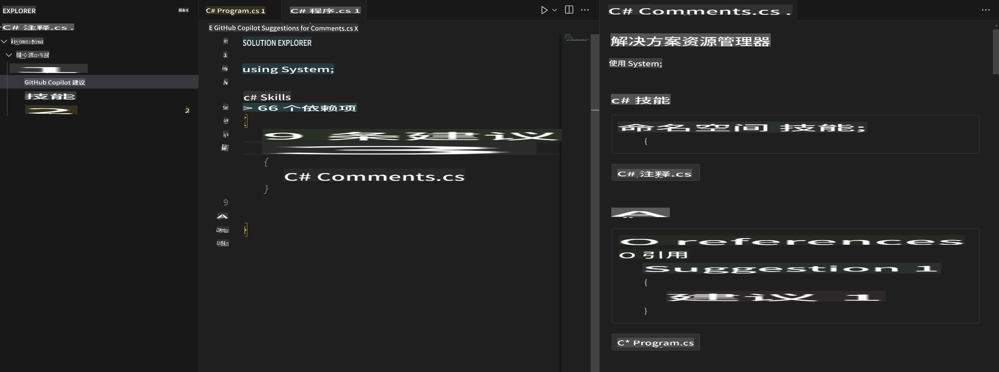
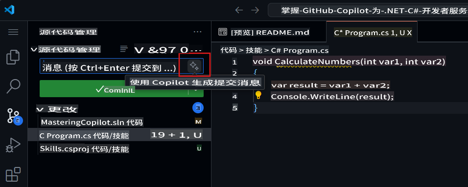

## 第四步：使用注释通过 Copilot 生成代码

_很好地利用了 Copilot 标签页！_ 🎉

现在你已经学会了如何通过 Copilot 快速标签页的自动建议和 Copilot 中心接受 AI 生成的建议。

接下来，让我们看看如何通过注释生成 Copilot 的建议！

### ⌨️ 活动：通过注释生成 Copilot 建议的代码

1. 在 Solution Explorer 的代码空间中，右键点击项目，创建一个新文件。

> 注意：如果你之前关闭了代码空间，请重新打开它或者创建一个新的代码空间。

2. 选择 **Class** 并将文件命名为 `Comments.cs`。
3. 在 **Comments** 类中输入以下注释：
   ```
   // create a method that generates a comment for a given skill
   ```
4. 按下 `enter` to go to a new line.
5. Copilot will suggest a code block.
6. Hover over the red squiggly and select the `...`

   > **Note**
   > If you don't see the copilot code block suggestion or the red squiggly and the three dots `...`, you can type `control + enter` to bring up the GitHub Copilot completions panel.

7. Click `Open Completions Panel`. Copilot will synthesise around 10 different code suggestions. You should see something like this:
   
8. Find a solution you like and click `Accept Solution`。
9. 你的 `Comments.cs` 文件将会用你的解决方案进行更新。

### ⌨️ 活动：从代码空间将代码推送到你的仓库

让我们使用 GitHub Copilot 总结我们的更改并提交代码。

1. 打开 **Source Control** 标签页。
2. 点击 **Message** 输入框中的 ✨ 按钮，使用 Copilot 生成你的提交信息。



3. 点击 **Commit** 按钮。

前往 [练习 4 - 使用 GitHub Copilot 与 C#](../../04-Using-GitHub-Copilot-with-CSharp/README.md)

**免责声明**：  
本文件使用基于机器的人工智能翻译服务进行翻译。尽管我们努力确保准确性，但请注意，自动翻译可能包含错误或不准确之处。应以原文的母语版本作为权威来源。对于关键信息，建议寻求专业人工翻译。我们对于因使用此翻译而导致的任何误解或误读不承担责任。