- **适合人群**：开发人员、DevOps工程师、软件开发经理、测试人员。  
- **你将学到的内容**：如何使用 GitHub Copilot 创建代码并为你的工作添加注释。  
- **你将构建的内容**：通过 Copilot AI 生成代码和注释建议的 C# 文件。  
- **前提条件**：GitHub Copilot 可免费使用，注册请访问 [GitHub Copilot](https://gh.io/copilot)。  
- **所需时间**：本课程可在一小时内完成。  

完成本模块后，你将掌握以下技能：  

- 创建提示以从 GitHub Copilot 生成建议。  
- 应用 GitHub Copilot 改进你的项目。  

## 前置阅读材料：  
- [GitHub Copilot 的提示工程简介](https://learn.microsoft.com/training/modules/introduction-prompt-engineering-with-github-copilot)  

- [什么是 Visual Studio 的 GitHub Copilot 扩展？](https://learn.microsoft.com/en-us/visualstudio/ide/visual-studio-github-copilot-extension?view=vs-2022)  

## 要求  

1. 启用你的 [GitHub Copilot 服务](https://github.com/github-copilot/signup)  

2. 熟悉 [此包含 Codespaces 的存储库](https://github.com/github/dotnet-codespaces)  

## 💪🏽 练习  

**右键点击以下 Codespaces 按钮，在新标签页中打开你的 Codespace**  

[](https://codespaces.new/github/dotnet-codespaces)  

“**GitHub Codespaces ♥️ .NET**” 存储库构建了一个使用 Minimal APIs 的天气 API，打开 Swagger 以便你调用和测试 API，并使用 Blazor 和 .NET 在 Web 应用中显示数据。  

我们将回顾更新天气后端应用的步骤，添加一个新端点以请求特定位置并返回该位置的天气预报。  

### 🤔 第 0 步：熟悉 "GitHub Codespaces ♥️ .NET" 存储库  

当你在 Codespaces 中打开存储库后，你将看到一个新的浏览器窗口，里面有一个完全运行的 Codespace。此存储库的所有内容都包含在这个 Codespace 中。例如，在资源管理器面板中，我们可以看到后端和前端项目的主要代码。  

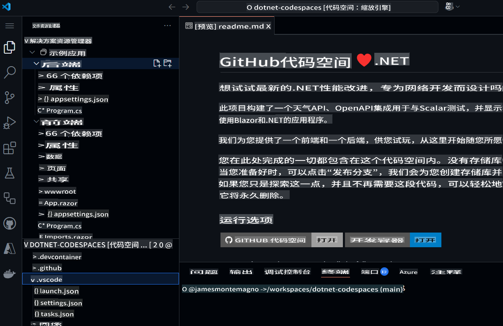  

在运行项目之前，让我们使用 GitHub Copilot Chat 了解项目内容及其不同的组成部分。  

1. 从主导航栏打开 **GitHub Copilot Chat**。  
1. 输入 `What is this project doing, and what are the key components?` 并点击 **发送**。  

GitHub Copilot Chat 将会查看整个项目，并为我们提供项目的摘要，包括它们的功能、使用的技术以及关键组件。  

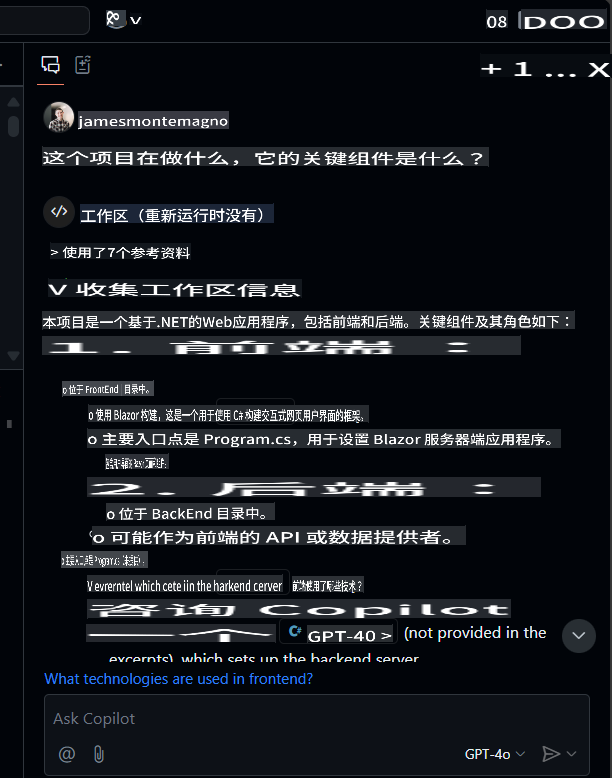  

从这里，你可以点击文件进行导航，并可以提出后续问题，例如 `What APIs are available?`。  

### 🚀 第 1 步：运行项目  

现在我们已经了解了项目的内容，让我们运行它并查看实际效果。  
要运行后端项目，请转到“运行和调试”面板，并选择“BackEnd”项目。  

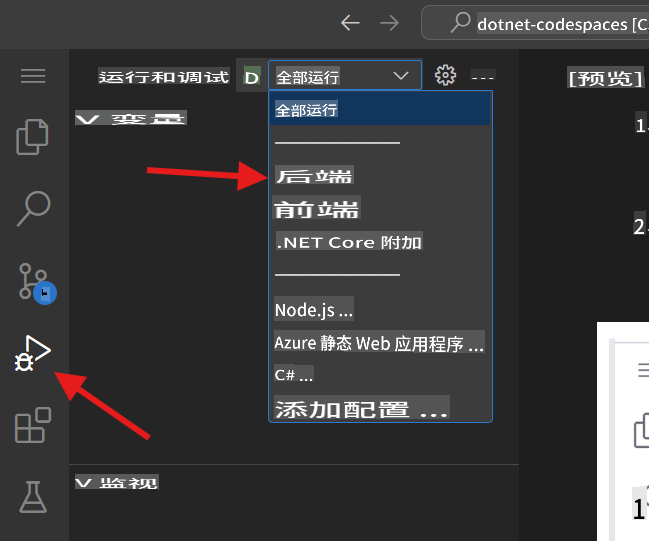  

启动调试所选项目。天气 API 项目（我们的后端项目）现在将在端口 8080 上运行。我们可以从 *端口* 面板复制已发布的 URL。  

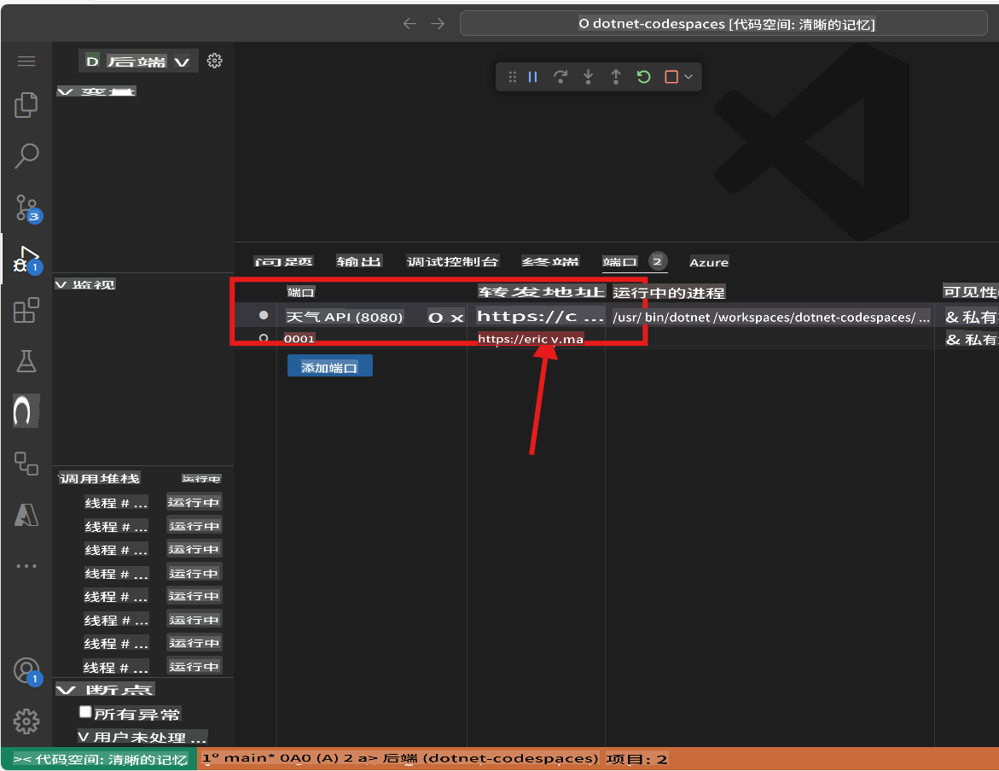  

> 注意：当你运行应用程序时，你可能会看到“此页面无法正常工作”的错误消息。这是因为我们需要导航到端点，详细信息如下所示。  

后端应用程序发布了一个名为 `weatherforecast` 的端点，用于生成随机的天气预报数据。要测试当前运行的应用程序，你可以在发布的 URL 后添加 `/weatherforecast`。最终的 URL 应类似于：  

```bash
https://< your url>.app.github.dev/weatherforecast
```  
在浏览器中运行的应用程序应如下所示。  

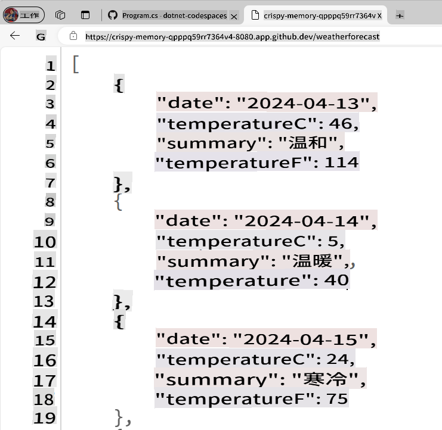  

现在，让我们在应用程序中添加一个断点，以调试对 API 的每次调用。转到 `Program.cs` file in the BackEnd project. The file is in the following path `SampleApp\BackEnd\Program.cs`. 

Add a breakpoint in line 24 (press F9) and refresh the browser with the Url to test the endpoint. The browser should not show the weather forecast, and in the Visual Studio Editor we can see how the program execution was paused at line 24.

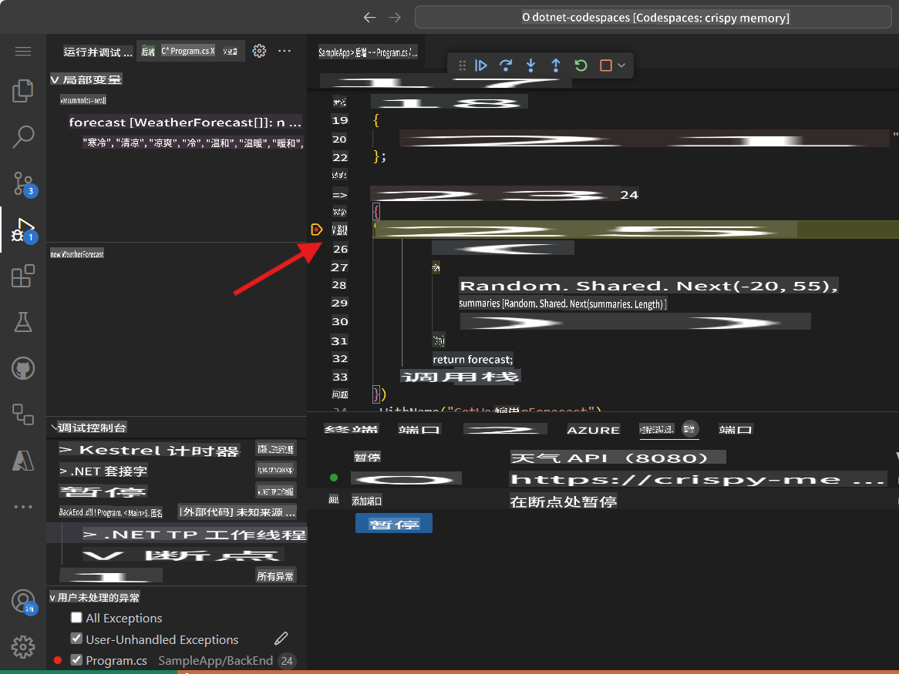

Pressing F10 we can debug step-by-step until line 32, where we can see the generated values. The application should have been generated samples Weather values for the next 5 days. The variable `forecast` has an array containing these values.

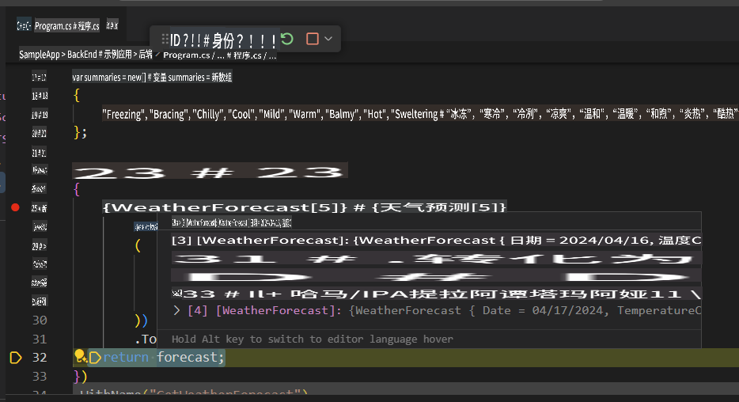

You can stop debugging now.

Congratulations! Now you are ready to add more features into the app using GitHub Copilot.

### 🗒️ Step 2: Get familiarized with GitHub Copilot Slash Commands

As we start working in our codebase, we usually need to refactor some code, or get more context or explanations about it. Using GitHub Copilot Chat, we can have AI-driven conversations to perform these tasks. 

Open the file `Program.cs` in the BackEnd project. The file is in the following path `SampleApp\BackEnd\Program.cs`. 

Now let's use a slash command, in GitHub Copilot to understand a piece of code. Select lines 22-35, press `CTRL + I` to open the inline chat, and type `/explain`。  

  

根据你使用的 GitHub Copilot 版本，你将看到内联响应或 Chat 面板的更新。GitHub Copilot 将生成所选代码的详细解释。摘要版本可能如下所示：  

```
The selected C# code is part of an ASP.NET Core application using the minimal API feature. It defines a GET endpoint at "/weatherforecast" that generates an array of WeatherForecast objects. Each object is created with a date, a random temperature, and a random summary. The endpoint is named "GetWeatherForecast" and has OpenAPI support for standardized API structure documentation.
```  

**斜杠命令** 是你可以在聊天中使用的特殊命令，用于对代码执行特定操作。例如，你可以使用：  
- `/doc` to add a documentation comment 
- `/explain` to explain the code 
- `/fix` to propose a fix for the problems in the selected code 
- `/generate` to generate code to answer your question

Let's use the `/tests` command to generate tests to the code. Select lines 39-42, press `CTRL + I` to open the inline chat, and type `/tests` (or select the /tests slash command) to generate a new set of tests for this record.


At this point, GitHub Copilot will suggest a new class. You need to first press [Accept] to create the new file. 

A new class `ProgramTests.cs` was created and added to the project. This tests are using XUnit, however, you can ask to generate tests using another Unit Test library with a command like this one `/tests use MSTests for unit testing`.

***Important:** We are not going to use the test file in this project. You must delete the generated test file to continue.*

Finally, let's use the `/doc` to generate automatic documentation to the code. Select lines 39-42, press `CTRL + I` to open the inline chat, and type `/doc` (or select the command) to generate the documentation for this record.


Inline chat, the Chat Panel, and slash commands are part of the amazing tools that support our development experience with GitHub Copilot. Now we are ready to add new features to this App.


### 🗒️ Step 3: Generate a new Record that includes the city name

Go to the `Program.cs` file in the BackEnd project. The file is in the following path `SampleApp\BackEnd\Program.cs`。  

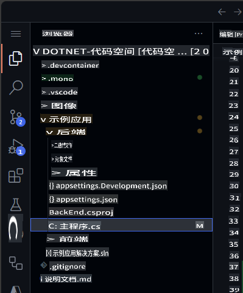  

导航到文件末尾，并要求 Copilot 生成一个包含城市名称的新记录。  

```csharp
// create a new internal record named WeatherForecastByCity that request the following parameters: City, Date, TemperatureC, Summary
```  

生成的代码应类似于以下内容：  

```csharp
// create a new internal record named WeatherForecastByCity that request the following parameters: City, Date, TemperatureC, Summary
internal record WeatherForecastByCity(string City, DateOnly Date, int TemperatureC, string? Summary)
{
    public int TemperatureF => 32 + (int)(TemperatureC / 0.5556);
}
```  

你可以在以下动画中查看提示的工作方式：  

  

### 🔎 第 4 步：生成一个新端点以获取城市的天气预报  

现在，让我们生成一个类似于 `/weatherforecast` 的新 API 端点，该端点还包括城市名称。新 API 端点名称将为 **`/weatherforecastbycity`**。  

***重要**：你必须将代码放置在 '.WithOpenApi();' 行之后，此行从第 36 行开始。还要记住在每行新建议代码中按 TAB，直到整个端点定义完成。*  

接下来，通过添加以下注释使用 GitHub Copilot 生成新端点：  

```csharp
// Create a new endpoint named /WeatherForecastByCity/{city}, that accepts a city name in the urls as a paremeter and generates a random forecast for that city
```  
在以下示例中，我们在前一个端点后添加了一些额外的空行，然后 GitHub Copilot 生成了新的端点。当端点的核心代码生成后，GitHub Copilot 还建议了端点名称（第 49 行）和 OpenAPI 规范（第 50 行）的代码。记住通过按 [TAB] 接受这些建议。  

  

***重要**：此提示会生成多行 C# 代码。强烈建议检查并审查生成的代码，以确保其按预期方式工作。*  

生成的代码应类似于以下内容：  

```csharp
// Create a new endpoint named /WeatherForecastByCity/{city}, that accepts a city name in the urls as a paremeter and generates a random forecast for that city
app.MapGet("/WeatherForecastByCity/{city}", (string city) =>
{
    var forecast = new WeatherForecastByCity
    (
        city,
        DateOnly.FromDateTime(DateTime.Now),
        Random.Shared.Next(-20, 55),
        summaries[Random.Shared.Next(summaries.Length)]
    );
    return forecast;
})
.WithName("GetWeatherForecastByCity")
.WithOpenApi();
```  

### 🐍 第 5 步：测试新端点  

最后，通过从运行和调试面板启动项目来验证新端点是否正常工作。  
选择“运行和调试”，然后选择后端项目。  

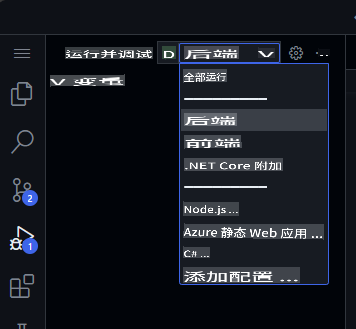  

现在点击运行，项目应该会构建并运行。一旦项目运行，我们可以使用你的 Codespace URL 和原始端点测试原始 URL：  

```bash
https://< your code space url >.app.github.dev/WeatherForecast
```  

新的端点也可以进行测试。以下是一些不同城市的示例 URL：  
```bash
https://< your code space url >.app.github.dev/WeatherForecastByCity/Toronto

https://< your code space url >.app.github.dev/WeatherForecastByCity/Madrid

https://< your code space url >.app.github.dev/WeatherForecastByCity/<AnyCityName>
```  

两个测试的运行效果应如下图所示：  

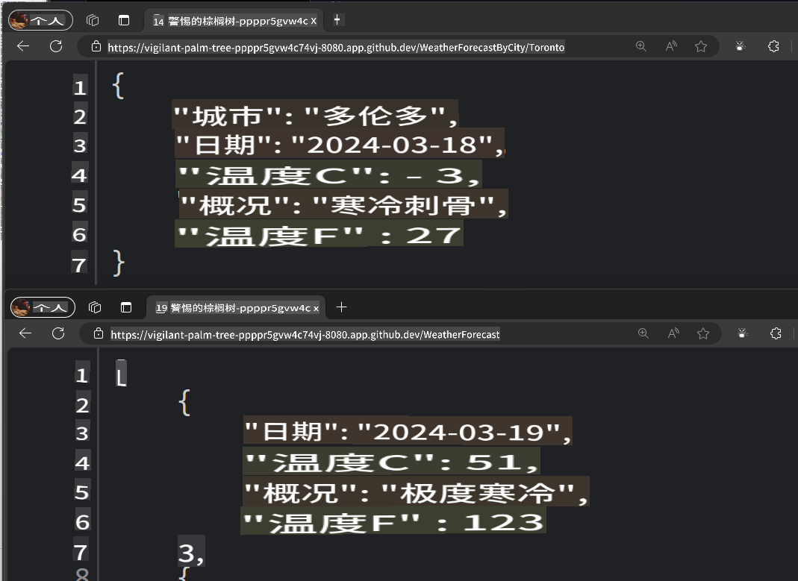  

🚀 恭喜你，通过本次练习，你不仅使用 GitHub Copilot 生成了代码，还以互动且有趣的方式完成了这一过程！你可以使用 GitHub Copilot 不仅生成代码，还可以编写文档、测试你的应用程序等等。  

### ✨ 额外奖励：使用 GitHub Copilot Edits 添加新功能  

让我们使用 **Copilot Edits** 开启一个由 AI 驱动的代码编辑会话，通过自然语言快速迭代多个文件中的代码更改。Copilot Edits 会直接在编辑器中应用更改，你可以在代码周围的完整上下文中进行审核。  

让我们添加一些新功能，让用户可以输入他们想查询天气的城市，并调用我们的新 API。  

1. 在 GitHub Copilot Chat 中打开 **Edits** 模式窗口。  

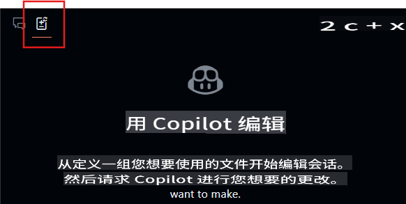  
2. 从 Edits 窗口中选择 **+Add Files...** 按钮，添加 **FetchData.razor** 和 **WeatherForecastClient.cs** 文件。  
3. 在聊天中输入：`更新用户界面，询问用户想要查询天气的城市，使用 forecast client 调用新端点，并更新表格以显示城市名称。`  
4. 点击 **发送** 按钮，Edits 将生成更改的迭代计划。  
5. 审查更改并点击 **接受** 按钮，接受对文件的所有更改。  
6. 运行应用程序。  

> 注意：如果应用程序无法运行或未调用新端点，请验证更改后的文件，确保端点被正确调用。  

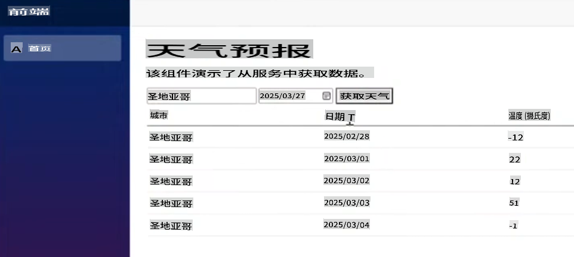  

从这里，你可以继续迭代，询问有关样式或其他功能的问题，并将其添加到应用程序中。  

## 法律声明  

Microsoft 和任何贡献者根据 [Creative Commons Attribution 4.0 International Public License](https://creativecommons.org/licenses/by/4.0/legalcode) 授予你使用本存储库中 Microsoft 文档和其他内容的许可，详见 [LICENSE](../../../04-Using-GitHub-Copilot-with-CSharp/LICENSE) 文件；并根据 [MIT License](https://opensource.org/licenses/MIT) 授予你使用本存储库中任何代码的许可，详见 [LICENSE-CODE](../../../04-Using-GitHub-Copilot-with-CSharp/LICENSE-CODE) 文件。  

Microsoft、Windows、Microsoft Azure 和/或文档中提到的其他 Microsoft 产品和服务可能是 Microsoft 在美国和/或其他国家的商标或注册商标。本项目的许可不授予你使用任何 Microsoft 名称、徽标或商标的权利。  
Microsoft 的通用商标指南可在以下网址找到：http://go.microsoft.com/fwlink/?LinkID=254653  

隐私信息可在以下网址找到：https://privacy.microsoft.com/en-us/  

Microsoft 和任何贡献者保留所有其他权利，无论是根据各自的版权、专利或商标，还是通过暗示、禁止反言或其他方式。  

**免责声明**:  
本文件通过基于机器的人工智能翻译服务翻译而成。尽管我们努力确保准确性，但请注意，自动翻译可能包含错误或不准确之处。原始语言的文件应被视为权威来源。对于关键信息，建议使用专业的人类翻译服务。我们不对因使用本翻译而引起的任何误解或误读承担责任。